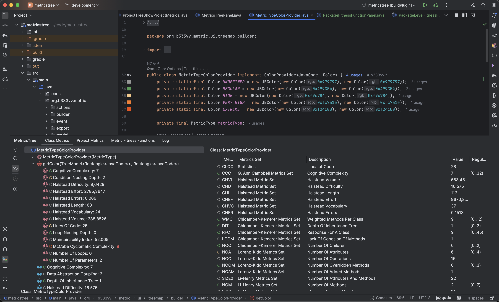
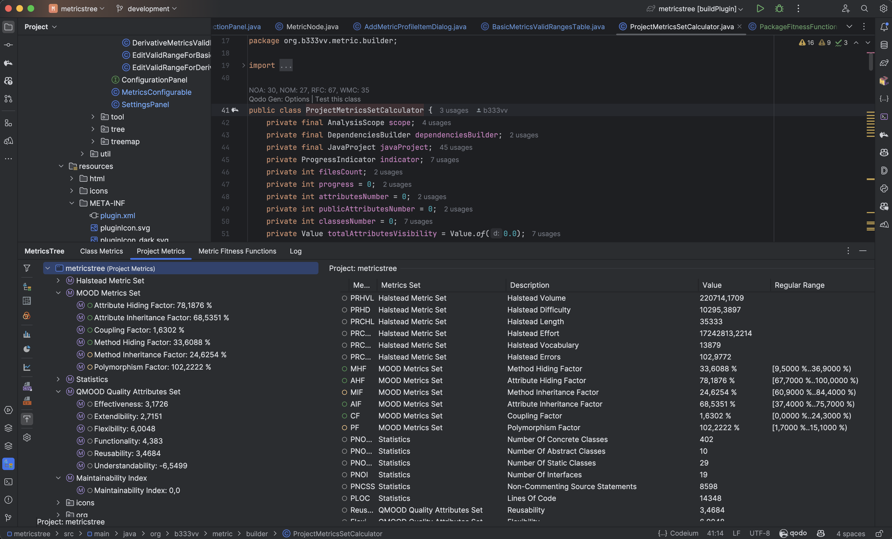
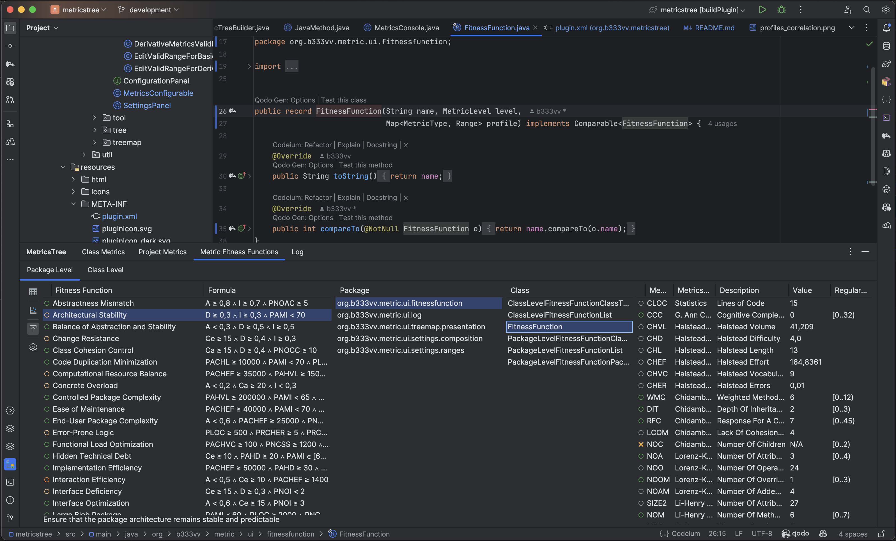
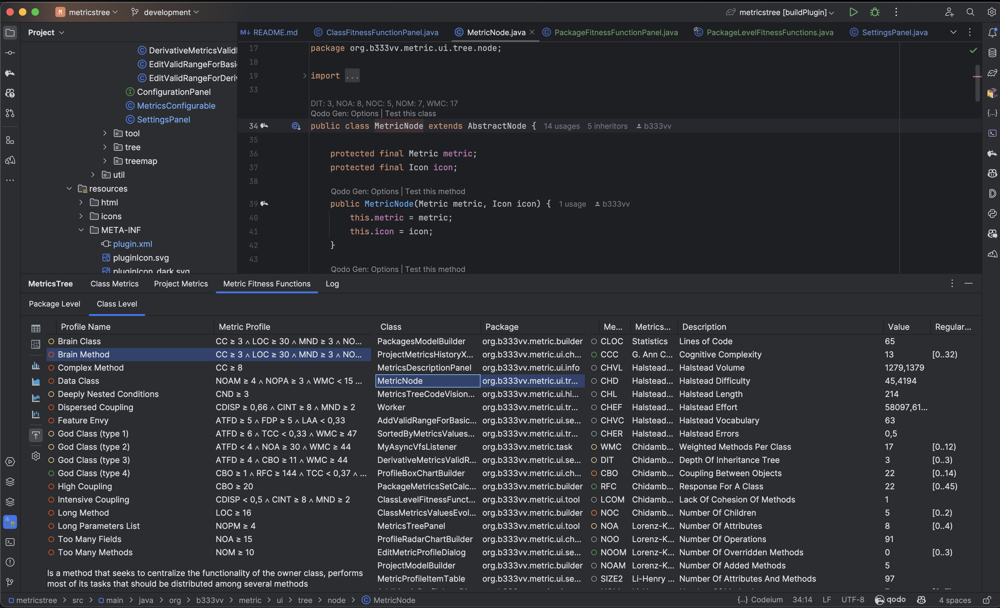
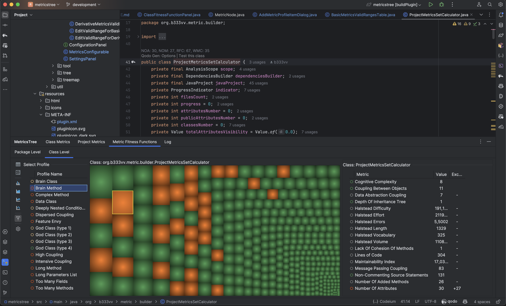
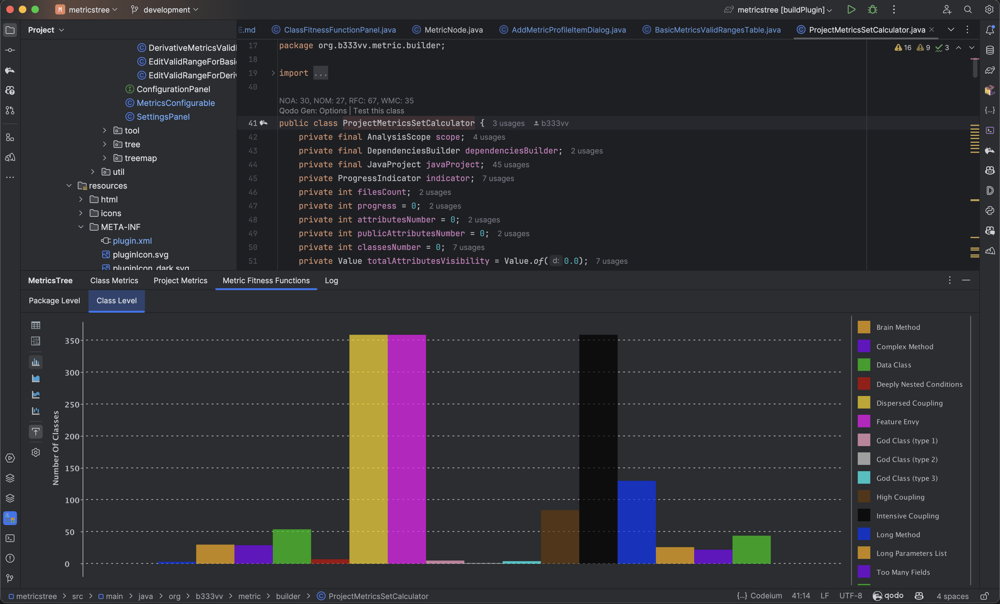
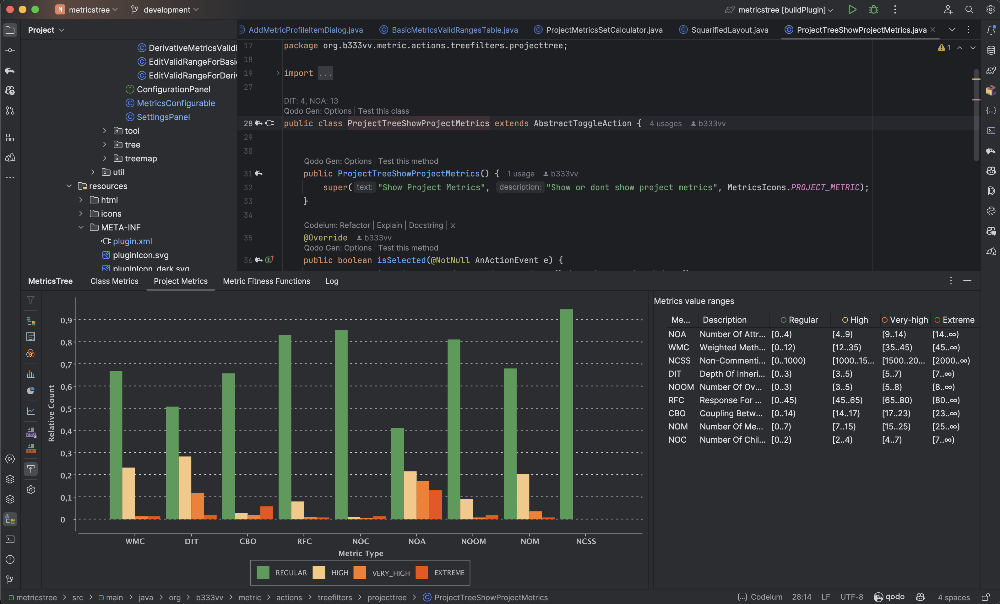
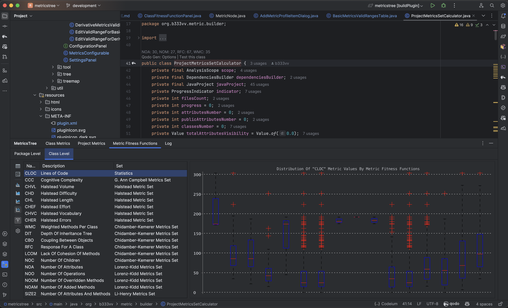
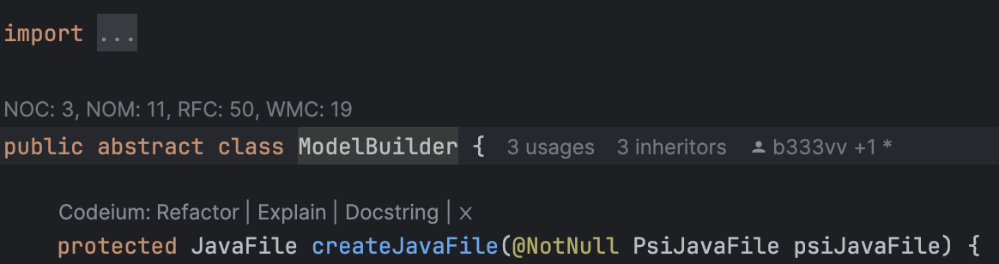
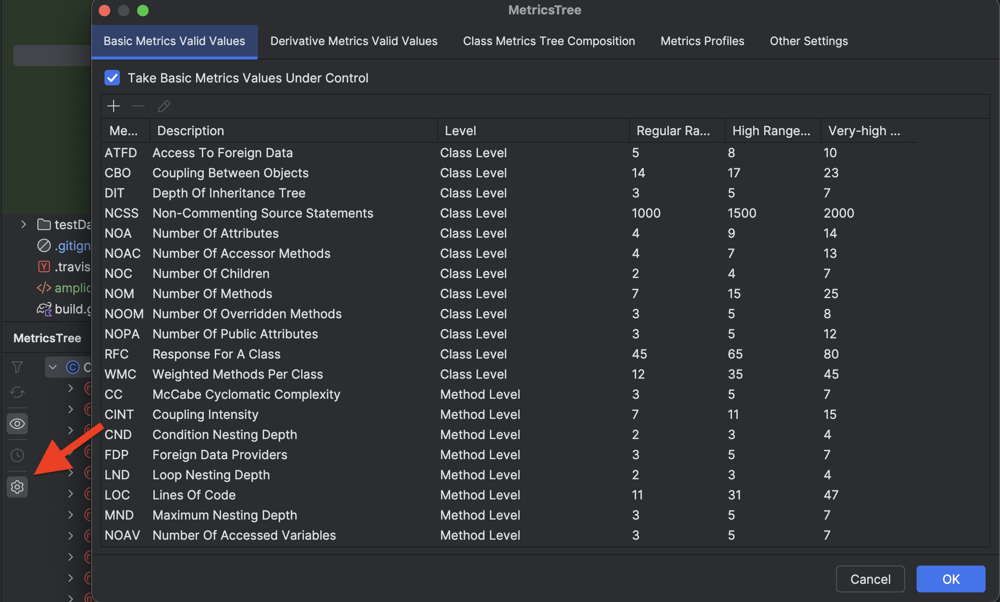

# MetricsTree IntelliJ IDEA plugin

[//]: # ([![Build Status]&#40;https://travis-ci.org/b333vv/metricstree.svg?branch=master&#41;]&#40;https://travis-ci.org/b333vv&#41;)

MetricsTree is an IDE extension that helps to evaluate quantitative properties of Java and Kotlin code.
It supports the most common sets of metrics at the project, package, class, and method levels.
# Metrics
1. Project level:
    - Non-Commenting Source Statements
    - Lines Of Code
    - Number Of Concrete Classes
    - Number Of Abstract Classes
    - Number Of Static Classes
    - Number Of Interfaces
    - MOOD metrics set [1]:  
        - MHF: Method Hiding Factor
        - AHF: Attribute Hiding Factor
        - MIF: Method Inheritance Factor
        - AIF: Attribute Inheritance Factor
        - PF: Polymorphism Factor
        - CF: Coupling Factor
   - QMOOD quality attributes set [2]:
        - Reusability 
        - Flexibility
        - Understandability
        - Functionality
        - Extendibility
        - Effectiveness
   - Halstead metrics set [10]:
      - Volume
      - Difficulty
      - Length
      - Effort
      - Vocabulary
      - Errors
   - Maintainability Index [11]
2. Package level
    - Non-Commenting Source Statements
    - Lines Of Code
    - Number Of Concrete Classes
    - Number Of Abstract Classes
    - Number Of Static Classes
    - Number Of Interfaces
    - Robert C. Martin metrics set [3, 4]:
        - Ce: Efferent Coupling
        - Ca: Afferent Coupling
        - I: Instability
        - A: Abstractness
        - D: Normalized Distance from Main Sequence
   - Halstead metrics set [10]:
     - Volume
     - Difficulty
     - Length
     - Effort
     - Vocabulary
     - Errors
   - Maintainability Index [11]
3. Class level
    - Lines of Code
    - Chidamber-Kemerer metrics set [5]:
        - WMC: Weighted methods per class
        - DIT: Depth of Inheritance Tree
        - NOC: Number of Children
        - CBO: Coupling between object classes
        - RFC: Response for a Class
        - LCOM: Lack of cohesion in methods
    - Lorenz-Kidd metrics set [6]:
        - NOA: Number of Attributes
        - NOO: Number of Operations
        - NOAM: Number of Added Methods
        - NOOM: Number of Overridden Methods
    - Li-Henry metrics set [7]:
        - SIZE2: Number of Attributes and Methods
        - MPC: Message Passing Coupling
        - DAC: Data Abstraction Coupling
        - NOM: Number of Methods
    - Lanza-Marinescu metrics set [8]:
        - ATFD: Access To Foreign Data
        - NOPA: Number Of Public Attributes
        - Number Of Accessor Methods
        - WOC: Weight Of A Class
    - Bieman-Kang metrics set [9]:
        - TCC: Tight Class Cohesion
    - Chr. Clemens Lee metrics set:
            - NCSS: Non-Commenting Source Statements
   - Halstead metrics set [10]:
     - Volume
     - Difficulty
     - Length
     - Effort
     - Vocabulary
     - Errors
   - Maintainability Index [11]
   - Cognitive Complexity [12]
4. Method level:
    - LOC: Lines Of Code
    - CC: McCabe Cyclomatic Complexity
    - Maximum Nesting Depth
    - Loop Nesting Depth
    - Condition Nesting Depth
    - Number Of Loops
    - LAA: Locality Of Attribute Accesses
    - FDP: Foreign Data Providers
    - NOAV: NumberOfAccessedVariables
    - CINT: Coupling Intensity
    - CDISP: Coupling Dispersion
   - Halstead metrics set [10]:
      - Volume
      - Difficulty
      - Length
      - Effort
      - Vocabulary
      - Errors
   - Maintainability Index [11]
   - Cognitive Complexity [12]
> 1. Brito e Abreu F. and Carapuça R. Object-Oriented Software Engineering: Measuring and controlling the development process, 4th Interntional Conference on Software Quality, Mc Lean, VA, USA, 1994.
> 2. Jagdish Bansiya and Carl G. Davis, A hierarchical model for object-oriented design quality assessment. Software Engineering, IEEE Transactions on, 28(1):4–17, 2002.
> 3. Martin, R. C. OO design quality metrics. An analysis of dependencies. 28 October 1994.
> 4. Martin, R. C. Agile Software Development: Principles, Patterns, and Practices. Alant Apt Series. Prentice Hall, Upper Saddle River, NJ, USA 2002.
> 5. S. R. Chidamber and C. F. Kemerer. A Metrics Suite for Object Oriented Design. In IEEE Transactions on Software Engineering, volume 20 (6), pages 476-493, June 1994.
> 6. M. Lorenz, J. Kidd. Object Oriented Software Metrics, Prentice Hall, NJ, 1994.
> 7. W. Li and S. Henry. Object-oriented metrics that predict maintainability. Journal of Systems and Software, Volume 23, Issue 2, pages 111-122, November 1993.
> 8. M. Lanza, R. Marinescu. Object-Oriented Metrics in Practice. Using Software Metrics to Characterize, Evaluate, and Improve the Design of Object-Oriented Systems. Springer-Verlag Berlin Heidelberg, 2006.
> 9. J. M. Bieman and B. Kang, Cohesion and reuse in an object-oriented system, Proceedings of the 1995 Symposium on Software reusability, Seattle, Washington, United States, pp. 259-262, 1995.
> 10. Halstead, Maurice H. Elements of Software Science. Amsterdam: Elsevier North-Holland, Inc. ISBN 0-444-00205-7.
> 11. D. Coleman, D. Ash, B. Lowther, and P. Oman, Using metrics to evaluate software system maintainability, Computer, vol. 27, no. 8, pp. 44–49, 1994.
> 12. G. Ann Campbell, {Cognitive Complexity} a new way of measuring understandability. SonarSource S.A., 2023, Switzerland.
# Featutes   
 - Represents metrics calculation results in forms of trees and treemaps
 - Builds trees with metrics for class open in the editor or for the entire project
 - Supports controlling calculated metrics values
 - Implements metric fitness functions at the package level (e.g. for detecting coupling and cohesion problems) and at the class level (e.g. for recognizing 'god class', 'feature envy' antipatterns)
 - Displays various metrics properties (distributions, correlations) in charts
 - Shows class metrics values evolution based on 'git log'
 - Indicates in the code editor the values for those class metrics that do not fit into the reference interval
 

# Installation
The plugin can be installed from the JetBrains plugin repository within your IDE with 
Preferences | Plugins | Market Place and searching for MetricsTree.
# Settings
To set reference intervals for metrics, metrics tree display parameters, etc., click on the properties button:

To control the display of inlay hints in code editor use the “Enable Metrics Tree Code Vision” checkbox in the Settings -> Metrics Tree Code Vision menu:

# Compatibility
The plugin tested for compatibility with IntelliJ IDEA version 2020.3+.
# Development
The plugin is written in Java using IntelliJ's plugin framework.
The code is hosted on GitHub and has a Travis-CI integration for automatic testing.
Compilation is done with Gradle (v 5.2.1+) using the IntelliJ Gradle plugin and should work out of the box.
# License     
The plugin is distributed under Apache License, version 2.0. For full license terms, see [LICENCE](../blob/master/LICENSE).