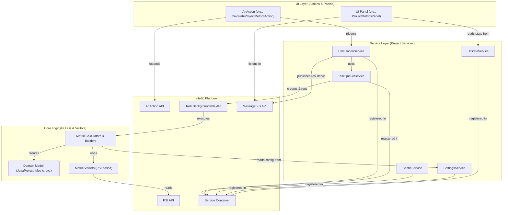

# Architectural Specification: MetricsTree IntelliJ Plugin

## 1. Executive Summary & Goals
This document provides a detailed architectural specification for the MetricsTree IntelliJ IDEA plugin. The plugin is designed to calculate, display, and analyze a wide range of software metrics for Java projects.

The architecture is designed to be modular, maintainable, and testable, adhering to modern software design principles. The key architectural goals are:
- **Separation of Concerns:** A clear distinction between UI, application services, and core metric calculation logic.
- **Decoupling:** Components interact through well-defined service interfaces and an event-driven model, minimizing direct dependencies.
- **Testability:** The architecture facilitates unit testing of core logic and services in isolation, with integration and E2E tests for validating the complete system.

## 2. Architectural Vision & Context
The project's structure and documentation (e.g., `architecture/*.md`, `doc/Refactoring/*.md`) indicate a deliberate and ongoing effort to refactor from a legacy, highly-coupled architecture to a clean, layered, service-oriented model. The legacy architecture suffered from "God Objects" (`MetricsUtils`, `MetricTaskCache`) that centralized state and functionality, hindering testability and maintainability.

This specification documents the **target architecture** that the project is successfully migrating towards. This architecture prioritizes clear boundaries, dependency injection via IntelliJ's service container, and an event-driven UI.

## 3. System Architecture Specification
### 3.1. High-Level Design / Architectural Overview
The system is structured into three primary layers: the **UI Layer**, the **Service Layer**, and the **Core Logic Layer**. These layers interact with the underlying IntelliJ Platform APIs.

**Data Flow & Responsibilities:**
1.  **UI Layer:** Comprises Swing components (`JComponent`) and IntelliJ `AnAction` classes. Actions are the entry points for user commands. They delegate all complex work to the Service Layer. UI Panels are "dumb" components that listen for events on the `MessageBus` and render the data they receive.
2.  **Service Layer:** A collection of project-level services that manage the application's lifecycle, state, and workflows. They are registered with and managed by the IntelliJ Platform's service container. This layer orchestrates the Core Logic but does not contain it.
3.  **Core Logic Layer:** Contains the "business logic" of the plugin. It is composed of Plain Old Java Objects (POJOs) and is completely decoupled from the IntelliJ Platform's UI and task management frameworks. It knows how to build a code model from PSI elements and calculate metrics on that model.

### 3.2. Key Components / Modules

#### 3.2.1. Core Logic Layer
-   **Domain Model (`org.b333vv.metric.model.code`)**: A hierarchical representation of the user's code, starting from `JavaProject` down to `JavaPackage`, `JavaFile`, `JavaClass`, and `JavaMethod`. Each entity can hold a collection of `Metric` objects.
-   **Metric Model (`org.b333vv.metric.model.metric`)**: Defines the `Metric`, `MetricType`, `MetricSet`, and `Value` classes. This model is central to the plugin's purpose.
-   **Metric Visitors (`org.b333vv.metric.model.visitor`)**: The primary mechanism for metric calculation. Each visitor traverses the PSI tree to calculate a specific metric (e.g., `McCabeCyclomaticComplexityVisitor`). This adheres to the Visitor design pattern, separating the calculation algorithm from the object structure it operates on.
-   **Calculators & Builders (`org.b333vv.metric.builder`)**: A suite of POJOs responsible for orchestrating the visitors and builders to produce a final result (e.g., a `DefaultTreeModel` or chart data). Examples include `ProjectTreeModelCalculator` and `PieChartDataCalculator`. They are pure logic components, making them highly testable.

#### 3.2.2. Service Layer
All services are registered as project-level services in `plugin.xml` and accessed via `project.getService(...)`.
-   **`CalculationService`**: The central facade for all metric calculation workflows. It abstracts the complexities of caching, background task management, and result publication from the UI layer. An action simply calls a method like `calculateProjectTree()`, and this service handles the rest.
-   **`CacheService`**: Manages all in-memory caching of calculation results using `UserDataHolder`. It also contains a `VirtualFileListener` to automatically invalidate caches when source files change, ensuring data consistency.
-   **`TaskQueueService`**: Manages a queue of background tasks (`Task.Backgroundable`) to ensure that long-running calculations do not block the UI thread and are executed sequentially to prevent race conditions.
-   **`UIStateService`**: Manages UI-related state, such as the "auto-scroll" setting or the visibility filters for the metrics tree. This service replaces a grab-bag of static fields from the legacy architecture.
-   **`SettingsService`**: A facade for all persistent configuration components (`*Settings` classes). It provides a single, clear entry point for accessing user-configured settings like metric value ranges and fitness functions.
-   **`MetricsConsole`**: A service that wraps the IntelliJ `ConsoleView` to provide a centralized logging facility for the plugin.

#### 3.2.3. UI Layer
-   **Actions (`org.b333vv.metric.actions`)**: `AnAction` implementations that are registered in `plugin.xml` and appear as buttons in the UI. They are lightweight and their sole responsibility is to delegate to the `CalculationService`.
-   **Tool Windows (`org.b333vv.metric.ui.tool`)**: The main UI panels registered in the `MetricsToolWindowFactory`. These panels (`ProjectMetricsPanel`, `ClassMetricsPanel`, `ClassLevelFitnessFunctionPanel`) are responsible for displaying the results. They contain an inner `MetricsEventListener` to subscribe to `MessageBus` topics and update their views when new data is available.
-   **Info Panels (`org.b333vv.metric.ui.info`)**: Reusable UI components for displaying detailed information, such as `MetricsSummaryTable` and `MetricsDescriptionPanel`.
-   **Tree Components (`org.b333vv.metric.ui.tree`)**: Contains the custom `MetricsTree` and the node/builder classes required to construct the visual representation of the metrics.

### 3.3. Key Architectural Patterns & Flows

#### Flow 1: Calculating Project Metrics
1.  **User Action:** The user clicks the "Calculate Project Metrics" button in the `ProjectMetricsPanel`.
2.  **Action Delegation:** The `CalculateProjectMetricsAction`'s `actionPerformed` method is invoked. It gets the `CalculationService` instance and calls `calculationService.calculateProjectTree()`.
3.  **Service Orchestration (`CalculationService`):**
    a.  It first checks the `CacheService` for a non-stale `PROJECT_TREE` result.
    b.  **Cache Hit:** If a valid result exists, it publishes it directly to the `MessageBus` via `messageBus.syncPublisher(MetricsEventListener.TOPIC).projectMetricsTreeIsReady(cachedModel)`. The flow ends here.
    c.  **Cache Miss:** If no valid cache exists, it proceeds.
4.  **Background Task Queuing:**
    a.  The `CalculationService` creates a `Supplier` that encapsulates the core logic call (e.g., `() -> new ProjectTreeModelCalculator(project).calculate()`).
    b.  It wraps this `Supplier` in a generic `MetricsBackgroundableTask`. The task's `onSuccess` callback is configured to:
    i.  Store the new result in the `CacheService`.
    ii. Publish the result to the `MessageBus`.
    c.  The task is passed to the `TaskQueueService` via `taskQueueService.queue(task)`.
5.  **UI Update:**
    a.  The `ProjectMetricsPanel`, listening to the `MessageBus`, receives the `projectMetricsTreeIsReady(model)` event.
    b.  It updates its internal `MetricsTree` component with the new `TreeModel`, causing the UI to refresh and display the results.

#### Flow 2: Handling UI State Changes
1.  **User Action:** The user clicks the "Auto Scroll To Source" toggle button.
2.  **Action Delegation:** The `SetProjectAutoScrollableAction`'s `setSelected` method is invoked.
3.  **State Update:** The action gets the `UIStateService` instance and calls `uiStateService.setProjectAutoScrollable(newState)`.
4.  **State Consumption:** Other components that depend on this state (e.g., the `MetricsTreePanel`'s selection listener) will get the current value from the `UIStateService` when they need to make a decision (e.g., whether to navigate the editor).

### 3.4. Data Model
The core domain model is located in `org.b333vv.metric.model.code` and `org.b333vv.metric.model.metric`.
-   **`JavaCode`**: An abstract base class for all code entities (Project, Package, Class, Method). It holds a name and a map of calculated `Metric` objects.
-   **`JavaProject`**: The root of the code model hierarchy.
-   **`JavaPackage`**: Represents a Java package, containing other packages or files.
-   **`JavaClass`**: Represents a Java class, containing methods and inner classes.
-   **`JavaMethod`**: Represents a Java method.
-   **`Metric`**: A simple data object holding a `MetricType` and a `Value`.
-   **`MetricType`**: An enum that defines every metric in the system, including its description, level (class, method, etc.), and associated `MetricSet`.
-   **`Value`**: A wrapper class for `Number` that handles both `Long` and `Double` metric values, providing a unified way to perform arithmetic and comparisons.

### 3.5. API Design
The public API of the system is primarily defined by its service interfaces.
-   **`CalculationService`**: Provides high-level, asynchronous methods to trigger any calculation (e.g., `calculateProjectTree()`, `exportToXml(String)`).
-   **`SettingsService`**: Provides getters for all persistent settings components (e.g., `getBasicMetricsSettings()`).
-   **`UIStateService`**: Provides getters and setters for transient UI state.
-   **`MetricsEventListener`**: The `MessageBus` listener interface defines the contract for all events that UI components can react to (e.g., `projectMetricsTreeIsReady(DefaultTreeModel)`).

## 4. Architectural Principles & Considerations
-   **Single Responsibility Principle (SRP):** Each service and calculator is designed to have a single, well-defined responsibility. This is a core tenet of the refactoring effort.
-   **Dependency Injection:** The architecture heavily relies on IntelliJ's service container for dependency injection. Components declare their dependencies on other services, which are provided by the platform, making them easy to mock for testing.
-   **Immutability:** The core domain model, once built, is treated as immutable during a single analysis run. This simplifies reasoning about state and concurrency.
-   **Event-Driven UI:** The UI is decoupled from the business logic via a `MessageBus`. This makes the UI more resilient to changes in the backend and easier to manage.
-   **Security:** As an IDE plugin that only analyzes source code, the primary security consideration is to avoid executing arbitrary code or introducing performance issues that could hang the IDE. The use of `Task.Backgroundable` for all long-running operations is a key mitigation for performance issues.

## 5. Testing Strategy
The project employs a robust, three-tiered testing strategy, evident from the source structure:
1.  **Unit Tests (`src/test`)**: For testing POJOs, utility classes, and simple components in complete isolation using standard JUnit and Mockito. The refactored `*Calculator` classes are prime candidates for this type of testing.
2.  **Integration Tests (`src/integration-test`)**: For testing components that require a minimal IntelliJ Platform environment (e.g., PSI access, services). These tests extend `BasePlatformTestCase` and are used to validate service interactions, visitor logic, and event listener behavior.
3.  **End-to-End Tests (`src/e2e-test`)**: For testing the full user workflow, from an `AnAction` being triggered to the expected UI outcome. These also use `BasePlatformTestCase` but focus on higher-level component interactions.

## 6. Assumptions Made
- The IntelliJ Platform's service container and `MessageBus` are the primary mechanisms for component communication and lifecycle management.
- The Visitor pattern is the most effective way to traverse the PSI and calculate metrics.
- All long-running operations must be executed on a background thread to avoid freezing the UI.

## 7. Open Questions / Areas for Further Investigation
- **Performance Optimization:** While the architecture is sound, the performance of individual metric visitors on very large codebases could be an area for future investigation and optimization.
- **Configuration Complexity:** The number of settings classes is growing. A future effort could explore consolidating related settings into fewer `PersistentStateComponent`s to simplify the `SettingsService`.
- **ViewModel Layer:** For more complex UI panels, introducing a formal ViewModel layer between the `MessageBus` listener and the Swing components could further improve state management and testability.