# Architectural Specification: MetricsTree IntelliJ Plugin

## 1. Executive Summary & Goals
This document provides a detailed architectural specification for the MetricsTree IntelliJ IDEA plugin. The plugin is designed to calculate, display, and analyze a wide range of software metrics for Java and Kotlin projects.

The architecture is designed to be modular, maintainable, and testable, adhering to modern software design principles. The key architectural goals are:
-   **Multi-Language Support:** Seamlessly integrate metric calculation for both Java and Kotlin source code.
-   **Configurable Calculation Engine:** Allow selection between PSI-based and JavaParser-based analysis for flexibility and verification.
-   **Separation of Concerns:** A clear distinction between UI, application services, and core metric calculation logic.
-   **Decoupling:** Components interact through well-defined service interfaces and an event-driven model, minimizing direct dependencies.
-   **Testability:** The architecture facilitates unit testing of core logic and services in isolation, with integration and E2E tests for validating the complete system.
-   **Extensibility:** Design for easy addition of new metrics, languages, or analysis tools.

## 2. Architectural Vision & Context
The project's structure and documentation (e.g., `architecture/*.md`, `doc/Refactoring/*.md`) indicate a deliberate and ongoing effort to refactor from a legacy, highly-coupled architecture to a clean, layered, service-oriented model. The legacy architecture suffered from "God Objects" (`MetricsUtils`, `MetricTaskCache`) that centralized state and functionality, hindering testability and maintainability.

This specification documents the **current and target architecture** that the project has successfully migrated towards. This architecture prioritizes clear boundaries, dependency injection via IntelliJ's service container, an event-driven UI, and a flexible strategy for metric calculation across multiple programming languages.

## 3. System Architecture Specification
### 3.1. High-Level Design / Architectural Overview
The system is structured into four primary layers: the **UI Layer**, the **Service Layer**, the **Strategy Layer**, and the **Core Logic Layer**. These layers interact with the underlying IntelliJ Platform APIs.

```mermaid
graph TD
    subgraph "UI Layer (Actions & Panels)"
        UI_Action["AnAction (e.g., CalculateProjectMetricsAction)"]
        UI_Panel["UI Panel (e.g., ProjectMetricsPanel)"]
        UI_FitnessPanel["Fitness Function Panels"]
        UI_TreeMap["Metric/Profile TreeMaps"]
    end

    subgraph "Service Layer (Project Services)"
        S_Calculation["CalculationService"]
        S_TaskQueue["TaskQueueService"]
        S_Cache["CacheService"]
        S_Settings["SettingsService"]
        S_UIState["UIStateService"]
        S_ClassMetricsTree["ClassMetricsTreeService"]
    end

    subgraph "Strategy Layer (Metric Calculation)"
        Strategy_Interface["MetricCalculationStrategy (Interface)"]
        Psi_Strategy["PsiCalculationStrategy"]
        JavaParser_Strategy["JavaParserCalculationStrategy"]
    end

    subgraph "Core Logic (Builders, Models & Visitors)"
        Core_ProjBuilder["ProjectModelBuilder"]
        Core_ClassBuilder["ClassModelBuilder"]
        Core_KotlinBuilder["KotlinModelBuilder"]
        Core_DomainModel["Domain Model (ProjectElement, ClassElement, etc.)"]
        Core_MetricModel["Metric Model (Metric, MetricType, etc.)"]
        Core_PsiVisitors["PSI Visitors (Java & Kotlin)"]
        Core_JpVisitors["JavaParser Visitors (Java)"]
        Core_Dependencies["DependenciesBuilder"]
        Core_Calculators["Chart/Tree Calculators"]
    end

    subgraph "IntelliJ Platform"
        Platform_AnAction["AnAction API"]
        Platform_Backgroundable["Task.Backgroundable API"]
        Platform_MessageBus["MessageBus API"]
        Platform_PSI["PSI API"]
        Platform_Service["Service Container"]
        Platform_VCS["Git4Idea (for history)"]
    end

    UI_Action -- triggers --> S_Calculation
    S_Calculation -- uses --> S_TaskQueue
    S_TaskQueue -- creates & runs --> Platform_Backgroundable
    Platform_Backgroundable -- executes --> Strategy_Interface
    Strategy_Interface -- implements --> Psi_Strategy
    Strategy_Interface -- implements --> JavaParser_Strategy
    Psi_Strategy -- uses --> Core_ProjBuilder
    JavaParser_Strategy -- uses --> Core_ProjBuilder
    Core_ProjBuilder -- uses --> Core_ClassBuilder
    Core_ProjBuilder -- uses (reflectively) --> Core_KotlinBuilder
    Core_ClassBuilder -- uses --> Core_PsiVisitors
    Core_KotlinBuilder -- uses --> Core_PsiVisitors
    JavaParser_Strategy -- uses --> Core_JpVisitors
    Core_PsiVisitors -- reads --> Platform_PSI
    Core_JpVisitors -- reads --> JavaParser_AST
    Core_DomainModel -- contains --> Core_MetricModel
    S_Calculation -- publishes results via --> Platform_MessageBus
    UI_Panel -- listens to --> Platform_MessageBus
    UI_FitnessPanel -- listens to --> Platform_MessageBus
    UI_TreeMap -- listens to --> Platform_MessageBus
    UI_Panel -- reads state from --> S_UIState
    S_Calculation -- reads config from --> S_Settings
    S_Calculation -- uses --> S_Cache
    Core_Dependencies -- populates --> S_Cache
    S_Calculation -- uses --> Core_Dependencies
    Core_Dependencies -- reads --> Platform_PSI
    UI_Action -- extends --> Platform_AnAction
    S_Calculation -- registered in --> Platform_Service
    S_TaskQueue -- registered in --> Platform_Service
    S_Cache -- registered in --> Platform_Service
    S_Settings -- registered in --> Platform_Service
    S_UIState -- registered in --> Platform_Service
    S_ClassMetricsTree -- registered in --> Platform_Service
    Core_ProjBuilder -- interacts with --> S_Cache
    Core_ProjBuilder -- interacts with --> S_Settings
    Core_ProjBuilder -- interacts with --> S_UIState
    Core_Calculators -- uses --> Core_DomainModel
    Core_Calculators -- uses --> S_Settings
    Core_Calculators -- uses --> S_Cache
    UI_Action -- interacts with --> Platform_VCS
    Core_ProjBuilder -- interacts with --> Platform_VCS
```

**Data Flow & Responsibilities:**
1.  **UI Layer:** Comprises Swing components (`JComponent`) and IntelliJ `AnAction` classes. Actions are the entry points for user commands. They delegate all complex work to the Service Layer. UI Panels are "dumb" components that listen for events on the `MessageBus` and render the data they receive. This layer also includes specialized panels for displaying Fitness Functions, Metrics Evolution, and TreeMaps.
2.  **Service Layer:** A collection of project-level services that manage the application's lifecycle, state, and workflows. They are registered with and managed by the IntelliJ Platform's service container. This layer orchestrates the Strategy and Core Logic layers but does not contain the core business logic itself.
3.  **Strategy Layer:** Defines the `MetricCalculationStrategy` interface, allowing the `CalculationService` to dynamically choose between different metric calculation implementations (e.g., PSI-based or JavaParser-based). This promotes extensibility and testability.
4.  **Core Logic Layer:** Contains the "business logic" of the plugin. It is composed of Plain Old Java Objects (POJOs), builders, and visitors. It is largely decoupled from the IntelliJ Platform's UI and task management frameworks. It knows how to build a code model from PSI elements (or JavaParser ASTs) and calculate metrics on that model.

### 3.2. Key Components / Modules

#### 3.2.1. Core Logic Layer
-   **Domain Model (`org.b333vv.metric.model.code`)**: A hierarchical representation of the user's code, starting from `ProjectElement` down to `PackageElement`, `FileElement`, `ClassElement`, and `MethodElement`. Each entity can hold a collection of `Metric` objects. `ClassElement` and `MethodElement` are designed to wrap either Java PSI elements (`PsiClass`, `PsiMethod`) or Kotlin PSI elements (`KtClassOrObject`, `KtNamedFunction`, `KtConstructor`).
-   **Metric Model (`org.b333vv.metric.model.metric`)**: Defines the `Metric`, `MetricType`, `MetricSet`, and `Value` classes. This model is central to the plugin's purpose.
-   **Metric Visitors (`org.b333vv.metric.model.visitor`)**: The primary mechanism for metric calculation.
    *   **Java PSI Visitors (`org.b333vv.metric.model.visitor.type`, `org.b333vv.metric.model.visitor.method`)**: Each visitor traverses the Java PSI tree to calculate a specific metric (e.g., `McCabeCyclomaticComplexityVisitor`). This adheres to the Visitor design pattern.
    *   **Kotlin PSI Visitors (`org.b333vv.metric.model.visitor.kotlin.type`, `org.b333vv.metric.model.visitor.kotlin.method`)**: A parallel set of visitors that traverses the Kotlin PSI tree, mirroring the Java visitors' functionality for Kotlin-specific constructs.
-   **JavaParser Metric Visitors (`org.b333vv.metric.model.javaparser.visitor`)**: A parallel set of visitors that calculates metrics using the external JavaParser library instead of PSI. This implementation is **not used in the plugin's primary production functionality**. Its sole purpose is for debugging, testing, and cross-verification of the metric calculations against the primary PSI-based implementation.
-   **Builders (`org.b333vv.metric.builder`)**: A suite of POJOs responsible for orchestrating the visitors and other builders to produce a final result (e.g., a `DefaultTreeModel` or chart data). Examples include `ProjectModelBuilder`, `ClassModelBuilder`, `KotlinModelBuilder`, `ProjectTreeModelCalculator`, and `PieChartDataCalculator`. They are pure logic components, making them highly testable.
-   **Dependencies Builder (`org.b333vv.metric.builder.DependenciesBuilder`)**: A specialized builder that traverses the PSI tree to identify class and package dependencies, crucial for coupling metrics (e.g., CBO, Ce, Ca).

#### 3.2.2. Service Layer
All services are registered as project-level services in `plugin.xml` and accessed via `project.getService(...)`.
-   **`CalculationService`**: The central facade for all metric calculation workflows. It abstracts the complexities of caching, background task management, and result publication from the UI layer. An action simply calls a method like `calculateProjectTree()`, and this service handles the rest, delegating to the appropriate `MetricCalculationStrategy`.
-   **`CacheService`**: Manages all in-memory caching of calculation results using `UserDataHolder`. It also contains a `VirtualFileListener` to automatically invalidate caches when source files change, ensuring data consistency.
-   **`TaskQueueService`**: Manages a queue of background tasks (`Task.Backgroundable`) to ensure that long-running calculations do not block the UI thread and are executed sequentially to prevent race conditions.
-   **`UIStateService`**: Manages UI-related state, such as the "auto-scroll" setting or the visibility filters for the metrics tree. This service replaces a grab-bag of static fields from the legacy architecture.
-   **`SettingsService`**: A facade for all persistent configuration components (`*Settings` classes). It provides a single, clear entry point for accessing user-configured settings like metric value ranges, fitness functions, and the chosen `CalculationEngine`.
-   **`MetricsConsole`**: A service that wraps the IntelliJ `ConsoleView` to provide a centralized logging facility for the plugin.
-   **`ClassMetricsTreeService`**: Provides a specialized service for building the sorted class metrics tree, leveraging the `CalculationService`.

#### 3.2.3. Strategy Layer
-   **`MetricCalculationStrategy`**: An interface defining the contract for metric calculation.
-   **`PsiCalculationStrategy`**: An implementation of `MetricCalculationStrategy` that uses IntelliJ's PSI API for traversing and analyzing code. It leverages `ProjectModelBuilder` which in turn uses `ClassModelBuilder` (for Java) and `KotlinModelBuilder` (reflectively for Kotlin).
-   **`JavaParserCalculationStrategy`**: An alternative implementation that uses the external JavaParser library for code analysis. It augments the `ProjectElement` model with JavaParser-derived metric values, primarily used for verification and cross-checking. Its activation is controlled by `SettingsService` (via `metricstree.properties`).

#### 3.2.4. UI Layer
-   **Actions (`org.b333vv.metric.actions`)**: `AnAction` implementations that are registered in `plugin.xml` and appear as buttons in the UI. They are lightweight and their sole responsibility is to delegate to the `CalculationService`.
-   **Tool Windows (`org.b333vv.metric.ui.tool`)**: The main UI panels registered in the `MetricsToolWindowFactory`. These panels (`ProjectMetricsPanel`, `ClassMetricsPanel`, `ClassLevelFitnessFunctionPanel`, `PackageLevelFitnessFunctionPanel`) are responsible for displaying the results. They contain an inner `MetricsEventListener` to subscribe to `MessageBus` topics and update their views when new data is available.
-   **Info Panels (`org.b333vv.metric.ui.info`)**: Reusable UI components for displaying detailed information, such as `MetricsSummaryTable` and `MetricsDescriptionPanel`.
-   **Tree Components (`org.b333vv.metric.ui.tree`)**: Contains the custom `MetricsTree` and the node/builder classes required to construct the visual representation of the metrics.
-   **Fitness Function UI (`org.b333vv.metric.ui.fitnessfunction`)**: Panels and tables for defining, editing, and displaying fitness functions and the classes/packages that violate them.
-   **TreeMap UI (`org.b333vv.metric.ui.treemap`)**: Components for visualizing metrics and fitness function distributions as interactive treemaps.
-   **Code Vision (`org.b333vv.metric.ui.hints`)**: Provides in-editor hints for metrics that fall outside defined "regular" ranges.

### 3.3. Key Architectural Patterns & Flows

#### Flow 1: Calculating Project Metrics (with Strategy Pattern)
1.  **User Action:** The user clicks the "Calculate Project Metrics" button in the `ProjectMetricsPanel`.
2.  **Action Delegation:** The `CalculateProjectMetricsAction`'s `actionPerformed` method is invoked. It gets the `CalculationService` instance and calls `calculationService.calculateProjectTree(module)`.
3.  **Service Orchestration (`CalculationService`):**
    a.  It first checks the `CacheService` for a non-stale `PROJECT_TREE` result for the given module.
    b.  **Cache Hit:** If a valid result exists, it publishes it directly to the `MessageBus`. The flow ends here.
    c.  **Cache Miss:** If no valid cache exists, it proceeds.
4.  **Background Task Queuing:**
    a.  The `CalculationService` creates a `Supplier` that encapsulates the core logic call:
    i.  It determines the active `MetricCalculationStrategy` (PSI or JavaParser) from `SettingsService`.
    ii. It calls `strategy.calculate(project, indicator, module)` to build the initial `ProjectElement` model (PSI-based).
    iii. If `JavaParserCalculationStrategy` is active, it then calls `javaParserStrategy.augment(projectElement, project, allUnits, indicator)` to add JavaParser-derived metrics to the existing model.
    iv. It then uses `ProjectTreeModelCalculator` to build the `DefaultTreeModel` from the `ProjectElement`.
    b.  This `Supplier` is wrapped in a generic `MetricsBackgroundableTask`. The task's `onSuccess` callback is configured to:
    i.  Store the new result in the `CacheService`.
    ii. Publish the result to the `MessageBus`.
    c.  The task is passed to the `TaskQueueService` via `taskQueueService.queue(task)`.
5.  **UI Update:**
    a.  The `ProjectMetricsPanel`, listening to the `MessageBus`, receives the `projectMetricsTreeIsReady(model)` event.
    b.  It updates its internal `MetricsTree` component with the new `TreeModel`, causing the UI to refresh and display the results.

#### Flow 2: Processing Kotlin Files
1.  **File Detection:** `PsiCalculationStrategy`'s `PsiJavaFileVisitor` encounters a `KtFile`.
2.  **Reflective Delegation:** Instead of directly processing Kotlin PSI (to maintain optional dependency), `ProjectModelBuilder` (called by `PsiCalculationStrategy`) uses reflection to invoke `KotlinModelBuilder.createKotlinFileBridge(psiFile)`.
3.  **Kotlin Model Building (`KotlinModelBuilder`):**
    a.  It directly traverses the `KtFile` and its `KtClassOrObject` declarations.
    b.  For each Kotlin class/object/function, it applies specific `Kotlin*Visitor` instances (e.g., `KotlinWeightedMethodCountVisitor`, `KotlinLinesOfCodeVisitor`) to calculate metrics.
    c.  It constructs `ClassElement` and `MethodElement` instances, populating them with Kotlin-specific metric values.
    d.  It handles Kotlin-specific constructs like primary/secondary constructors, properties with custom accessors, and data class generated methods.
4.  **Model Integration:** The `FileElement` (containing `ClassElement`s derived from Kotlin code) is added to the overall `ProjectElement` model.

### 3.4. Data Model
The core domain model is located in `org.b333vv.metric.model.code` and `org.b333vv.metric.model.metric`.
-   **`CodeElement`**: An abstract base class for all code entities (Project, Package, File, Class, Method). It holds a name and a map of calculated `Metric` objects.
-   **`ProjectElement`**: The root of the code model hierarchy, representing the entire project or a module. It holds collections of `PackageElement`s and `ClassElement`s.
-   **`PackageElement`**: Represents a Java or Kotlin package, containing `FileElement`s and other `PackageElement`s. It wraps a `PsiPackage` (for Java) or is synthetic (for Kotlin top-level files).
-   **`FileElement`**: Represents a source file (e.g., `.java`, `.kt`), containing `ClassElement`s.
-   **`ClassElement`**: Represents a Java class (`PsiClass`) or a Kotlin class/object (`KtClassOrObject`). It contains `MethodElement`s and nested `ClassElement`s.
-   **`MethodElement`**: Represents a Java method (`PsiMethod`) or a Kotlin function/constructor (`KtNamedFunction`, `KtPrimaryConstructor`, `KtSecondaryConstructor`).
-   **`Metric`**: A simple data object holding a `MetricType` and `Value`s for both PSI-based (`psiValue`) and JavaParser-based (`javaParserValue`) calculations.
-   **`MetricType`**: An enum that defines every metric in the system, including its description, level (class, method, etc.), and associated `MetricSet`. It also provides a factory method for its default PSI visitor.
-   **`Value`**: A wrapper class for `Number` that handles both `Long` and `Double` metric values, providing a unified way to perform arithmetic and comparisons.

### 3.5. API Design
The public API of the system is primarily defined by its service interfaces.
-   **`CalculationService`**: Provides high-level, asynchronous methods to trigger any calculation (e.g., `calculateProjectTree()`, `exportToXml(String)`).
-   **`SettingsService`**: Provides getters for all persistent settings components (e.g., `getBasicMetricsSettings()`).
-   **`UIStateService`**: Provides getters and setters for transient UI state.
-   **`MetricsEventListener`**: The `MessageBus` listener interface defines the contract for all events that UI components can react to (e.g., `projectMetricsTreeIsReady(DefaultTreeModel)`).

## 4. Architectural Principles & Considerations
-   **Single Responsibility Principle (SRP):** Each service, builder, and visitor is designed to have a single, well-defined responsibility. This was a core tenet of the refactoring effort.
-   **Dependency Injection:** The architecture heavily relies on IntelliJ's service container for dependency injection. Components declare their dependencies on other services, which are provided by the platform, making them easy to mock for testing.
-   **Immutability:** The core domain model (`ProjectElement`, `ClassElement`, etc.), once built for a single analysis run, is treated as largely immutable. This simplifies reasoning about state and concurrency.
-   **Event-Driven UI:** The UI is decoupled from the business logic via a `MessageBus`. This makes the UI more resilient to changes in the backend and easier to manage.
-   **Security:** As an IDE plugin that analyzes source code, the primary security consideration is to avoid executing arbitrary code or introducing performance issues that could hang the IDE. The use of `Task.Backgroundable` for all long-running operations is a key mitigation for performance issues.
-   **Multi-Language Support:** Kotlin support is implemented using a combination of Kotlin PSI visitors and reflective loading of `KotlinModelBuilder` to maintain optional dependency on the Kotlin plugin. This ensures the plugin functions even if the Kotlin plugin is not installed.
-   **Configurable Calculation Engine:** The `MetricCalculationStrategy` allows switching between PSI and JavaParser. PSI is generally faster and more integrated with the IDE, while JavaParser offers an independent verification path.

## 5. Testing Strategy
The project employs a robust, three-tiered testing strategy, evident from the source structure:
1.  **Unit Tests (`src/test`)**: For testing POJOs, utility classes, and simple components in complete isolation using standard JUnit and Mockito. The refactored `*Calculator` classes and individual visitors are prime candidates for this type of testing.
2.  **Integration Tests (`src/integration-test`)**: For testing components that require a minimal IntelliJ Platform environment (e.g., PSI access, services). These tests extend `BasePlatformTestCase` and are used to validate service interactions, visitor logic, and event listener behavior. This includes tests for both Java and Kotlin PSI processing.
3.  **End-to-End Tests (`src/e2e-test`)**: For testing the full user workflow, from an `AnAction` being triggered to the expected UI outcome. These also use `BasePlatformTestCase` but focus on higher-level component interactions.

To further ensure the correctness of metric calculations, the project maintains a parallel set of metric visitors based on the JavaParser library. This dual-implementation strategy allows for cross-verification of results during testing and debugging, ensuring that the primary PSI-based logic is accurate and robust.

## 6. Assumptions Made
-   The IntelliJ Platform's service container and `MessageBus` are the primary mechanisms for component communication and lifecycle management.
-   The Visitor pattern is an effective way to traverse the PSI/AST and calculate metrics for both Java and Kotlin.
-   All long-running operations must be executed on a background thread to avoid freezing the UI.
-   Kotlin support is optional, and the plugin handles its absence gracefully (e.g., via reflection for `KotlinModelBuilder`).
-   The `metricstree.properties` file is the source of truth for the default `CalculationEngine`.

## 7. Open Questions / Areas for Further Investigation
-   **Performance Optimization:** While the architecture is sound, the performance of individual metric visitors on very large codebases (especially for Kotlin PSI traversal) could be an area for future investigation and optimization.
-   **Configuration Complexity:** The number of settings classes is growing. A future effort could explore consolidating related settings into fewer `PersistentStateComponent`s to simplify the `SettingsService`.
-   **ViewModel Layer:** For more complex UI panels, introducing a formal ViewModel layer between the `MessageBus` listener and the Swing components could further improve state management and testability.
-   **Kotlin PSI Resolution:** The current Kotlin visitors often rely on heuristics or simplified PSI traversal. Enhancing them with full Kotlin resolution capabilities (similar to JavaParser's symbol solver) could improve accuracy but might introduce performance overhead or tighter coupling to Kotlin compiler internals.
-   **Cross-Language Dependencies:** How to accurately calculate coupling metrics (e.g., CBO, ATFD) when Java code depends on Kotlin code and vice-versa. The current `DependenciesBuilder` handles this at a basic level, but deeper integration might be needed.