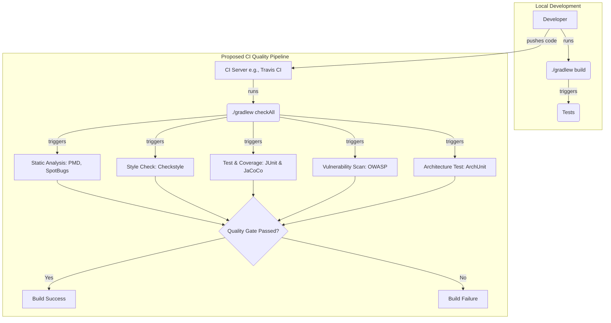

# CI Quality Gates Integration Plan

## 1. Executive Summary & Goals
This document outlines a plan to integrate a suite of automated quality evaluation tools into the Continuous Integration (CI) pipeline for the `metricstree` project. The current setup has a strong foundation in testing but lacks automated checks for code style, static analysis, security vulnerabilities, and architectural adherence.

The primary goals of this plan are:
-   **Improve Code Quality & Maintainability:** Automatically detect and report code smells, potential bugs, and style violations.
-   **Enhance Security Posture:** Proactively identify and manage known vulnerabilities in third-party dependencies.
-   **Enforce Architectural Integrity:** Ensure the codebase adheres to the defined architectural principles, preventing architectural drift.

## 2. Current Situation Analysis
The project is a Java-based IntelliJ IDEA plugin built with Gradle and uses Travis CI for its CI/CD pipeline.

-   **Strengths:**
    -   A well-defined, multi-layered testing strategy is in place (`test`, `integration-test`, `e2e-test`).
    -   The project architecture is documented in `architecture/arch_spec.md`, indicating a commitment to clean design.
    -   The use of Gradle provides a standard, extensible build system for integrating new tools.

-   **Areas for Improvement:**
    -   **No Automated Static Analysis:** There are no tools like PMD, SpotBugs, or Checkstyle configured in the build, meaning bug patterns and code smells are likely found only through manual review.
    -   **No Code Coverage Reporting:** While tests exist, their effectiveness is not measured or tracked over time via code coverage metrics.
    -   **No Dependency Vulnerability Scanning:** The project's dependencies are not automatically scanned for known security vulnerabilities.
    -   **No Architectural Enforcement:** The architectural rules described in `arch_spec.md` are not automatically enforced, risking violations over time.

## 3. Proposed Solution / Refactoring Strategy
### 3.1. High-Level Design / Architectural Overview
We will introduce a "Quality Gates" layer into the Gradle build process. This will be achieved by integrating several quality tools via their respective Gradle plugins. These individual checks will be aggregated into a single Gradle task (e.g., `checkAll` or `qualityGate`) that can be easily executed by the CI pipeline.

The CI process will be updated to execute this aggregate task. Initially, the task can be configured to report issues without failing the build to establish a baseline. Subsequently, it can be configured to fail the build if high-severity issues are detected, thus acting as a true quality gate for pull requests and merges.

### 3.2. Key Components / Modules (Recommended Tools)
The following tools are recommended due to their maturity, strong community support, and excellent Gradle integration.

-   **Static Analysis (Bugs & Smells):**
    -   **SpotBugs:** Analyzes bytecode to find potential bug patterns. More effective at finding actual bugs than style checkers.
    -   **PMD:** Analyzes source code to find common programming flaws, such as unused variables, empty catch blocks, and overly complex code.
-   **Code Style & Formatting:**
    -   **Checkstyle:** Enforces a consistent coding standard and style, improving readability and maintainability.
-   **Code Coverage:**
    -   **JaCoCo:** The de-facto standard for code coverage in Java. It will measure the percentage of code exercised by the unit and integration tests.
-   **Dependency Vulnerability Scanning:**
    -   **OWASP Dependency-Check:** Scans project dependencies for known, publicly disclosed vulnerabilities (CVEs).
-   **Architectural Rule Enforcement:**
    -   **ArchUnit:** A Java library that allows for writing plain Java unit tests to check architectural rules, such as layer dependencies, package containment, and naming conventions.

### 3.3. Detailed Action Plan / Phases
This plan is broken into phases to allow for incremental adoption and to manage the initial volume of reported issues.

#### Phase 1: Foundational Static Analysis & Code Style
-   **Objective(s):** Establish a baseline for code quality and enforce a consistent style.
-   **Priority:** High

-   **Task 1.1: Integrate Checkstyle**
    -   **Rationale/Goal:** Enforce a consistent coding style across the project to improve readability. A standard ruleset (e.g., Google Java Style) should be chosen as a starting point.
    -   **Estimated Effort (Optional):** M
    -   **Deliverable/Criteria for Completion:** The `./gradlew checkstyleMain` task is added to the build and runs successfully, generating a report. The initial configuration and ruleset are committed.

-   **Task 1.2: Integrate PMD**
    -   **Rationale/Goal:** Automatically detect common programming flaws and "code smells" that are not caught by the compiler.
    -   **Estimated Effort (Optional):** M
    -   **Deliverable/Criteria for Completion:** The `./gradlew pmdMain` task is added and runs successfully, generating a report. A baseline of issues is established.

-   **Task 1.3: Integrate SpotBugs**
    -   **Rationale/Goal:** Perform deeper analysis on the compiled bytecode to find potential bugs, such as null pointer dereferences and resource leaks.
    -   **Estimated Effort (Optional):** M
    -   **Deliverable/Criteria for Completion:** The `./gradlew spotbugsMain` task is added and runs successfully, generating a report.

-   **Task 1.4: Create an Aggregate Quality Task**
    -   **Rationale/Goal:** Create a single Gradle task (e.g., `checkAll`) that depends on `checkstyleMain`, `pmdMain`, and `spotbugsMain` for easy execution in the CI pipeline.
    -   **Estimated Effort (Optional):** S
    -   **Deliverable/Criteria for Completion:** Running `./gradlew checkAll` executes all three static analysis tasks.

#### Phase 2: Code Coverage & Architectural Validation
-   **Objective(s):** Measure test effectiveness and programmatically enforce architectural rules.
-   **Priority:** High

-   **Task 2.1: Integrate JaCoCo for Code Coverage**
    -   **Rationale/Goal:** Measure the percentage of code covered by the existing test suites (`test`, `integration-test`, `e2e-test`). This provides a quantifiable metric for test quality.
    -   **Estimated Effort (Optional):** M
    -   **Deliverable/Criteria for Completion:** The `./gradlew jacocoTestReport` task is configured and generates an HTML coverage report after tests are run.

-   **Task 2.2: (Optional) Publish Coverage Reports**
    -   **Rationale/Goal:** Integrate with a third-party service like [Codecov](https://about.codecov.io/) or [Coveralls](https://coveralls.io/) to track coverage over time and display results on pull requests.
    -   **Estimated Effort (Optional):** S
    -   **Deliverable/Criteria for Completion:** CI pipeline successfully uploads coverage data. A coverage badge can be added to the `README.md`.

-   **Task 2.3: Implement ArchUnit Tests**
    -   **Rationale/Goal:** Codify the architectural rules from `architecture/arch_spec.md` into executable tests. This prevents violations of the layered architecture (e.g., UI layer calling core logic directly).
    -   **Estimated Effort (Optional):** L
    -   **Deliverable/Criteria for Completion:** A new test class using ArchUnit is created in the `test` or `integration-test` source set. It contains at least one rule (e.g., "services must not depend on UI packages") and is executed as part of the test suite.

#### Phase 3: Security & CI Enforcement
-   **Objective(s):** Introduce automated security checks and integrate all quality gates into the CI pipeline.
-   **Priority:** Medium

-   **Task 3.1: Integrate OWASP Dependency-Check**
    -   **Rationale/Goal:** Automatically scan project dependencies for known vulnerabilities to improve the security posture of the plugin.
    -   **Estimated Effort (Optional):** M
    -   **Deliverable/Criteria for Completion:** The `./gradlew dependencyCheckAnalyze` task is configured and runs successfully, generating a vulnerability report.

-   **Task 3.2: Update CI Configuration**
    -   **Rationale/Goal:** Modify the `.travis.yml` file (or future CI configuration) to execute the aggregate quality tasks (e.g., `./gradlew checkAll jacocoTestReport dependencyCheckAnalyze`).
    -   **Estimated Effort (Optional):** S
    -   **Deliverable/Criteria for Completion:** The CI build log shows that all quality tasks are being executed on every run.

-   **Task 3.3: Enforce Quality Gates**
    -   **Rationale/Goal:** Configure the Gradle build to fail if any of the quality checks produce high-severity warnings or if coverage drops below a defined threshold. This turns the checks into true gates.
    -   **Estimated Effort (Optional):** S
    -   **Deliverable/Criteria for Completion:** The CI build fails when a new, severe issue is introduced in a pull request.

## 4. Key Considerations & Risk Mitigation
### 4.1. Technical Risks & Challenges
-   **Initial Volume of Issues:** The first run of static analysis tools may report a large number of issues.
    -   **Mitigation:** Create a baseline by suppressing existing issues in a configuration file. The build should only fail on *new* issues. The team can then work through the baseline technical debt over time.
-   **Build Time Increase:** Adding these checks will increase the CI build time.
    -   **Mitigation:** The performance impact of these tools is generally acceptable. However, the `dependencyCheckAnalyze` task can be slower as it downloads a vulnerability database. If necessary, it can be configured to run on a less frequent schedule (e.g., nightly or weekly) instead of on every commit.
-   **Configuration Overhead:** Setting up rulesets for Checkstyle, PMD, and SpotBugs requires an initial effort.
    -   **Mitigation:** Start with widely-accepted default configurations (e.g., Google Java Style for Checkstyle) and customize them incrementally as needed.

### 4.2. Dependencies
-   The plan relies on external Gradle plugins for each tool. These are well-maintained and widely used.
-   Task 2.2 (optional coverage reporting) depends on an external service like Codecov or Coveralls.

### 4.3. Non-Functional Requirements (NFRs) Addressed
-   **Maintainability:** Directly improved by Checkstyle, PMD, and ArchUnit, which enforce clean, consistent, and well-structured code.
-   **Reliability:** Improved by SpotBugs (detecting potential bugs) and JaCoCo (ensuring critical code paths are tested).
-   **Security:** Directly addressed by the OWASP Dependency-Check tool, which finds vulnerabilities in third-party libraries.

## 5. Success Metrics / Validation Criteria
-   The number of bugs or style issues caught during manual code review decreases over time.
-   Code coverage percentage remains stable or trends upward.
-   The CI build successfully fails when a pull request introduces a new high-severity static analysis issue or a new critical vulnerability.
-   The project maintains a "zero critical/high vulnerability" status in its dependency reports.

## 6. Assumptions Made
-   The development team is willing to adopt and adhere to the standards enforced by these tools.
-   The CI environment has sufficient resources and permissions to execute the new Gradle tasks.
-   The team will agree on a process for handling the initial set of issues reported by the tools.

## 7. Open Questions / Areas for Further Investigation
-   Which specific Checkstyle ruleset (e.g., Google, Sun) should be adopted as the project's standard?
-   What is the initial target for code coverage percentage to be enforced by the build?
-   What is the strategy for addressing the initial findings from PMD and SpotBugs? (e.g., fix all at once, fix over several sprints, suppress non-critical issues).