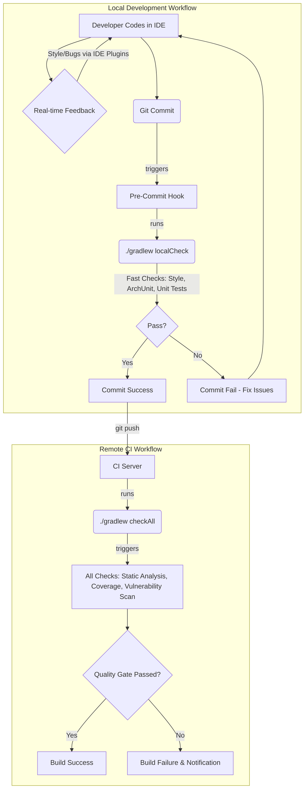

# Design Plan: Quality Gates for Single-Developer Mode

## 1. Executive Summary & Goals
This document outlines a practical strategy for adapting the comprehensive CI Quality Gates plan for a single-developer workflow. The primary objective is to provide rapid, actionable feedback during local development while ensuring a complete quality and security backstop through a remote process.

The key goals are:
*   **Fast Feedback Loop:** Enable the developer to catch common style, bug, and architectural issues in real-time or pre-commit without significant delays.
*   **Comprehensive Assurance:** Use a remote process (CI server) to run slower, more exhaustive checks like dependency vulnerability scanning and code coverage enforcement.
*   **Frictionless Workflow:** Integrate checks seamlessly into the IDE and local build process to encourage adoption and maintain high code quality without being burdensome.

## 2. Current Situation Analysis
The existing `docs/ci/quality_gates.md` document proposes a robust quality pipeline designed for a team environment. It integrates static analysis (PMD, SpotBugs), style checking (Checkstyle), test coverage (JaCoCo), vulnerability scanning (OWASP), and architectural validation (ArchUnit) into a single CI task that fails the build on violations.

While excellent for team-based CI, this "all-or-nothing" approach can introduce significant friction for a single developer due to:
*   **Slow Local Builds:** Running all checks, especially dependency scanning and full test coverage analysis, can significantly increase local build times, discouraging frequent validation.
*   **Delayed Feedback:** If all checks are deferred to a remote CI server, the feedback loop for simple style or logic errors becomes too long, leading to context switching and frustration.

## 3. Proposed Solution / Refactoring Strategy
### 3.1. High-Level Design / Architectural Overview
The proposed strategy is a hybrid model that splits the quality gates into two categories: **Local Gates** (for speed and immediate feedback) and **Remote Gates** (for completeness and security).

*   **Local Gates:** These are fast, essential checks integrated directly into the developer's IDE and local Gradle build. They are designed to be run frequently, ideally in real-time or via a pre-commit hook.
*   **Remote Gates:** These are more comprehensive and potentially slower checks that run on a CI server (e.g., GitHub Actions, Travis CI) after code is pushed to the remote repository. This serves as the definitive quality gate before code is considered "done".

### 3.2. Justification of Gate Placement

| Tool / Gate                 | Placement | Justification                                                                                                                                                                                                                         |
| --------------------------- | :---------: | ------------------------------------------------------------------------------------------------------------------------------------------------------------------------------------------------------------------------------------- |
| **Checkstyle**              | **Local**   | **Speed & Immediacy:** Extremely fast source code analysis. Integrating it into the IDE provides real-time feedback on formatting and style, allowing fixes before the code is even saved. It causes negligible overhead in a pre-commit hook. |
| **PMD / SpotBugs**          | **Both**    | **Local (Light):** A curated, lightweight ruleset focusing on critical bugs (e.g., null pointers, resource leaks) can run quickly locally, providing immediate feedback on common programming errors.   **Remote (Full):** The complete, exhaustive ruleset should run remotely to catch more subtle issues without slowing down the local development cycle. |
| **JUnit & JaCoCo (Tests)**  | **Both**    | **Local (Execution):** All unit, integration, and architectural tests *must* pass locally before any commit. This is a non-negotiable, fast-feedback gate.   **Remote (Coverage Enforcement):** Generating and analyzing the full code coverage report can be slow. The remote gate should run the tests again and *enforce a coverage threshold*, failing the build if it drops. |
| **ArchUnit**                | **Local**   | **Architectural Integrity:** These are fast-running tests that provide critical, high-level feedback on the design. A developer needs to know immediately if they have violated a core architectural principle (e.g., UI code calling the domain layer directly). They should be part of the standard local test suite. |
| **OWASP Dependency-Check**  | **Remote**  | **Performance & Scope:** This is the slowest check as it often requires downloading and processing a large vulnerability database. It is not necessary to run on every local build. A remote check triggered on push (or nightly) provides sufficient security assurance for a solo developer. |

### 3.3. Detailed Action Plan / Phases
This plan is designed for incremental implementation.

#### Phase 1: Local Environment Fortification
-   **Objective(s):** Provide the fastest possible feedback loop for the most common issues.
-   **Priority:** High

-   **Task 1.1: Configure IDE Integrations**
    -   **Rationale/Goal:** To get real-time, as-you-type feedback, which is the fastest possible loop.
    -   **Estimated Effort (Optional):** S
    -   **Deliverable/Criteria for Completion:** Install and configure IDE plugins like "CheckStyle-IDEA". The IDE highlights style violations and potential bugs from a lightweight PMD/SpotBugs ruleset in the editor.

-   **Task 1.2: Create a `localCheck` Gradle Task**
    -   **Rationale/Goal:** To create a single, fast command that aggregates all essential local checks for use in pre-commit hooks or manual validation.
    -   **Estimated Effort (Optional):** M
    -   **Deliverable/Criteria for Completion:** A new Gradle task `localCheck` is created in `build.gradle.kts`. It depends on `checkstyleMain`, `test`, and a new `pmdLight` task (a PMD task configured with a minimal ruleset).

-   **Task 1.3: Implement ArchUnit Tests**
    -   **Rationale/Goal:** Codify the architectural rules from `architecture/arch_spec.md` into executable tests to prevent architectural drift.
    -   **Estimated Effort (Optional):** L
    -   **Deliverable/Criteria for Completion:** An `ArchUnit` test class is added to the `integration-test` source set. It includes rules to enforce layering (e.g., "UI layer must not be accessed by Core Logic") and is executed by the `./gradlew test` task.

-   **Task 1.4: (Optional but Recommended) Implement a Git Pre-Commit Hook**
    -   **Rationale/Goal:** To automate the execution of local checks, ensuring no code is committed that violates local quality standards.
    -   **Estimated Effort (Optional):** S
    -   **Deliverable/Criteria for Completion:** A script is added to `.git/hooks/pre-commit` that executes `./gradlew localCheck`. The commit is aborted if the task fails.

#### Phase 2: Remote CI Gatekeeper Setup
-   **Objective(s):** Establish a definitive, comprehensive quality gate that runs automatically on every code push.
-   **Priority:** Medium

-   **Task 2.1: Configure the `checkAll` Aggregate Gradle Task**
    -   **Rationale/Goal:** To have a single command for the CI server to run that executes every quality check, including the slow ones.
    -   **Estimated Effort (Optional):** S
    -   **Deliverable/Criteria for Completion:** A Gradle task `checkAll` is created that depends on `check`, `pmdMain`, `spotbugsMain`, `jacocoTestReport`, and `dependencyCheckAnalyze`.

-   **Task 2.2: Create a CI Server Configuration**
    -   **Rationale/Goal:** To automate the execution of the `checkAll` task on a remote server.
    -   **Estimated Effort (Optional):** M
    -   **Deliverable/Criteria for Completion:** A configuration file (e.g., `.github/workflows/ci.yml` for GitHub Actions) is created. The configuration defines a job that checks out the code and runs `./gradlew checkAll` on every push to the main branch.

-   **Task 2.3: Enforce Build Failure**
    -   **Rationale/Goal:** To turn the remote checks into a true "gate" that prevents low-quality or insecure code from being merged.
    -   **Estimated Effort (Optional):** S
    -   **Deliverable/Criteria for Completion:** The Gradle tasks (`pmd`, `dependencyCheckAnalyze`, `jacoco`) are configured to fail the build if high-severity issues are found or if code coverage drops below a defined threshold (e.g., 80%). The CI build log clearly shows a failure in these cases.

## 4. Key Considerations & Risk Mitigation
### 4.1. Technical Risks & Challenges
-   **Local Build Performance:** Even "fast" checks can accumulate and slow down the pre-commit hook.
    -   **Mitigation:** Initially, only include Checkstyle and ArchUnit tests in the `localCheck` task. Add lightweight PMD/SpotBugs rules incrementally and monitor performance.
-   **Initial Volume of Issues:** The first run of these tools will likely report a large number of existing issues, making the gates impossible to pass.
    -   **Mitigation:** Establish a baseline for all tools. Configure them to ignore existing issues and only fail on *newly introduced* violations. The existing issues can be addressed gradually over time.
-   **Configuration Complexity:** Setting up Gradle plugins and CI configurations can be time-consuming.
    -   **Mitigation:** Follow the phased approach. Start with the local setup, which provides the most immediate value. Use standard, community-accepted default configurations for tools like Checkstyle and PMD before customizing.

### 4.2. Dependencies
-   **Internal:** The `localCheck` task (1.2) is a prerequisite for the pre-commit hook (1.4). The `checkAll` task (2.1) is a prerequisite for the CI configuration (2.2).
-   **External:** This plan relies on the availability of a Git hosting platform with CI/CD capabilities (e.g., GitHub, GitLab).

### 4.3. Non-Functional Requirements (NFRs) Addressed
-   **Maintainability:** Directly improved by enforcing consistent style (Checkstyle), reducing complexity (PMD), and maintaining architectural integrity (ArchUnit).
-   **Reliability:** Improved by running all tests automatically (local and remote) and detecting potential bugs early (PMD/SpotBugs).
-   **Security:** Directly addressed by the remote OWASP Dependency-Check gate, which prevents the introduction of known vulnerabilities.

## 5. Success Metrics / Validation Criteria
-   The pre-commit hook successfully blocks a commit containing a style violation.
-   The remote CI build fails when a push includes a high-severity vulnerability in a dependency.
-   The developer receives feedback from IDE plugins without having to run a manual build.
-   The time to run the local `./gradlew localCheck` task remains under a reasonable threshold (e.g., 1-2 minutes).

## 6. Assumptions Made
-   The developer uses a Git-based version control system and a remote repository that supports CI runners.
-   The developer is using an IDE (like IntelliJ IDEA) that supports plugins for tools like Checkstyle.
-   The primary build tool is Gradle, as indicated in the project structure.

## 7. Open Questions / Areas for Further Investigation
-   What is the initial set of "critical" PMD/SpotBugs rules to be included in the `localCheck` task?
-   What is the initial code coverage percentage to be enforced by the remote JaCoCo gate?
-   What is the preferred CI platform (e.g., GitHub Actions, Travis CI, GitLab CI)? The plan should be adapted to the specific syntax of the chosen platform.

