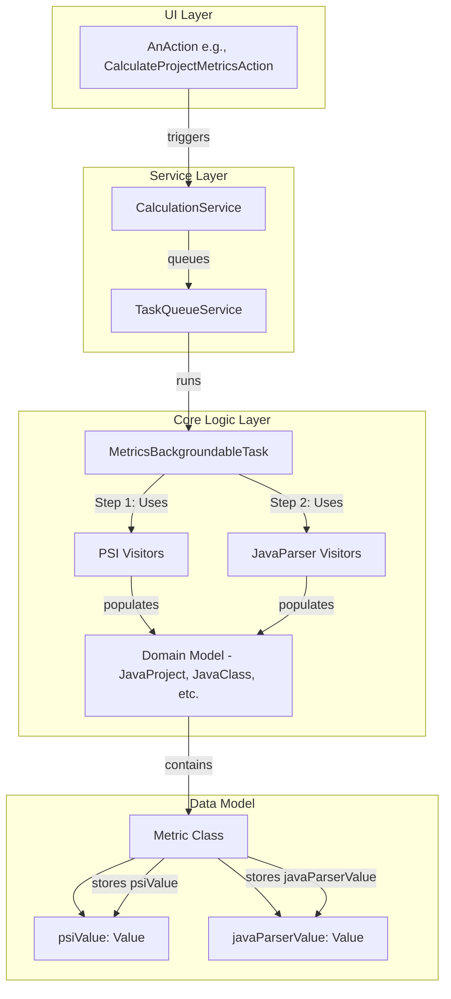

# Refactoring Plan: Parallel PSI and JavaParser Metric Calculation

## 1. Executive Summary & Goals
This plan details the refactoring required to integrate metric calculations using the JavaParser library to run in parallel with the existing PSI-based calculations. The results from both engines will be stored and displayed simultaneously, allowing for comparative analysis.

-   **Primary Objective:** To enhance the system's analytical capabilities by calculating software metrics using two distinct parsing technologies (PSI and JavaParser) in a single execution.
-   **Key Goals:**
    1.  Refactor the core data model to accommodate metric values from both PSI and JavaParser sources.
    2.  Integrate a JavaParser-based calculation workflow that runs alongside the existing PSI workflow.
    3.  Update the UI, specifically the metrics trees and summary tables, to display the JavaParser-calculated value in parentheses immediately following the PSI-calculated value (e.g., `WMC: 15 (16)`).

## 2. Current Situation Analysis
The existing architecture is a well-defined, service-oriented model as documented in `docs/architecture/arch_spec.md`. Calculations are initiated by UI `Actions`, orchestrated by the `CalculationService`, and executed in the background. The core logic resides in `builder` classes which use PSI-based `visitor` classes to traverse the code and compute metrics.

-   **Key Strengths:** The decoupled architecture, particularly the separation of UI, services, and core logic, provides a strong foundation for this enhancement. The use of background tasks ensures UI responsiveness.
-   **Key Limitations:**
    -   The core data model, specifically the `Metric` and `Value` classes, is designed to store only a single numerical result per metric.
    -   The calculation logic is tightly coupled to the PSI API, with no mechanism for a parallel calculation run using a different source.
-   **Existing Plans:** Previous design documents (`docs/javaparser/*.md`) outlined a strategy to introduce JavaParser as an *alternative*, switchable engine. This plan adapts that work to support the new requirement of *parallel* execution and dual-value display.

## 3. Proposed Solution / Refactoring Strategy
### 3.1. High-Level Design / Architectural Overview
The core of this strategy is to augment the existing data model and calculation flow rather than replacing components. The `Metric` class will be modified to store two values. The `CalculationService` will be updated to orchestrate a two-stage calculation within a single background task: first calculating all PSI-based values, then iterating over the same model to add the JavaParser-based values.



### 3.2. Key Components / Modules
-   **`model.metric.Metric` (Modification):** This class will be the primary data model change. It will be refactored to hold two `Value` objects instead of one.
-   **`builder.PsiCalculationStrategy` & `builder.JavaParserCalculationStrategy` (Adaptation):** The existing plan to create these strategies will be adapted. Instead of being mutually exclusive, the `CalculationService` will use them sequentially. The `PsiCalculationStrategy` will build the initial model, and the `JavaParserCalculationStrategy` will augment the existing model with its results.
-   **`model.javaparser.visitor.*` (New Package):** A new package will be created to house a complete suite of metric calculation visitors that operate on the JavaParser Abstract Syntax Tree (AST), mirroring the existing PSI visitor structure.
-   **`ui.tree.node.MetricNode` (Modification):** The `render` method of this class will be updated to fetch both metric values and format them for display.
-   **`ui.info.MetricsSummaryTable` (Modification):** The table model and cell renderer for this component will be updated to display both values.

### 3.3. Detailed Action Plan / Phases
#### Phase 1: Data Model Refactoring
-   **Objective(s):** Modify the core `Metric` class to support dual values. This foundational step will intentionally cause compilation errors, clearly identifying all affected parts of the codebase.
-   **Priority:** High
-   **Task 1.1: Modify `Metric` Class**
    -   **Rationale/Goal:** To enable the storage of two distinct values for each metric.
    -   **Estimated Effort (Optional):** M
    -   **Deliverable/Criteria for Completion:**
        -   The `Metric` class is changed from `private final Value value;` to:
            ```java
            private Value psiValue;
            private Value javaParserValue;
            ```
        -   Getters and setters (`getPsiValue`, `setPsiValue`, `getJavaParserValue`, `setJavaParserValue`) are created. The legacy `getValue()` method is marked as deprecated and modified to return `getPsiValue()` for backward compatibility during the transition.
        -   Factory methods like `Metric.of(...)` are updated to accept an initial value and initialize `psiValue`.
-   **Task 1.2: Update Codebase to Compile**
    -   **Rationale/Goal:** To resolve all compilation errors caused by the `Metric` class refactoring, ensuring the application functions as before, with the JavaParser value being null or `Value.UNDEFINED`.
    -   **Estimated Effort (Optional):** L
    -   **Deliverable/Criteria for Completion:**
        -   All calls to `metric.getValue()` are reviewed and replaced with `metric.getPsiValue()` where appropriate.
        -   All instantiations of `Metric` are updated.
        -   The entire project compiles successfully. All existing tests pass.

#### Phase 2: Parallel Calculation Implementation
-   **Objective(s):** Integrate the JavaParser calculation logic into the main workflow and populate the new `javaParserValue` field.
-   **Priority:** High
-   **Task 2.1: Implement Full Suite of JavaParser Visitors**
    -   **Rationale/Goal:** To create JavaParser-based calculators for all metrics that currently exist in the PSI-based system.
    -   **Estimated Effort (Optional):** L
    -   **Deliverable/Criteria for Completion:** For every visitor in `org.b333vv.metric.model.visitor.*`, a corresponding visitor is created in `org.b333vv.metric.model.javaparser.visitor.*` that performs the same calculation on a JavaParser AST.
-   **Task 2.2: Modify `CalculationService` and Strategies**
    -   **Rationale/Goal:** To orchestrate the two-part calculation process within a single background task.
    -   **Estimated Effort (Optional):** M
    -   **Deliverable/Criteria for Completion:**
        -   The primary background task in `CalculationServiceImpl` is modified.
        -   **Step 1:** It calls the `PsiCalculationStrategy` to build the `JavaProject` model and calculate all metrics, populating the `psiValue` field in each `Metric` object.
        -   **Step 2:** It then calls the `JavaParserCalculationStrategy`. This strategy receives the *already populated* `JavaProject` model. It traverses the project files using JavaParser, calculates each metric, and populates the corresponding `javaParserValue` field on the *existing* `Metric` objects.
        -   The `CacheService` will now store the `JavaProject` model containing both sets of values.

#### Phase 3: UI Display Refactoring
-   **Objective(s):** Update all relevant UI components to display both metric values in the specified format.
-   **Priority:** Medium
-   **Task 3.1: Update `MetricNode` Renderer**
    -   **Rationale/Goal:** To display both values in the metrics tree.
    -   **Estimated Effort (Optional):** S
    -   **Deliverable/Criteria for Completion:**
        -   The `render` method in `MetricNode` is modified.
        -   It now constructs the display string as: `metric.getType().description() + ": " + metric.getPsiValue() + " (" + metric.getJavaParserValue() + ")"`.
        -   It must gracefully handle cases where `javaParserValue` is null or `Value.UNDEFINED` (e.g., by omitting the parentheses).
-   **Task 3.2: Update `MetricsSummaryTable`**
    -   **Rationale/Goal:** To display both values in the summary table view.
    -   **Estimated Effort (Optional):** M
    -   **Deliverable/Criteria for Completion:**
        -   The `Value` column in the `MetricsSummaryTable.Model` is updated.
        -   The `getValueAt` method now returns a formatted string: `psiValue + " (" + javaParserValue + ")"`.
        -   The cell renderer logic that colors the value based on its range should continue to operate on the primary `psiValue`.

## 4. Key Considerations & Risk Mitigation
### 4.1. Technical Risks & Challenges
-   **Performance Degradation:** Executing two separate, full-project static analysis runs will increase calculation time.
    -   **Mitigation:** The existing background task architecture is crucial and must be maintained. The plan assumes this overhead is acceptable. A future enhancement could add a setting to enable/disable the JavaParser calculation to manage performance.
-   **Metric Value Discrepancies:** JavaParser and PSI may interpret code constructs differently, leading to different metric values.
    -   **Mitigation:** This is an expected outcome and a primary reason for the feature. A dedicated testing task should be created to run both engines against a sample project, compare the results, and document any non-obvious discrepancies to ensure they stem from legitimate parser differences, not bugs.
-   **JavaParser Type Resolution:** Accurately calculating metrics like CBO and DIT requires robust type resolution, which can be complex to configure for JavaParser across different project structures.
    -   **Mitigation:** The implementation of the `JavaParserCalculationStrategy` must carefully configure the `TypeSolver` to be aware of the project's source roots, module dependencies, and library classpaths.

### 4.2. Dependencies
-   **Internal:** Phase 1 (Data Model) is a blocker for all subsequent phases. Phase 2 (Calculation Logic) must be complete before Phase 3 (UI) can be fully validated.

## 5. Success Metrics / Validation Criteria
-   The UI correctly displays metric values in the format `Metric: X (Y)` in both the metrics tree and summary tables.
-   The application remains stable and responsive, with long calculations running in the background.
-   Unit and integration tests are updated to validate the new dual-value `Metric` model.
-   A comparative analysis confirms that both PSI and JavaParser values are being calculated and stored correctly.

## 6. Assumptions Made
-   The existing domain model (`JavaProject`, `JavaClass`, etc.) is sufficiently abstract to be populated by both PSI and JavaParser backends. This is supported by previous analysis in `docs/javaparser/phase2-3.md`.
-   The performance impact of running both calculation engines is acceptable for the end-user.

## 7. Open Questions / Areas for Further Investigation
-   Should the range-based highlighting (e.g., red for extreme values) in the UI be based on the PSI value, the JavaParser value, or the worse of the two? (Assumption: Based on PSI value for now).
-   How should the system behave if the JavaParser engine fails to parse a file that the PSI engine handles correctly (or vice-versa)? (Assumption: The `javaParserValue` should be set to `Value.UNDEFINED` and a log entry should be created).

