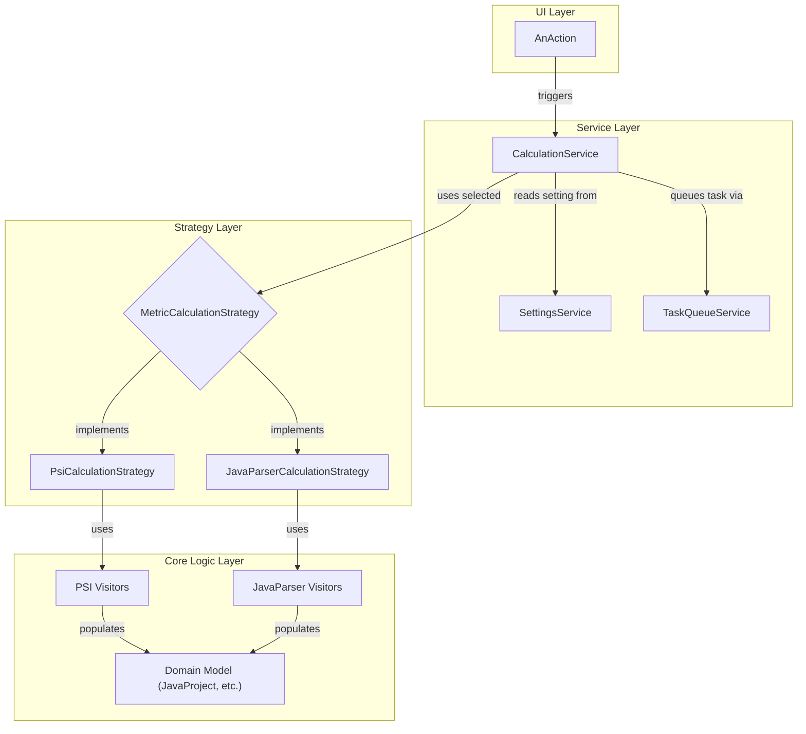

# Refactoring Plan: Introduce JavaParser as a Metric Calculation Engine

## 1. Executive Summary & Goals
This plan outlines the refactoring of the metric calculation logic to introduce the JavaParser library as an alternative to the existing PSI-based implementation. The user will be able to select the desired calculation engine through the plugin's settings.

- **Primary Objective:** To create a flexible architecture that supports multiple metric calculation engines.
- **Key Goals:**
    1.  Integrate JavaParser for metric calculation while preserving the existing PSI implementation.
    2.  Provide a user-configurable setting to switch between PSI and JavaParser.
    3.  Establish a decoupled, strategy-based design for the calculation logic that allows for future expansion.

## 2. Current Situation Analysis
The current architecture is well-structured and service-oriented, as documented in `docs/architecture/arch_spec.md`. Metric calculation is initiated by UI `Actions`, which delegate to the `CalculationService`. This service orchestrates the process, utilizing a `TaskQueueService` for background execution and a `CacheService` for results.

The core calculation logic resides in the `builder` package, specifically within `ClassAndMethodsMetricsCalculator` and its underlying `*ModelBuilder` classes. These builders use a suite of `visitor` classes (`org.b333vv.metric.model.visitor.*`) that traverse the IntelliJ Platform's Program Structure Interface (PSI) tree to compute metrics.

- **Key Strengths:** The service-oriented design and use of a message bus for UI updates provide a solid foundation for this refactoring. The core logic is largely separate from the UI.
- **Key Limitations:** The calculation logic in the `builder` and `visitor` packages is tightly coupled to the PSI API. There is no abstraction that would allow for an alternative parsing and calculation engine.

## 3. Proposed Solution / Refactoring Strategy
### 3.1. High-Level Design / Architectural Overview
The proposed solution is to introduce a **Strategy Pattern** for the metric calculation engine. This will decouple the `CalculationService` from the specifics of any single implementation (PSI or JavaParser).

1.  An abstraction, `MetricCalculationStrategy`, will be created to define the contract for building the metric model.
2.  The existing PSI-based logic will be encapsulated within a `PsiCalculationStrategy` class.
3.  A new `JavaParserCalculationStrategy` class will be created to house the JavaParser-based implementation.
4.  The `CalculationService` will be modified to delegate calculation tasks to the currently selected strategy, which will be determined by a new user setting.

The existing domain model (`org.b333vv.metric.model.code.*`) will remain unchanged. Both strategies will be responsible for populating this same model.



### 3.2. Key Components / Modules
-   **`MetricCalculationStrategy` (Interface):** A new interface defining the method(s) for calculating metrics for a given scope, e.g., `JavaProject calculate(AnalysisScope scope, ProgressIndicator indicator)`.
-   **`PsiCalculationStrategy` (Implementation):** A new class that implements `MetricCalculationStrategy`. It will contain the refactored logic from the existing `ClassAndMethodsMetricsCalculator`, `ProjectModelBuilder`, and related PSI-based builders.
-   **`JavaParserCalculationStrategy` (Implementation):** A new class that implements `MetricCalculationStrategy`. It will be responsible for parsing the project files using JavaParser and running a new set of JavaParser-based visitors to populate the domain model.
-   **`...model.javaparser.visitor` (New Package):** A new package to house metric calculation visitors that operate on the JavaParser Abstract Syntax Tree (AST), mirroring the existing `...model.visitor` package structure.
-   **`OtherSettings` / `OtherSettingsPanel` (Modification):** The existing settings classes will be updated to include a new option (e.g., a dropdown or radio button group) for the user to select the calculation engine.

### 3.3. Detailed Action Plan / Phases
#### Phase 1: Configuration and Abstraction Layer
-   **Objective(s):** Introduce the strategy pattern and configuration setting without altering existing functionality.
-   **Priority:** High
-   **Task 1.1: Add Configuration Setting**
    -   **Rationale/Goal:** Allow the user to select the calculation engine.
    -   **Estimated Effort (Optional):** S
    -   **Deliverable/Criteria for Completion:**
        -   An enum `CalculationEngine { PSI, JAVAPARSER }` is created.
        -   A field `private CalculationEngine calculationEngine = CalculationEngine.PSI;` is added to `OtherSettings`.
        -   A UI component (e.g., `JComboBox`) is added to `OtherSettingsPanel` to modify this setting.
        -   The setting is exposed via the `SettingsService`.
-   **Task 1.2: Create `MetricCalculationStrategy` Interface**
    -   **Rationale/Goal:** Define a common contract for all calculation engines.
    -   **Estimated Effort (Optional):** S
    -   **Deliverable/Criteria for Completion:** An interface `MetricCalculationStrategy` with a `calculate` method is created in the `...builder` package.
-   **Task 1.3: Refactor Existing Logic into `PsiCalculationStrategy`**
    -   **Rationale/Goal:** Encapsulate the current PSI-based implementation into a concrete strategy class. This is a pure refactoring step.
    -   **Estimated Effort (Optional):** M
    -   **Deliverable/Criteria for Completion:**
        -   A new class `PsiCalculationStrategy` is created, implementing `MetricCalculationStrategy`.
        -   The core logic from `CalculationServiceImpl`'s `getOrBuild...` methods and the `ClassAndMethodsMetricsCalculator` is moved into this new class.
        -   `CalculationServiceImpl` is updated to instantiate and call `PsiCalculationStrategy` directly. The application's behavior should be identical to the current state.
-   **Task 1.4: Introduce Strategy Selection in `CalculationService`**
    -   **Rationale/Goal:** Make the `CalculationService` aware of the different strategies and the user's selection.
    -   **Estimated Effort (Optional):** M
    -   **Deliverable/Criteria for Completion:**
        -   `CalculationServiceImpl` is modified to use a factory or a `switch` statement based on the `SettingsService` value to choose the appropriate `MetricCalculationStrategy`.
        -   A listener is added to the settings, so that when the engine is changed, the `CacheService` is instructed to invalidate all metric-related caches.

#### Phase 2: JavaParser Integration and Implementation
-   **Objective(s):** Set up the foundation for the new JavaParser engine and implement a proof-of-concept.
-   **Priority:** Medium
-   **Task 2.1: Add JavaParser Dependency**
    -   **Rationale/Goal:** Make the JavaParser library available to the project.
    -   **Estimated Effort (Optional):** S
    -   **Deliverable/Criteria for Completion:** The `com.github.javaparser:javaparser-symbol-solver-core` dependency is added to `build.gradle.kts`.
-   **Task 2.2: Create `JavaParserCalculationStrategy` Skeleton**
    -   **Rationale/Goal:** Create the entry point for the new calculation logic.
    -   **Estimated Effort (Optional):** S
    -   **Deliverable/Criteria for Completion:** A new class `JavaParserCalculationStrategy` is created that implements `MetricCalculationStrategy` with a placeholder `calculate` method.
-   **Task 2.3: Implement JavaParser-based Visitors (Proof of Concept)**
    -   **Rationale/Goal:** Implement a few simple metrics to validate the approach of populating the existing domain model from a JavaParser AST.
    -   **Estimated Effort (Optional):** L
    -   **Deliverable/Criteria for Completion:**
        -   A new package `org.b333vv.metric.model.javaparser.visitor` is created.
        -   JavaParser visitors for simple metrics like `NOM` (Number of Methods) and `WMC` (Weighted Method Count) are implemented. These visitors must populate the project's `JavaClass` and `JavaMethod` objects.
        -   The `JavaParserCalculationStrategy` is updated to parse files and run these new visitors.

### 3.5. API Design / Interface Changes
-   **New Interface:** `org.b333vv.metric.builder.MetricCalculationStrategy`
    ```java
    public interface MetricCalculationStrategy {
        JavaProject calculate(AnalysisScope scope, ProgressIndicator indicator);
    }
    ```
-   **Modified Service:** `CalculationServiceImpl` will no longer contain the core calculation logic directly but will delegate to a `MetricCalculationStrategy` instance.

## 4. Key Considerations & Risk Mitigation
### 4.1. Technical Risks & Challenges
-   **Metric Discrepancies:** JavaParser and PSI may resolve types or interpret certain language constructs differently, leading to slight variations in metric values.
    -   **Mitigation:** Create a set of "golden" test files with known metric values. Run both PSI and JavaParser implementations against these files and compare the results. Document any known, acceptable differences.
-   **Type Resolution:** Complex metrics (e.g., CBO, DIT) require accurate type resolution. This can be complex to configure with JavaParser.
    -   **Mitigation:** The plan includes using the `javaparser-symbol-solver-core` library, which is designed for this purpose. Initial implementation will focus on simpler metrics, with type-resolution-heavy metrics being added in a later phase after the framework is proven.
-   **Performance:** The performance of JavaParser relative to PSI for a full project scan is unknown.
    -   **Mitigation:** The existing architecture's use of background tasks already protects the UI. Performance can be benchmarked after the initial implementation. If significant issues arise, optimizations can be investigated.

### 4.2. Dependencies
-   **Internal:** The refactoring in Phase 1 must be completed before the JavaParser implementation in Phase 2 can be integrated.
-   **External:** A new dependency on the `javaparser-symbol-solver-core` library will be introduced.

### 4.3. Non-Functional Requirements (NFRs) Addressed
-   **Maintainability:** The Strategy pattern will significantly improve maintainability by clearly separating the "what" (calculating metrics, managed by `CalculationService`) from the "how" (PSI vs. JavaParser, managed by strategies).
-   **Extensibility:** This design makes it straightforward to add other calculation engines or static analysis tools in the future by simply creating a new strategy class.

## 5. Success Metrics / Validation Criteria
-   The user can switch between PSI and JavaParser in the settings, and the selected engine is used for the next calculation.
-   Metric values calculated by the new JavaParser engine for the proof-of-concept metrics (`NOM`, `WMC`) are correct and consistent with the PSI implementation for standard code constructs.
-   All existing tests continue to pass after the Phase 1 refactoring.
-   The application remains stable, and background calculations do not block the UI, regardless of the selected engine.

## 6. Assumptions Made
-   The existing domain model (`JavaProject`, `JavaClass`, etc.) is sufficiently abstract to be populated by different AST backends.
-   The JavaParser library, with its symbol solver, can provide the necessary semantic information to calculate all existing metrics.
-   The performance of the JavaParser implementation will be acceptable for use within an IDE plugin.

## 7. Open Questions / Areas for Further Investigation
-   What is the optimal way to configure the JavaParser `TypeSolver` to correctly resolve all project dependencies, including libraries and other modules? This will require further investigation during implementation.
-   How should errors during JavaParser parsing (e.g., for code that does not compile) be handled and reported to the user, and how does this compare to the current PSI-based error handling?

