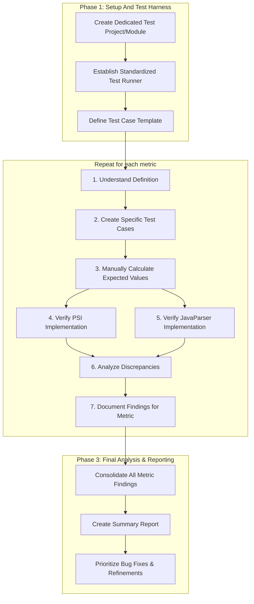

# Research Plan: PSI vs. JavaParser Metric Calculation Verification

## 1. Executive Summary & Goals
This document outlines a systematic research plan to investigate and identify the root causes of discrepancies between software metric values calculated using the IntelliJ PSI (Program Structure Interface) and the JavaParser library. The current plugin displays values from both sources, but they frequently differ, undermining user trust and the utility of the feature.

-   **Primary Objective:** To create a structured, repeatable process for verifying the correctness of each metric's implementation (both PSI and JavaParser) against its formal definition and to pinpoint the sources of any observed differences.
-   **Key Goals:**
    1.  Establish a "ground truth" for each metric through manual calculation on a curated set of test cases.
    2.  Systematically validate, debug, and document the correctness of each PSI and JavaParser metric visitor.
    3.  Produce a detailed findings report for each investigated metric, outlining discrepancies, their causes, and recommended corrective actions.

## 2. Current Situation Analysis
The plugin's architecture correctly isolates the metric calculation logic into two distinct sets of visitors: one operating on the PSI tree (`org.b333vv.metric.model.visitor.*`) and another on the JavaParser AST (`org.b333vv.metric.model.javaparser.visitor.*`). The UI then presents the JavaParser value in parentheses next to the PSI value.

-   **Key Pain Point:** Users observe that for many class-level metrics, the PSI and JavaParser values are different (e.g., `WMC: 15 (16)`). This inconsistency makes it impossible to determine which value is correct or to trust the measurements for analysis.
-   **Existing Assets:**
    -   Formal metric definitions are available in `docs/metric/class/*.md`.
    -   A `testData` directory provides a starting point for test cases.
    -   Unit and integration tests exist for many visitors, which can be extended.
    -   The dual implementation structure allows for direct comparison and targeted debugging.

## 3. Proposed Solution / Refactoring Strategy
### 3.1. High-Level Design / Architectural Overview
The research will be conducted in three phases. Phase 1 establishes the testing framework. Phase 2 is the core investigation, consisting of a repeatable, parallelizable workflow applied to each class-level metric. Phase 3 consolidates the findings.

### 3.2. Key Components / Modules
-   **Dedicated Test Project:** A new, isolated IntelliJ project or module will be created. This ensures that type resolution and classpath analysis are clean and predictable, which is critical for verifying coupling and inheritance metrics.
-   **Metric Verification Test Harness:** A new set of integration tests will be developed. This harness will be responsible for:
    1.  Loading a specific Java file from the test project.
    2.  Running the `PsiCalculationStrategy` on it.
    3.  Running the `JavaParserCalculationStrategy` on it.
    4.  Providing easy access to the resulting metric values for assertion against expected outcomes.
-   **Metric Findings Document:** A template will be created to standardize the documentation of findings for each metric, ensuring consistency and clarity.

### 3.3. Detailed Action Plan / Phases
#### Phase 1: Foundation and Tooling Setup
-   **Objective(s):** Prepare a robust and repeatable environment for conducting the research.
-   **Priority:** High
-   **Task 1.1: Create Dedicated Test Project**
    -   **Rationale/Goal:** To have a controlled environment with simple, verifiable code examples that isolate specific language features relevant to metric calculations.
    -   **Estimated Effort (Optional):** S
    -   **Deliverable/Criteria for Completion:** A new Gradle module or separate project (`metric-verification-data`) is created and configured within the existing build structure. It contains a sample package structure.
-   **Task 1.2: Develop a Unified Test Harness**
    -   **Rationale/Goal:** To create a single, reusable test class or utility that can execute both PSI and JavaParser calculations on a given test file and provide the results for comparison.
    -   **Estimated Effort (Optional):** M
    -   **Deliverable/Criteria for Completion:** An abstract base test class `MetricVerificationTest` exists. A test extending this class can specify a source file, run both calculators, and easily assert the value of a specific metric from both results.
-   **Task 1.3: Define Metric Findings Documentation Template**
    -   **Rationale/Goal:** To ensure all research findings are documented consistently, making them easy to review and act upon.
    -   **Estimated Effort (Optional):** S
    -   **Deliverable/Criteria for Completion:** A Markdown template (`docs/research/template.md`) is created. It includes sections for Metric Definition, Test Cases, Manual Calculation, PSI Analysis, JavaParser Analysis, Discrepancy Cause, and Recommended Action.

#### Phase 2: Systematic Per-Metric Investigation
-   **Objective(s):** Execute the core research for each class-level metric, identify the root cause of discrepancies, and document the findings. The following tasks should be performed for each metric.
-   **Priority:** High
-   **Task 2.1: Investigate Coupling Metrics (CBO, RFC, MPC, DAC, ATFD)**
    -   **Rationale/Goal:** These metrics are highly dependent on accurate type resolution and are common sources of discrepancies.
    -   **Estimated Effort (Optional):** L
    -   **Deliverable/Criteria for Completion:** A detailed findings document for each coupling metric is completed according to the template from Task 1.3.
    -   **Sub-steps (for each metric, e.g., CBO):**
        1.  **Review Definition:** Analyze `docs/metric/class/CBO_en.md` and the original Chidamber & Kemerer paper if needed.
        2.  **Create Test Cases:** In the test project, create classes demonstrating various coupling types: inheritance, field types, method parameters/return types, local variables, method calls, generic types, and dependencies on library classes.
        3.  **Manual Calculation:** Manually count the coupled classes for each test case, establishing the ground truth.
        4.  **PSI Verification:** Use the test harness to get the PSI value. If it differs from the manual calculation, debug `CouplingBetweenObjectsVisitor`. Document findings.
        5.  **JavaParser Verification:** Use the test harness to get the JavaParser value. If it differs, debug `JavaParserCouplingBetweenObjectsVisitor`. Pay special attention to the `TypeSolverProvider` configuration. Document findings.
        6.  **Analyze & Conclude:** Compare all three values (Manual, PSI, JP) to determine the root cause of any discrepancy (e.g., "JavaParser visitor fails to resolve types from project libraries," "PSI visitor does not count generic type arguments as coupling").
-   **Task 2.2: Investigate Cohesion Metrics (LCOM, TCC, WOC)**
    -   **Rationale/Goal:** Cohesion metrics involve complex logic regarding field access and method relationships.
    -   **Estimated Effort (Optional):** L
    -   **Deliverable/Criteria for Completion:** A detailed findings document for each cohesion metric is completed.
    -   **Sub-steps (for each metric, e.g., LCOM):** Follow the same 6-step process as in Task 2.1, creating test cases with varying levels of method-field interaction, including methods that don't use fields, methods that use the same fields, and multiple disconnected groups of methods.
-   **Task 2.3: Investigate Inheritance Metrics (DIT, NOC, NOAM, NOOM)**
    -   **Rationale/Goal:** These metrics test the system's ability to correctly navigate the class hierarchy
    -   **Estimated Effort (Optional):** M
    -   **Deliverable/Criteria for Completion:** A detailed findings document for each inheritance metric is completed.
    -   **Sub-steps (for each metric, e.g., DIT):** Follow the same 6-step process, creating test cases with single inheritance, multi-level inheritance, and classes that only extend `java.lang.Object`.
-   **Task 2.4: Investigate Complexity & Size Metrics (WMC, NCSS, NOM, NOA, etc.)**
    -   **Rationale/Goal:** These are foundational metrics that should be straightforward but can have subtle differences in what is counted (e.g., constructors, static initializers).
    -   **Estimated Effort (Optional):** M
    -   **Deliverable/Criteria for Completion:** A detailed findings document for each complexity and size metric is completed.
    -   **Sub-steps (for each metric, e.g., WMC):** Follow the same 6-step process, creating test cases that cover all control flow statements (`if`, `for`, `while`, `switch`, `catch`, ternary operator, logical operators) to verify the complexity calculation for each method.

#### Phase 3: Consolidation and Reporting
-   **Objective(s):** Synthesize the individual findings into a high-level summary and prioritize next steps.
-   **Priority:** Medium
-   **Task 3.1: Create Summary Report**
    -   **Rationale/Goal:** To provide a consolidated overview of the research outcomes for project stakeholders.
    -   **Estimated Effort (Optional):** S
    -   **Deliverable/Criteria for Completion:** A single Markdown document is created that lists all investigated metrics, summarizes the primary cause of discrepancy for each (e.g., "Bug in PSI Visitor", "JP Type Resolution Issue", "Definition Misinterpretation"), and links to the detailed findings documents.
-   **Task 3.2: Prioritize Corrective Actions**
    -   **Rationale/Goal:** To transform the research findings into an actionable backlog for the development team.
    -   **Estimated Effort (Optional):** S
    -   **Deliverable/Criteria for Completion:** A prioritized list of tasks (e.g., bug tickets) is created based on the summary report. Prioritization should consider the severity of the error, the importance of the metric, and the estimated effort to fix.

## 4. Key Considerations & Risk Mitigation
### 4.1. Technical Risks & Challenges
-   **Ambiguous Metric Definitions:** The definition of some metrics can be interpreted in multiple ways (e.g., whether to include constructors in method counts).
    -   **Mitigation:** Where ambiguity exists, consult the original academic source for the metric. If still unclear, make a reasoned decision, document it in the findings, and ensure both PSI and JavaParser implementations adhere to the same interpretation.
-   **JavaParser Type Resolution:** Accurately resolving types across a complex project structure (multiple modules, libraries) is a known challenge for JavaParser. This is the most likely source of errors for coupling and inheritance metrics.
    -   **Mitigation:** The test harness and dedicated test project must include scenarios with inter-file and library dependencies. The `TypeSolverProvider` will be a primary focus during the debugging of JavaParser visitors.
-   **Scope Creep:** The investigation could uncover a large number of issues, making the task seem endless.
    -   **Mitigation:** Strictly adhere to the plan. Focus on class-level metrics first. The goal is to investigate and document, not to fix everything at once. The prioritization in Phase 3 will manage the follow-up work.

### 4.2. Dependencies
-   Phase 2 tasks are dependent on the completion of Phase 1.
-   The individual metric investigations in Phase 2 are largely independent and can be parallelized.

### 4.3. Non-Functional Requirements (NFRs) Addressed
-   **Correctness:** This entire plan is focused on ensuring the functional correctness of the metric calculations.
-   **Reliability:** By resolving discrepancies, the plugin will become more reliable and trustworthy for users.
-   **Maintainability:** The creation of a comprehensive test harness and clear documentation will make the metric calculation logic easier to maintain and validate in the future.

## 5. Success Metrics / Validation Criteria
-   **Primary Success Metric:** For each class-level metric, a findings document is produced that clearly identifies the root cause of the PSI vs. JavaParser discrepancy.
-   **Secondary Success Metrics:**
    -   The unified test harness is successfully implemented and used for all investigations.
    -   A prioritized backlog of corrective actions is created.
    -   The research process is completed within a reasonable timeframe.

## 6. Assumptions Made
-   The metric definitions provided in the `docs/metric/` directory are the intended "source of truth" for the project.
-   The development environment can be configured to run and debug both PSI and JavaParser visitors against a test project.
-   The discrepancies are due to implementation errors or differences in parser behavior, not fundamental flaws in the overall architecture.

## 7. Open Questions / Areas for Further Investigation
-   What is the priority order for investigating the metrics? (Suggestion: Start with simpler metrics like `NOM`/`NOA` to validate the test harness, then move to more complex ones like `CBO` and `LCOM`).
-   For discrepancies caused by legitimate differences in parser interpretation (e.g., how lambdas are handled), which behavior should be considered canonical for this plugin?
-   Should this research plan be extended to cover method-level, package-level, and project-level metrics after the class-level investigation is complete? (Assumption: Yes, but as a follow-up project).