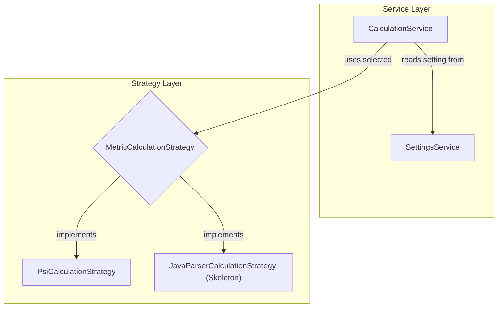

# Refactoring Plan: JavaParser Integration - Phase 2 Kick-off

## 1. Executive Summary & Goals
This document outlines the initial, foundational tasks for Phase 2 of the JavaParser integration, as defined in `docs/javaparser/abstract-plan.md`. The successful completion of Phase 1 has prepared the architecture for this work.

-   **Primary Objective:** To scaffold the JavaParser calculation engine by adding the required dependency and creating the skeleton implementation class.
-   **Key Goals:**
    1.  Integrate the JavaParser library into the project's build system.
    2.  Create the `JavaParserCalculationStrategy` class structure, ensuring it adheres to the `MetricCalculationStrategy` interface.
    3.  Wire the new skeleton strategy into the `CalculationService` to make it selectable in the UI, even with no functional implementation yet.

## 2. Current Situation Analysis
The audit of Phase 1 confirmed that the core architectural refactoring is complete. The `MetricCalculationStrategy` interface exists, and the `CalculationService` is capable of selecting a strategy based on user settings. The codebase is now ready to accept a new, alternative calculation strategy. This plan details the first concrete steps of that integration.

## 3. Proposed Solution / Refactoring Strategy
The strategy is to perform two sequential, non-disruptive tasks. First, the JavaParser dependency will be added via the Gradle build file, making the library's classes available to the project. Second, a new `JavaParserCalculationStrategy.java` file will be created. This class will implement the required interface with placeholder logic, allowing the project to compile and run without errors. Finally, the `CalculationService` will be updated to recognize and instantiate this new skeleton class when the user selects the "JAVAPARSER" engine.

### 3.1. High-Level Design / Architectural Overview
This plan does not alter the existing high-level design but begins to populate it. The `JavaParserCalculationStrategy` will be a new concrete implementation of the `MetricCalculationStrategy` interface, sitting alongside the existing `PsiCalculationStrategy`.



### 3.2. Detailed Action Plan / Phases

#### Phase 2.1: JavaParser Scaffolding
-   **Objective(s):** Add the JavaParser dependency and create the necessary skeleton class for the new engine.
-   **Priority:** High

-   **Task 2.1.1: Add JavaParser Dependency**
    -   **Rationale/Goal:** To make the JavaParser library, including its advanced symbol-solving capabilities, available to the project for metric calculation.
    -   **Estimated Effort (Optional):** S
    -   **Deliverable/Criteria for Completion:** The `build.gradle.kts` file is updated with the new dependency, and the Gradle project can be successfully synchronized.
    -   **Action:**
        1.  Open the `build.gradle.kts` file.
        2.  Locate the `dependencies` block.
        3.  Add the following line to include the `javaparser-symbol-solver-core` library. A recent stable version is recommended.
            ```kotlin
            // Inside build.gradle.kts -> dependencies { ... }
            implementation("com.github.javaparser:javaparser-symbol-solver-core:3.25.10")
            ```
        4.  Synchronize the Gradle project to download the new dependency.

-   **Task 2.1.2: Create `JavaParserCalculationStrategy` Skeleton**
    -   **Rationale/Goal:** To create the concrete class that will house the JavaParser-based calculation logic, ensuring it compiles and fits into the existing strategy pattern.
    -   **Estimated Effort (Optional):** S
    -   **Deliverable/Criteria for Completion:** The new file `JavaParserCalculationStrategy.java` is created in the correct package and the project compiles without errors.
    -   **Action:**
        1.  Create a new Java file named `JavaParserCalculationStrategy.java`.
        2.  Place it in the package: `org.b333vv.metric.builder`.
        3.  Populate the file with the following skeleton code. This includes a placeholder for the `calculate` method that logs a "Not Implemented" message and returns `null`.

            ```java
            package org.b333vv.metric.builder;

            import com.intellij.openapi.progress.ProgressIndicator;
            import com.intellij.openapi.project.Project;
            import org.b333vv.metric.model.code.JavaProject;
            import org.b333vv.metric.ui.log.MetricsConsole;

            public class JavaParserCalculationStrategy implements MetricCalculationStrategy {
                @Override
                public JavaProject calculate(Project project, ProgressIndicator indicator) {
                    MetricsConsole console = project.getService(MetricsConsole.class);
                    console.info("JavaParser calculation engine is not yet implemented.");
                    
                    // Return a new, empty JavaProject to avoid NullPointerExceptions downstream.
                    return new JavaProject(project.getName());
                }
            }
            ```

-   **Task 2.1.3: Integrate Skeleton into `CalculationService`**
    -   **Rationale/Goal:** To make the application aware of the new strategy, allowing users to select it from the settings without causing an error. This completes the wiring of the new component.
    -   **Estimated Effort (Optional):** S
    -   **Deliverable/Criteria for Completion:** The `CalculationServiceImpl.java` file is updated to instantiate the new strategy when the corresponding setting is active.
    -   **Action:**
        1.  Open the file `src/main/java/org/b333vv/metric/service/CalculationServiceImpl.java`.
        2.  Locate the `createStrategy()` method.
        3.  Modify the method to include the new `JavaParserCalculationStrategy`. The method should look like this:

            ```java
            // In CalculationServiceImpl.java

            private MetricCalculationStrategy createStrategy() {
                // The following import will be required:
                // import org.b333vv.metric.builder.JavaParserCalculationStrategy;
            
                if (settingsService.getCalculationEngine() == CalculationEngine.JAVAPARSER) {
                    return new JavaParserCalculationStrategy();
                }
                // Default to PSI strategy
                return new PsiCalculationStrategy();
            }
            ```

## 4. Key Considerations & Risk Mitigation
### 4.1. Technical Risks & Challenges
-   **Dependency Conflicts:** Adding a new library could potentially conflict with existing transitive dependencies.
    -   **Mitigation:** JavaParser is a well-established library with minimal, common dependencies (like `com.google.guava`), making this risk low. A Gradle sync will immediately reveal any such issues.
-   **Build Size:** The new dependency will increase the final plugin artifact size.
    -   **Mitigation:** This is an accepted trade-off for gaining the new functionality. The `javaparser-symbol-solver-core` JAR is reasonably sized (~3-4 MB).

### 4.2. Dependencies
-   **Internal:** This plan is strictly dependent on the successful completion of all tasks in **Phase 1** of `docs/javaparser/abstract-plan.md`.

## 5. Success Metrics / Validation Criteria
-   The project successfully compiles and builds after all changes are applied.
-   The `com.github.javaparser` library is present in the project's external libraries.
-   The user can select "JAVAPARSER" in the plugin settings. When a metric calculation is subsequently triggered, the application does not crash, and a "Not yet implemented" message appears in the MetricsTree log console.

## 6. Assumptions Made
-   The project uses Gradle for dependency management, and the `build.gradle.kts` file is the correct location for adding new libraries.
-   The `MetricCalculationStrategy` interface and `CalculationServiceImpl` exist in the packages specified by the Phase 1 audit.

## 7. Open Questions / Areas for Further Investigation
-   No open questions remain for this specific set of tasks. The plan is self-contained and prepares the project for the functional implementation of the JavaParser visitors.