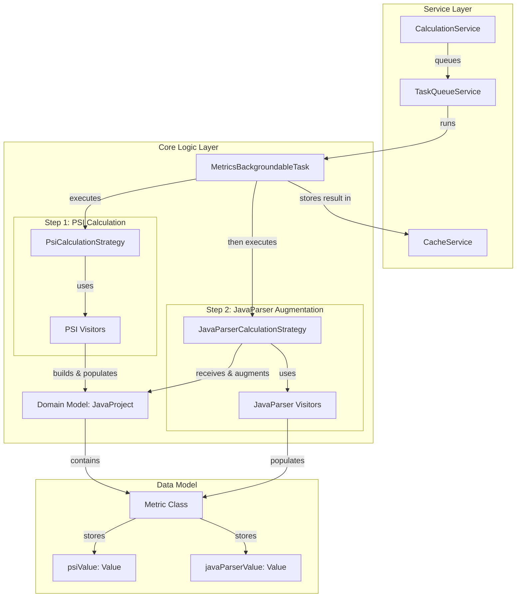

# Refactoring Plan: Parallel Calculation Implementation (Phase 2)

## 1. Executive Summary & Goals
This document provides a detailed action plan for Phase 2 of the "Parallel PSI and JavaParser Metric Calculation" refactoring. This phase focuses on implementing the core logic for calculating metrics using the JavaParser library and integrating it into the existing calculation workflow to run in parallel with the current PSI-based engine.

-   **Primary Objective:** To implement a complete suite of JavaParser-based metric visitors and orchestrate a two-stage calculation process within the `CalculationService`.
-   **Key Goals:**
    1.  Achieve feature-parity by creating JavaParser visitors for all existing PSI-based metrics.
    2.  Modify the central `CalculationService` to execute both PSI and JavaParser calculations sequentially within a single background task, populating a unified data model.
    3.  Ensure the system is robust against parsing failures and that the performance impact is managed by leveraging the existing background task architecture.

## 2. Current Situation Analysis (if applicable, especially for refactoring or when `File Structure` is provided)
The system architecture is well-defined, with a clear separation between services and core calculation logic. The calculation process is initiated by UI actions, managed by `CalculationService` and `TaskQueueService`, and executed on a background thread.

This plan assumes the successful completion of **Phase 1: Data Model Refactoring**. Specifically, the `org.b333vv.metric.model.metric.Metric` class has been modified to store two distinct values: `psiValue` and `javaParserValue`. The current implementation only populates `psiValue`. This phase will implement the logic to populate `javaParserValue`.

## 3. Proposed Solution / Refactoring Strategy
### 3.1. High-Level Design / Architectural Overview
The existing calculation flow will be augmented, not replaced. The `CalculationService` will orchestrate a two-step process within a single `MetricsBackgroundableTask`. First, the `PsiCalculationStrategy` will be used to build the complete `JavaProject` model and populate the `psiValue` for every metric. Second, the `JavaParserCalculationStrategy` will receive this pre-populated model, traverse it, parse the corresponding source files using JavaParser, and populate the `javaParserValue` on the *same* `Metric` objects.

This ensures a single, consistent data model containing results from both engines is cached and published to the UI layer.

### 3.2. Key Components / Modules
-   **`service.CalculationServiceImpl` (Modification):** The primary background task logic within this service will be updated to execute the two strategies sequentially. It will be responsible for passing the model generated by the PSI strategy to the JavaParser strategy.
-   **`builder.JavaParserCalculationStrategy` (Adaptation/Creation):** This strategy will be modified. Its new responsibility is to receive an already-built `JavaProject` model. It will not create new `Metric` objects but will instead find the existing ones and populate their `javaParserValue` field.
-   **`model.javaparser.visitor.*` (New Package):** This new package will house the complete suite of metric calculation visitors that operate on the JavaParser Abstract Syntax Tree (AST). Its structure will mirror the existing `org.b333vv.metric.model.visitor.*` package.

### 3.3. Detailed Action Plan / Phases
#### Phase 2: Parallel Calculation Implementation
-   **Objective(s):** Integrate JavaParser calculation logic into the main workflow and populate the `javaParserValue` field for all metrics.
-   **Priority:** High

-   **Task 2.1: Implement Full Suite of JavaParser Visitors**
    -   **Rationale/Goal:** To create JavaParser-based calculators for all metrics that currently exist in the PSI-based system, ensuring complete feature parity between the two engines.
    -   **Estimated Effort (Optional):** L
    -   **Deliverable/Criteria for Completion:** For every visitor in `org.b333vv.metric.model.visitor.type.*` and `org.b333vv.metric.model.visitor.method.*`, a corresponding visitor is created in a new `org.b333vv.metric.model.javaparser.visitor.*` package. Each new visitor must perform the same calculation on a JavaParser AST node as its PSI counterpart does on a PSI element. Comprehensive unit tests for each new visitor must be created.

-   **Task 2.2: Implement and Configure JavaParser Type Solver**
    -   **Rationale/Goal:** Accurate calculation of type-dependent metrics (e.g., CBO, DIT, RFC) requires robust type resolution. This task is critical for the correctness of the JavaParser results.
    -   **Estimated Effort (Optional):** M
    -   **Deliverable/Criteria for Completion:** A utility or factory is created that correctly configures a JavaParser `TypeSolver` (likely a `CombinedTypeSolver`). This solver must be aware of the project's source roots, module dependencies, and library classpaths to resolve types across the entire project scope.

-   **Task 2.3: Modify `CalculationService` and Calculation Strategies**
    -   **Rationale/Goal:** To orchestrate the two-stage calculation process (PSI followed by JavaParser) within a single, atomic background task.
    -   **Estimated Effort (Optional):** M
    -   **Deliverable/Criteria for Completion:**
        -   The primary `MetricsBackgroundableTask` logic in `CalculationServiceImpl` is modified.
        -   **Step 1:** The task first invokes the existing `PsiCalculationStrategy` to build the `JavaProject` model and calculate all metrics, populating the `psiValue` field in each `Metric` object.
        -   **Step 2:** The task then invokes the `JavaParserCalculationStrategy`, passing it the `JavaProject` model created in Step 1.
        -   The `JavaParserCalculationStrategy` is implemented to traverse the received model. For each code element, it parses the corresponding file using JavaParser and uses the new visitors (from Task 2.1) to calculate and set the `javaParserValue` on the existing `Metric` objects.
        -   The final, fully-populated `JavaProject` model is stored in the `CacheService`.

-   **Task 2.4: Implement Robust Error Handling in JavaParser Strategy**
    -   **Rationale/Goal:** To prevent the entire analysis from failing if the JavaParser engine is unable to parse a specific file that the PSI engine handles correctly.
    -   **Estimated Effort (Optional):** S
    -   **Deliverable/Criteria for Completion:** The `JavaParserCalculationStrategy` contains `try-catch` blocks around file parsing operations. If a file fails to parse, an error is logged to the `MetricsConsole`, and the `javaParserValue` for all metrics related to that file are set to `Value.UNDEFINED`. The calculation proceeds to the next file without crashing.

## 4. Key Considerations & Risk Mitigation
### 4.1. Technical Risks & Challenges
-   **Performance Degradation:** Executing two full static analysis runs will increase total calculation time.
    -   **Mitigation:** The use of a single, cancellable `MetricsBackgroundableTask` is essential to keep the UI responsive. The performance impact is considered an acceptable trade-off for the added analytical capability. A future enhancement could add a setting to enable/disable the JavaParser calculation to give users control over performance.
-   **JavaParser Type Resolution Complexity:** Correctly configuring the `TypeSolver` for complex project structures (multi-module, external dependencies) is a known challenge.
    -   **Mitigation:** Task 2.2 is dedicated to this challenge. The implementation must be thoroughly tested with various project structures to ensure its robustness.
-   **Metric Value Discrepancies:** JavaParser and PSI may interpret certain code constructs differently, leading to different metric values.
    -   **Mitigation:** This is an expected and desired outcome. A validation task should be created to run both engines against a sample project to compare results. Any significant, non-obvious discrepancies should be documented to ensure they stem from legitimate parser differences, not implementation bugs.

### 4.2. Dependencies
-   **Internal:** This entire phase is dependent on the completion of **Phase 1: Data Model Refactoring**. It is a direct prerequisite for **Phase 3: UI Display Refactoring**, which will consume the dual-value data model.

## 5. Success Metrics / Validation Criteria
-   After a full calculation, `Metric` objects within the cached `JavaProject` model contain valid, non-null values for both `psiValue` and `javaParserValue` (or `Value.UNDEFINED` in case of parsing errors).
-   Unit and integration tests confirm that both PSI and JavaParser visitors produce correct values for a comprehensive set of code samples.
-   The `CalculationService` correctly orchestrates the two-step process, and the final cached model is properly augmented.
-   The application remains stable and responsive, with the entire parallel calculation running as a single background task.

## 6. Assumptions Made
-   The `Metric` class and its related data models have been successfully refactored to support storing two values (`psiValue` and `javaParserValue`) as part of Phase 1.
-   The existing `JavaProject` domain model is sufficiently abstract to be populated by two different backends sequentially.
-   The performance overhead of running a second analysis engine is acceptable to the end-user.

## 7. Open Questions / Areas for Further Investigation
-   How should the system behave if the JavaParser engine fails to parse a file that the PSI engine handles correctly (or vice-versa)? (Assumption: The `javaParserValue` should be set to `Value.UNDEFINED` and a log entry should be created in the `MetricsConsole`).
-   For UI features like range-based highlighting, which value should take precedence if they fall into different ranges? (Initial Assumption: The UI will continue to be driven by the `psiValue` until Phase 3, where this will be explicitly addressed).
-   **Key discussion point for the team:** Should the JavaParser calculation be enabled by default, or should it be an opt-in feature in the settings to manage performance expectations? (Recommendation: Enable by default, but add an option to disable it).