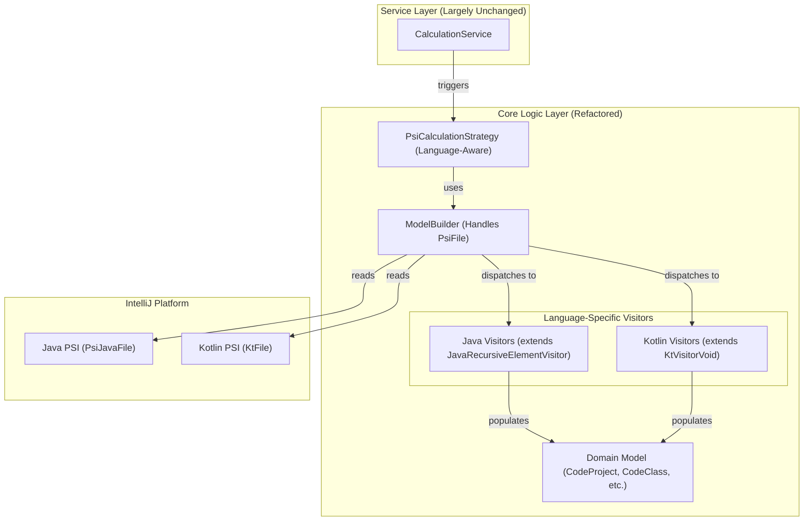

# Refactoring Plan: Add Kotlin Support for Metric Calculation

## 1. Executive Summary & Goals
This plan outlines the necessary steps to extend the MetricsTree plugin's capabilities from analyzing only Java classes to also calculating metrics for Kotlin classes. The core strategy involves making the domain model language-agnostic, implementing a parallel set of metric visitors for Kotlin's Program Structure Interface (PSI), and integrating them into the existing calculation workflow.

-   **Primary Objective:** Enable the calculation of the existing suite of class-level and method-level metrics for Kotlin code.
-   **Key Goals:**
    1.  Refactor the core domain model to be language-agnostic, preparing for future language support.
    2.  Implement a complete set of Kotlin PSI visitors that mirror the functionality of the existing Java PSI visitors.
    3.  Seamlessly integrate Kotlin file processing into the main calculation service, ensuring a consistent user experience.

## 2. Current Situation Analysis
The current architecture is well-structured and service-oriented, as documented in `docs/architecture/arch_spec.md`. Metric calculation is handled in the Core Logic Layer, which relies on a `JavaRecursiveElementVisitor`-based approach to traverse the Java PSI tree.

-   **Key Strengths:** The decoupled architecture, with a clear separation between services and the core calculation logic (visitors and builders), provides a solid foundation for extension. The use of a `PsiCalculationStrategy` allows for clean integration of new logic.
-   **Limitations Relevant to Task:**
    -   **Language-Specific Model:** The core domain model (`org.b333vv.metric.model.code.*`) is explicitly tied to Java (e.g., `JavaProject`, `JavaClass`, `JavaMethod`). This prevents the direct representation of code from other languages.
    -   **Java-Specific Visitors:** The metric calculation visitors in `org.b333vv.metric.model.visitor.*` are subclasses of `JavaRecursiveElementVisitor` and are designed to work only with the Java PSI tree.
    -   **File Processing:** The model builders (`ProjectModelBuilder`, `ClassModelBuilder`) are currently hardwired to process `PsiJavaFile` instances, ignoring other file types like Kotlin's `KtFile`.

## 3. Proposed Solution / Refactoring Strategy
### 3.1. High-Level Design / Architectural Overview
The strategy is to introduce Kotlin support in parallel with the existing Java support, unified under a language-agnostic domain model. This ensures that the service and UI layers remain largely unchanged.

1.  **Model Refactoring:** The `Java*` domain model classes will be renamed to generic `Code*` equivalents (e.g., `JavaClass` -> `CodeClass`). This is a foundational change that makes the entire system extensible to new languages.
2.  **Kotlin Visitor Implementation:** A new package will be created to house Kotlin-specific metric visitors. These visitors will implement the same logic as their Java counterparts but will operate on the Kotlin PSI tree by extending `org.jetbrains.kotlin.psi.KtVisitorVoid`.
3.  **Builder and Strategy Adaptation:** The existing `ClassModelBuilder` and `PsiCalculationStrategy` will be modified to be language-aware. They will inspect the `PsiFile` type and delegate to the appropriate set of visitors (Java or Kotlin).

### 3.2. Key Components / Modules
-   **`model.code.*` (To be Refactored):** All classes like `JavaProject`, `JavaClass`, `JavaMethod`, `JavaFile`, `JavaPackage` will be renamed to `CodeProject`, `CodeClass`, `CodeMethod`, `CodeFile`, `CodePackage`. Their internal logic will be updated to handle both Java and Kotlin PSI elements where necessary.
-   **`model.visitor.kotlin.*` (New):** A new package to contain all Kotlin-specific metric visitors (e.g., `KotlinMcCabeCyclomaticComplexityVisitor`). These will extend `org.jetbrains.kotlin.psi.KtVisitorVoid`.
-   **`builder.ClassModelBuilder` (To be Modified):** The `buildJavaFile` method will be refactored to a more generic `buildFile(PsiFile psiFile)` which internally checks `instanceof PsiJavaFile` or `instanceof KtFile` to trigger the correct visitor set.
-   **`builder.ProjectModelBuilder` (To be Modified):** The file scanning logic will be updated to include `.kt` files in its scope.
-   **`builder.PsiCalculationStrategy` (To be Modified):** The main `calculate` method will be updated to ensure its file traversal includes Kotlin files and passes them to the `ProjectModelBuilder`.

### 3.3. Detailed Action Plan / Phases
#### Phase 1: Foundational Domain Model Refactoring
-   **Objective(s):** Decouple the core domain model from the Java language to support multiple languages.
-   **Priority:** High
-   **Task 1.1:** Rename core model classes.
    -   **Rationale/Goal:** Create a language-agnostic foundation. This is a breaking change that will guide the rest of the refactoring.
    -   **Estimated Effort (Optional):** M
    -   **Deliverable/Criteria for Completion:**
        -   `JavaProject` -> `ProjectElement`
        -   `JavaPackage` -> `PackageElement`
        -   `JavaFile` -> `FileElement`
        -   `JavaClass` -> `ClassElement`
        -   `JavaMethod` -> `MethodElement`
        -   `JavaCode` -> `CodeElement`
        -   All references throughout the codebase are updated using IDE refactoring tools.
-   **Task 1.2:** Verify existing functionality.
    -   **Rationale/Goal:** Ensure that the renaming and associated fixes have not introduced regressions for Java metric calculation.
    -   **Estimated Effort (Optional):** M
    -   **Deliverable/Criteria for Completion:** The project compiles successfully. All existing unit, integration, and E2E tests pass without modification to their logic.

#### Phase 2: Kotlin Visitor Implementation
-   **Objective(s):** Implement the logic to calculate all existing metrics for Kotlin code.
-   **Priority:** High
-   **Task 2.1:** Add Kotlin PSI dependency.
    -   **Rationale/Goal:** Ensure the necessary Kotlin PSI classes are available for the new visitors.
    -   **Estimated Effort (Optional):** S
    -   **Deliverable/Criteria for Completion:** The `org.jetbrains.kotlin:kotlin-compiler-embeddable` or similar dependency is correctly configured in `build.gradle.kts`.
-   **Task 2.2:** Create the Kotlin visitor package structure.
    -   **Rationale/Goal:** Establish a clean, parallel structure for Kotlin visitors.
    -   **Estimated Effort (Optional):** S
    -   **Deliverable/Criteria for Completion:** New packages `org.b333vv.metric.model.visitor.kotlin.type` and `org.b333vv.metric.model.visitor.kotlin.method` are created.
-   **Task 2.3:** Implement Kotlin Class-Level Visitors.
    -   **Rationale/Goal:** Implement calculation logic for all class-level metrics on Kotlin classes.
    -   **Estimated Effort (Optional):** L
    -   **Deliverable/Criteria for Completion:** For each visitor in `...visitor.type`, a corresponding visitor is created in `...visitor.kotlin.type` that extends `org.jetbrains.kotlin.psi.KtVisitorVoid` and calculates the same metric (e.g., `KotlinWeightedMethodCountVisitor`).
-   **Task 2.4:** Implement Kotlin Method-Level Visitors.
    -   **Rationale/Goal:** Implement calculation logic for all method-level metrics on Kotlin functions.
    -   **Estimated Effort (Optional):** L
    -   **Deliverable/Criteria for Completion:** For each visitor in `...visitor.method`, a corresponding visitor is created in `...visitor.kotlin.method` that extends `org.jetbrains.kotlin.psi.KtVisitorVoid` (e.g., `KotlinLinesOfCodeVisitor`).

#### Phase 3: Integration into Calculation Workflow
-   **Objective(s):** Wire the new Kotlin visitors into the existing metric calculation pipeline.
-   **Priority:** Medium
-   **Task 3.1:** Make `ModelBuilder` language-aware.
    -   **Rationale/Goal:** Centralize the logic for handling different file types.
    -   **Estimated Effort (Optional):** M
    -   **Deliverable/Criteria for Completion:** The `ClassModelBuilder` is modified to accept a generic `PsiFile`. It uses `instanceof` checks to differentiate between `PsiJavaFile` and `org.jetbrains.kotlin.psi.KtFile` and invokes the correct set of visitors for each.
-   **Task 3.2:** Update `ProjectModelBuilder` and `PsiCalculationStrategy`.
    -   **Rationale/Goal:** Ensure that `.kt` files are discovered and processed during a full project scan.
    -   **Estimated Effort (Optional):** S
    -   **Deliverable/Criteria for Completion:** The file iteration logic within the strategy and project builder now includes Kotlin files and passes them to the language-aware `ClassModelBuilder`.

#### Phase 4: Verification and Testing
-   **Objective(s):** Validate the correctness of the Kotlin metric calculations and ensure no regressions were introduced.
-   **Priority:** High
-   **Task 4.1:** Create Kotlin test data.
    -   **Rationale/Goal:** Provide a comprehensive set of Kotlin code examples for testing.
    -   **Estimated Effort (Optional):** M
    -   **Deliverable/Criteria for Completion:** A new directory `metric-verification-data/src/main/kotlin` is created with several `.kt` files covering classes, objects, companion objects, top-level functions, and other features relevant to metric calculations.
-   **Task 4.2:** Create Kotlin metric verification tests.
    -   **Rationale/Goal:** Write automated tests to assert the correctness of the Kotlin metric values.
    -   **Estimated Effort (Optional):** L
    -   **Deliverable/Criteria for Completion:** New integration tests are created that load the Kotlin test files, run the full calculation pipeline, and assert that the calculated metric values match manually verified ground truths.
-   **Task 4.3:** Full regression testing.
    -   **Rationale/Goal:** Confirm that the extensive refactoring has not broken any existing functionality.
    -   **Estimated Effort (Optional):** M
    -   **Deliverable/Criteria for Completion:** The entire test suite (`test`, `integration-test`, `e2e-test`) passes successfully.

## 4. Key Considerations & Risk Mitigation
### 4.1. Technical Risks & Challenges
-   **Semantic Mapping of Metrics:** Some metrics may not have a direct 1:1 conceptual mapping to Kotlin. For example, how does LCOM (Lack of Cohesion of Methods) apply to a file with top-level functions? How should WMC be calculated for a class with methods in a companion object?
    -   **Mitigation:** Each visitor implementation task (2.3, 2.4) must include a brief analysis of the metric's definition in the context of Kotlin. Decisions on how to handle Kotlin-specific features must be documented in the code or related documentation.
-   **Domain Model Refactoring:** Renaming the core `Java*` model classes is a high-impact change that will affect a large portion of the codebase.
    -   **Mitigation:** This is addressed in Phase 1. By performing this refactoring first and ensuring all existing tests pass, we can isolate this risk and establish a stable, language-agnostic baseline before adding new functionality.
-   **Kotlin PSI Complexity:** The Kotlin PSI is generally more complex than Java's. Correctly identifying all relevant nodes for a given metric (e.g., all decision points for cyclomatic complexity) will require careful implementation.
    -   **Mitigation:** The implementation of each visitor should be paired with the creation of specific unit/integration tests that target the Kotlin language features it needs to handle.

### 4.2. Dependencies
-   **Internal:** Phase 1 is a prerequisite for all other phases. Phase 2 must be completed before Phase 3 and Phase 4 can be fully executed.
-   **External:** The project must correctly depend on the Kotlin IntelliJ plugin components to get access to the Kotlin PSI classes (`org.jetbrains.kotlin.psi.*`).

### 4.3. Non-Functional Requirements (NFRs) Addressed
-   **Maintainability:** The domain model refactoring significantly improves maintainability and extensibility by removing the Java-specific coupling at the core of the system.
-   **Extensibility:** The plan establishes a clear pattern for adding support for other JVM languages in the future.
-   **Correctness:** A dedicated verification and testing phase with new Kotlin-specific test cases is included to ensure the functional correctness of the new feature.

## 5. Success Metrics / Validation Criteria
-   The plugin successfully calculates and displays metrics for `.kt` files in the "Class Metrics" view.
-   Metrics for Kotlin classes and methods appear seamlessly alongside Java metrics in the "Project Metrics" view.
-   All existing functionality for Java files remains unchanged and fully operational.
-   The new suite of integration tests for Kotlin metric verification passes.

## 6. Assumptions Made
-   The existing set of metrics is conceptually applicable to Kotlin code, although interpretation may be required for certain language features.
-   The IntelliJ Platform SDK version used by the project provides stable access to the Kotlin PSI.
-   No major UI changes are required; the existing tree and table structures are sufficient to display metrics from both languages.

## 7. Open Questions / Areas for Further Investigation
-   How should metrics be calculated for Kotlin top-level functions that are not part of a class? (Suggestion: They could be grouped under a synthetic node representing the file).
-   How should methods within Kotlin `object` and `companion object` declarations be treated in class-level metrics like WMC and NOM? (Suggestion: Treat them as static methods of the enclosing class for metric calculation purposes).
-   Are there any Kotlin-specific metrics that should be considered for a future implementation? (e.g., number of extension functions, sealed class hierarchy depth). This is out of scope for the current task but worth noting.