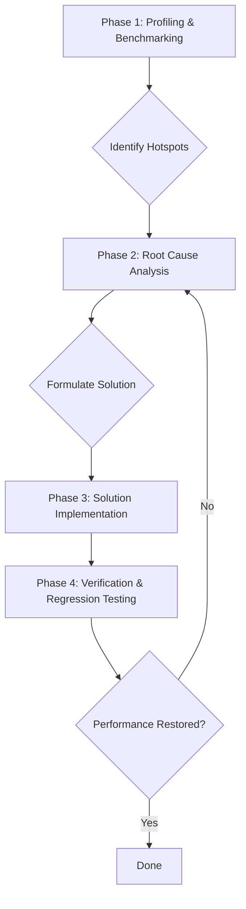

# Investigation Plan: Project Metrics Calculation Performance Degradation

## 1. Executive Summary & Goals
This document outlines a comprehensive plan to investigate and resolve the significant performance degradation observed during project-wide metric calculations. The issue appeared after the implementation of Kotlin language support and affects both Java and Kotlin projects. The investigation will use profiling to pinpoint the root cause, followed by a targeted implementation of a solution and rigorous verification.

-   **Primary Objective:** Identify the root cause of the performance slowdown in the `CalculateProjectMetricsAction` workflow and implement a robust fix.
-   **Key Goals:**
    1.  Establish a clear performance baseline using profiling on representative Java, Kotlin, and mixed-language projects.
    2.  Isolate the specific methods or architectural patterns introduced with Kotlin support that are responsible for the bottleneck.
    3.  Implement a solution that restores calculation performance to at least the pre-Kotlin baseline without compromising metric accuracy.
    4.  Verify the fix with comparative performance tests and a full regression test suite.

## 2. Current Situation Analysis
The performance drop correlates directly with the implementation of Kotlin support as detailed in `docs/kotlin/main_plan.md`. This major update introduced several significant changes:
-   A language-agnostic domain model (`ProjectElement`, `ClassElement`, etc.).
-   A new suite of metric visitors operating on the Kotlin Program Structure Interface (PSI).
-   Language-aware model builders (`ProjectModelBuilder`, `KotlinModelBuilder`) that dispatch file processing to the appropriate logic (Java or Kotlin).
-   Modifications to downstream calculators like `ProjectMetricsSetCalculator` to handle Kotlin files, notably by converting Kotlin classes to "light" Java `PsiClass` objects for analysis.

**Key Pain Points & Hypotheses:**
-   **Primary Suspect - Light Class Generation:** The `ProjectMetricsSetCalculator` processes Kotlin files by converting `KtClassOrObject` instances into `PsiClass` light classes using `LightClassUtilsKt.toLightClass`. This operation is known to be computationally expensive and is a very strong candidate for the primary performance bottleneck, especially when performed across all classes in a large project.
-   **Secondary Suspect - Inefficient Kotlin PSI Traversal:** The new Kotlin-specific visitors (`org.b333vv.metric.model.visitor.kotlin.*`) may contain inefficient PSI traversal logic. The Kotlin PSI is inherently more complex than Java's, and certain patterns of access could be suboptimal.
-   **Tertiary Suspect - Memory Allocation & GC Pressure:** The new model building and visiting logic for Kotlin might generate a high number of temporary objects, leading to increased Garbage Collection (GC) overhead, which manifests as slower overall execution.

## 3. Proposed Solution / Refactoring Strategy
The proposed strategy is a systematic, four-phase investigation designed to move from broad analysis to a targeted and verified solution.

### 3.1. High-Level Design / Architectural Overview
The investigation will follow a standard profile-driven optimization workflow.

### 3.2. Detailed Action Plan / Phases

#### Phase 1: Performance Profiling & Benchmarking
-   **Objective(s):** Quantify the performance degradation and identify the exact methods and code paths responsible for the slowdown.
-   **Priority:** High

-   **Task 1.1: Establish Benchmark Projects**
    -   **Rationale/Goal:** Create consistent, repeatable test cases for performance measurement.
    -   **Estimated Effort:** S
    -   **Deliverable/Criteria for Completion:** Three separate IntelliJ projects are prepared:
        1.  A medium-sized, pure Java project.
        2.  A medium-sized, pure Kotlin project of comparable complexity.
        3.  A medium-sized project with a mix of Java and Kotlin code.

-   **Task 1.2: Profile the Calculation Workflow**
    -   **Rationale/Goal:** Use a CPU and memory profiler to capture detailed execution data.
    -   **Estimated Effort:** M
    -   **Deliverable/Criteria for Completion:**
        -   The `CalculateProjectMetricsAction` is executed on all three benchmark projects using a profiler (e.g., IntelliJ's built-in profiler, YourKit, or JProfiler).
        -   CPU flame graphs, method hotspots, and memory allocation snapshots are captured for each run.

-   **Task 1.3: Analyze Profiling Data**
    -   **Rationale/Goal:** Pinpoint the exact methods or classes consuming the most CPU time and/or allocating the most memory.
    -   **Estimated Effort:** M
    -   **Deliverable/Criteria for Completion:** A short report is produced that identifies the top 3-5 performance hotspots. This report will validate or refute the initial hypotheses and guide Phase 2.

#### Phase 2: Root Cause Analysis
-   **Objective(s):** Deeply investigate the hotspots identified in Phase 1 to understand the underlying cause of the inefficiency.
-   **Priority:** High
-   *(This phase is contingent on the results of Phase 1. The following tasks assume the primary suspect is confirmed.)*

-   **Task 2.1: Analyze `ProjectMetricsSetCalculator` and Light Class Usage**
    -   **Rationale/Goal:** Confirm if `LightClassUtilsKt.toLightClass` is the bottleneck and determine if it can be avoided.
    -   **Estimated Effort:** M
    -   **Deliverable/Criteria for Completion:**
        -   The profiler data from Phase 1 is reviewed, specifically focusing on calls originating from `ProjectMetricsSetCalculator.visitFile`.
        -   The logic within `ProjectMetricsSetCalculator` is analyzed to determine which calculations rely on `PsiClass` objects. A feasibility assessment is made on refactoring this logic to work directly with `KtClassOrObject` and the Kotlin PSI.

-   **Task 2.2: (If Necessary) Analyze Individual Kotlin Visitors**
    -   **Rationale/Goal:** If profiling points to specific Kotlin visitors rather than light class generation, isolate and analyze them.
    -   **Estimated Effort:** L
    -   **Deliverable/Criteria for Completion:**
        -   Micro-benchmarks are created for the slowest visitors identified in profiling.
        -   The visitor's code is reviewed for inefficient algorithms, such as redundant PSI tree traversals or excessive object creation in loops.

#### Phase 3: Solution Implementation
-   **Objective(s):** Implement the most effective solution identified in Phase 2.
-   **Priority:** High

-   **Task 3.1: Refactor Bottleneck Component**
    -   **Rationale/Goal:** Apply the chosen fix. This will most likely involve refactoring `ProjectMetricsSetCalculator`.
    -   **Estimated Effort:** L
    -   **Deliverable/Criteria for Completion:**
        -   **If light classes are the issue:** The `ProjectMetricsSetCalculator` is refactored. Its `visitFile` method is updated to handle `KtFile` directly. Logic that previously required a `PsiClass` (e.g., for inheritance checks, method/field access) is rewritten using Kotlin PSI APIs.
        -   **If a visitor is the issue:** The inefficient visitor is rewritten with an optimized algorithm.

-   **Task 3.2: Update and Augment Tests**
    -   **Rationale/Goal:** Ensure the refactoring is covered by automated tests to prevent regressions.
    -   **Estimated Effort:** M
    -   **Deliverable/Criteria for Completion:** Existing integration tests are updated to reflect the refactoring. New tests are added if necessary to cover the new Kotlin PSI-based logic.

#### Phase 4: Verification
-   **Objective(s):** Confirm that the performance issue is resolved and no new functional or accuracy issues have been introduced.
-   **Priority:** High

-   **Task 4.1: Re-run Performance Benchmarks**
    -   **Rationale/Goal:** Quantitatively measure the impact of the fix.
    -   **Estimated Effort:** M
    -   **Deliverable/Criteria for Completion:** The profiling process from Task 1.2 is repeated on the benchmark projects. New execution times are recorded.

-   **Task 4.2: Compare Performance Results**
    -   **Rationale/Goal:** Validate that the performance goal has been met.
    -   **Estimated Effort:** S
    -   **Deliverable/Criteria for Completion:** A comparison report is created showing the "before" and "after" execution times. The "after" time for Kotlin and mixed projects should be comparable to the Java project baseline.

-   **Task 4.3: Execute Full Regression Suite**
    -   **Rationale/Goal:** Ensure metric accuracy has not been compromised.
    -   **Estimated Effort:** M
    -   **Deliverable/Criteria for Completion:** All unit, integration, and E2E tests pass for both Java and Kotlin projects, confirming the correctness of the calculated metrics.

## 4. Key Considerations & Risk Mitigation
### 4.1. Technical Risks & Challenges
-   **Complexity of Kotlin PSI:** Refactoring calculators to use Kotlin PSI directly may be complex, as the APIs and structure differ significantly from Java's PSI.
    -   **Mitigation:** Allocate sufficient time for research and prototyping in Phase 2. Leverage existing Kotlin visitors as examples for how to traverse the Kotlin PSI tree effectively.
-   **Introduction of New Bugs:** Major refactoring of core calculation logic carries a high risk of introducing subtle bugs that lead to incorrect metric values.
    -   **Mitigation:** The existing `integration-test` suite, which verifies metric values against known ground truths, is critical. This suite must be run thoroughly after the changes (Task 4.3).

### 4.2. Dependencies
-   Each phase is dependent on the successful completion of the previous one. The direction of Phase 2 is entirely dependent on the profiling results from Phase 1.

### 4.3. Non-Functional Requirements (NFRs) Addressed
-   **Performance:** This plan directly addresses and aims to resolve a critical performance regression.
-   **Maintainability:** By potentially removing the need for light class generation, the solution may result in cleaner, more direct, and more maintainable code for Kotlin analysis.

## 5. Success Metrics / Validation Criteria
-   The execution time for `CalculateProjectMetricsAction` on the Kotlin benchmark project is reduced by at least 75% (or to a level comparable with the pure Java project).
-   The profiler report for the fixed version no longer shows `LightClassUtilsKt.toLightClass` or other identified bottlenecks as a primary hotspot.
-   All existing metric verification tests in the `integration-test` source set continue to pass for both Java and Kotlin.

## 6. Assumptions Made
-   A suitable profiling tool is available and can be attached to the IntelliJ IDEA instance running the plugin.
-   The performance degradation is caused by a specific, identifiable bottleneck within the new Kotlin processing logic, not a systemic issue with the IntelliJ Platform itself.
-   A performance baseline from before the Kotlin implementation is available or can be reasonably established by checking out an older version of the code.

## 7. Open Questions / Areas for Further Investigation
-   Are there any metrics calculated in `ProjectMetricsSetCalculator` that *cannot* be derived from the Kotlin PSI and absolutely require a `PsiClass` representation? This needs to be confirmed during Task 2.1.
-   What is the exact performance cost of the reflective calls to `KotlinModelBuilder`? While not a primary suspect, this should be visible in the profiling data and confirmed as negligible.