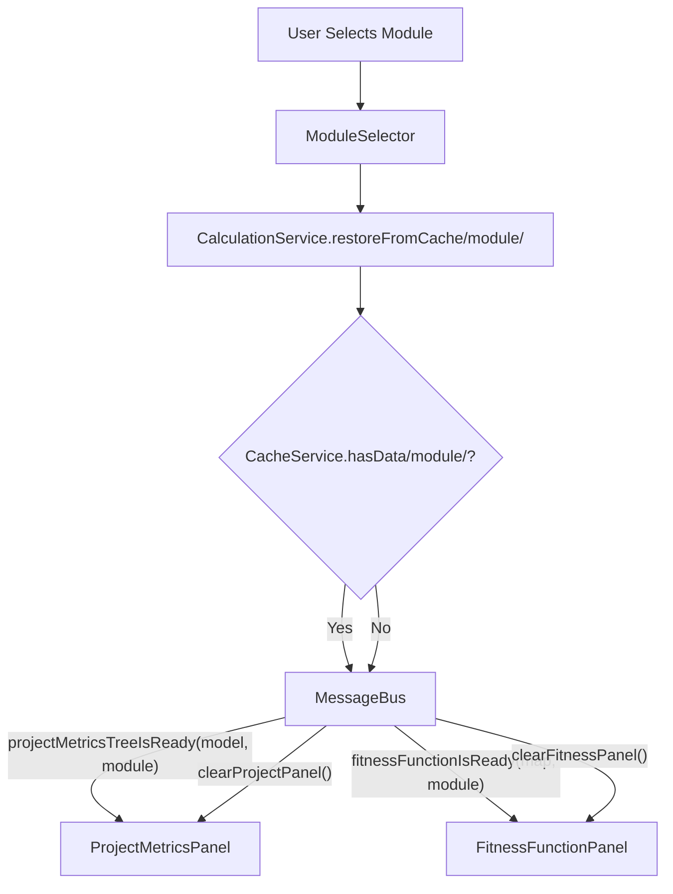

# Refactoring Plan: Module-Aware Cache Restoration for UI

## 1. Executive Summary & Goals
The objective of this plan is to optimize the user experience when switching between modules in the `ModuleSelector`. Currently, selecting a module clears the UI, forcing a manual recalculation or leaving the view empty. The goal is to implement a "Restore from Cache" mechanism that immediately populates the "Project Metrics" and "Metric Fitness Functions" tabs with previously calculated data for the selected module, if available.

**Key Goals:**
1.  **Instant Context Switching:** Populate UI immediately from cache when a module is selected.
2.  **Preserve Architecture:** Utilize the existing Service-Event-Listener pattern (`CalculationService`, `CacheService`, `MetricsEventListener`).
3.  **Scope Isolation:** Ensure the UI reflects *only* the data for the selected module.

## 2. Current Situation Analysis
*   **UI Trigger:** The `ModuleSelector` component (in `MetricsToolWindowFactory`) currently executes a callback that blindly sends `clearProjectPanel` and `clearPackageFitnessFunctionPanel` events.
*   **Service Layer:** `CalculationService` handles calculation and caching but lacks a dedicated method to simply *retrieve and display* cached data without triggering a new calculation if the cache is empty.
*   **Cache Layer:** `CacheService` already supports module-keyed storage (`getKey(Module)`), so the data structure supports this feature.
*   **Problem:** Switching modules destroys the current view state instead of checking if the target state is already available in memory.

## 3. Proposed Solution / Refactoring Strategy

### 3.1. High-Level Design
We will introduce a `restoreFromCache` capability within the `CalculationService`. When the `ModuleSelector` value changes, instead of clearing the UI, it will invoke this method. The service will query the `CacheService` for the selected module.
*   **Cache Hit:** The service publishes `*IsReady` events (e.g., `projectMetricsTreeIsReady`), causing the UI to update immediately.
*   **Cache Miss:** The service publishes `clear*` events, resetting the UI to a clean state (waiting for user calculation).



### 3.2. Key Components / Modules
*   **`CalculationService` (Interface & Impl):** New method `restoreFromCache(@Nullable Module module)`.
*   **`MetricsToolWindowFactory`:** Update the `ModuleSelector` initialization to call the new service method.

### 3.3. Detailed Action Plan / Phases

#### Phase 1: Service Layer Extension
*   **Objective:** Enable the business logic to restore UI state from cache.
*   **Priority:** High

*   **Task 1.1: Update `CalculationService` Interface**
    *   **Description:** Add `void restoreFromCache(@Nullable Module module);` to the interface.
    *   **Rationale:** Defines the contract for the UI to request a state restoration.

*   **Task 1.2: Implement `restoreFromCache` in `CalculationServiceImpl`**
    *   **Description:** Implement the logic to check specific cache keys and fire events.
    *   **Logic:**
        1.  **Project Tree:**
            *   Retrieve `DefaultTreeModel model = cacheService.getProjectTree(module)`.
            *   If `model != null`, publish `projectMetricsTreeIsReady(model, module)`.
            *   Else, publish `clearProjectMetricsTree()`.
        2.  **Package Fitness Functions:**
            *   Retrieve `Map<...> data = cacheService.getPackageLevelFitnessFunctions(module)`.
            *   If `data != null`, publish `packageLevelFitnessFunctionIsReady(module)`.
            *   Else, publish `clearPackageFitnessFunctionPanel()`.
        3.  **Class Fitness Functions:**
            *   Retrieve `Map<...> data = cacheService.getClassLevelFitnessFunctions(module)`.
            *   If `data != null`, publish `classLevelFitnessFunctionIsReady(module)`.
            *   Else, publish `clearClassFitnessFunctionPanel()`.
    *   **Dependencies:** `CacheService`, `MetricsEventListener`.

#### Phase 2: UI Integration
*   **Objective:** Connect the UI component to the new service logic.
*   **Priority:** High

*   **Task 2.1: Update `MetricsToolWindowFactory`**
    *   **Description:** Modify the `ModuleSelector` constructor callback.
    *   **Current Code:**
        ```java
        new ModuleSelector(project, () -> {
            project.getMessageBus()...clearProjectPanel();
            project.getMessageBus()...clearPackageFitnessFunctionPanel();
        })
        ```
    *   **New Code Logic:**
        1.  Get the selected module from `UIStateService`.
        2.  Call `project.getService(CalculationService.class).restoreFromCache(selectedModule)`.

### 3.4. API Design Changes
*   **`CalculationService`**:
    ```java
    /**
     * Attempts to restore metrics views from the cache for the specified module.
     * If data exists, fires *IsReady events. If not, fires clear* events.
     */
    void restoreFromCache(@Nullable Module module);
    ```

## 4. Key Considerations & Risk Mitigation
### 4.1. Technical Risks
*   **Race Conditions:** If a background calculation for *Module A* finishes exactly when the user switches to *Module B*, the `IsReady` event for A might overwrite the empty state of B.
    *   **Mitigation:** The `MetricsEventListener` methods already accept a `Module` parameter. The UI Panels (`ProjectMetricsPanel`, etc.) should ideally verify that the `module` passed in the event matches the `UIStateService.getSelectedModule()` before updating. *Note: This is a pre-existing architectural concern, but this refactoring relies on it working correctly.*

### 4.2. Dependencies
*   This plan depends on `CacheService` correctly storing data keyed by `Module` (which it appears to do via `getKey(Module)`).

### 4.3. Non-Functional Requirements
*   **Performance:** This change significantly improves perceived performance by avoiding unnecessary recalculations or empty screens when data is already available.
*   **Usability:** Provides a smoother navigation experience similar to standard IDE tool windows.

## 5. Success Metrics / Validation Criteria
*   **Scenario:**
    1.  Select "Whole Project", calculate metrics.
    2.  Select "Module A", calculate metrics.
    3.  Switch back to "Whole Project".
*   **Success:** The "Whole Project" metrics appear immediately without a progress bar/recalculation.
*   **Success:** Switching to a module that has *never* been calculated shows an empty/cleared state.

## 6. Assumptions Made
*   The `CacheService` persists data in memory as long as the project is open (or until invalidation).
*   The user prefers seeing "stale" (cached) data over an empty screen when switching contexts.

## 7. Open Questions
*   Should we display a "timestamp" or "stale" indicator if the cached data is old? (Out of scope for this specific task, but good for future UX).