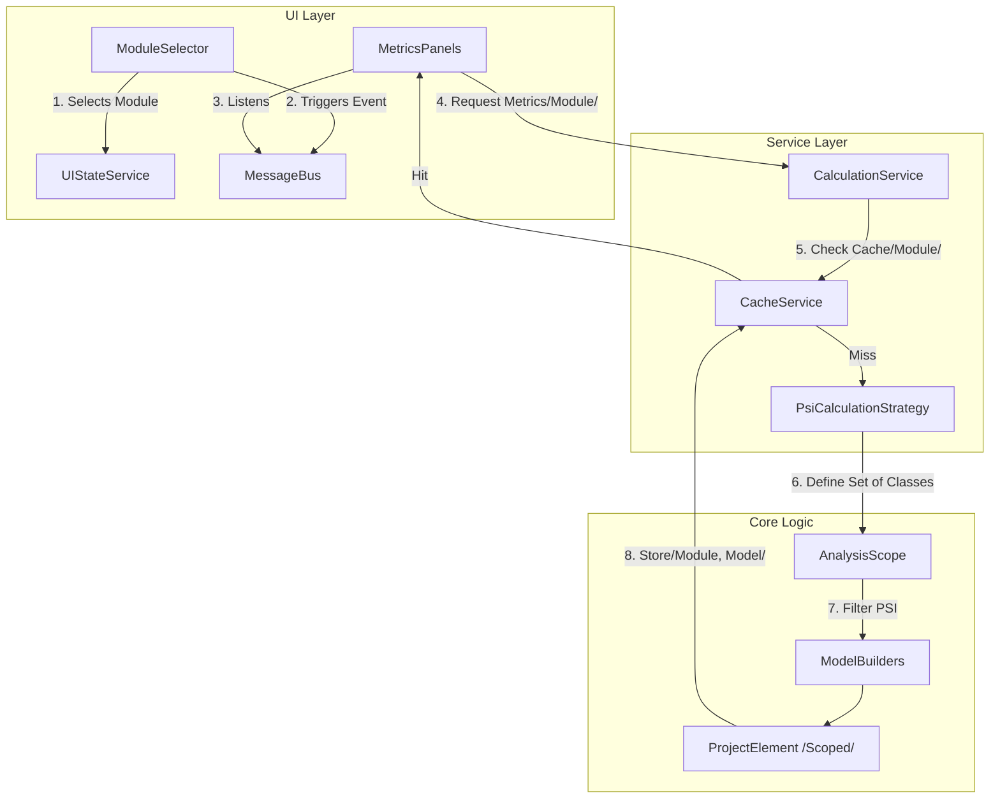

# Refactoring Plan: Module-Aware Metrics Calculation & Caching

## 1. Executive Summary & Goals
The objective of this plan is to finalize and enforce the **Module-Aware Architecture** for the `MetricsTree` plugin. The `ModuleSelector` component will serve as the single source of truth for the analysis scope (Set of Classes), allowing users to switch between the "Whole Project" and individual "Modules".

**Key Goals:**
1.  **Strict Scope Isolation:** Ensure that when a module is selected, all metrics, fitness functions, and charts are calculated *exclusively* for the classes within that module (and its test sources, if configured).
2.  **Context-Aware Caching:** Implement and verify a caching strategy where calculation results (models) are stored and retrieved based on the selected scope (Project vs. Specific Module), preventing data collisions and ensuring fast context switching.
3.  **Uniform Propagation:** Guarantee that the selected scope is propagated consistently from the UI layer (`ModuleSelector`) down to the Core Logic (`AnalysisScope`), without leakage of global project data.

## 2. Current Situation Analysis
Based on the provided file structure, the system has begun the transition to module-aware calculations:
-   **UI:** `ModuleSelector` exists in `src/main/java/org/b333vv/metric/ui/component/ModuleSelector.java` and updates the `UIStateService`.
-   **Service:** `CalculationService` and its implementation accept a `Module` parameter.
-   **Logic:** `PsiCalculationStrategy` creates an `AnalysisScope` based on the passed `Module`.
-   **Caching:** `CacheService` has methods to get/put metrics using `getKey(Module)`.

**Identified Gaps & Risks:**
-   **Verification of Scope:** While the strategy creates a module-based scope, we need to ensure that all downstream builders (`ProjectMetricsSetCalculator`, `ClassLevelFitnessFunctionBuilder`) operate strictly on the resulting `ProjectElement` (sub-tree) and do not query the global `Project` indices directly, which would bleed scope.
-   **Fitness & Charts consistency:** Ensure that visual components (Pie Charts, Histograms) refresh their data source from the *scoped* cache immediately upon selection change.

## 3. Proposed Solution / Refactoring Strategy

### 3.1. High-Level Design / Architectural Overview

The architecture will enforce a top-down propagation of the "Selection Context".



### 3.2. Key Components / Modules

1.  **`ModuleSelector` (UI Controller):**
    *   **Responsibility:** Provides the user-selected "Set of Classes".
    *   **Action:** Updates `UIStateService.selectedModule` and triggers a refresh event.
2.  **`UIStateService` (State Container):**
    *   **Responsibility:** Holds the currently active scope (null = Project, value = Module).
3.  **`CalculationService` (Orchestrator):**
    *   **Responsibility:** The bridge between UI request and Core Logic. Must pass the `Module` context explicitly to all backend calls.
4.  **`CacheService` (State Management):**
    *   **Responsibility:** Manages a map of `Map<String, ProjectElement>` where the key is derived from the Module Name (or "PROJECT_ROOT").

### 3.3. Detailed Action Plan / Phases

#### Phase 1: Scope Definition & Caching Logic Verification
*   **Objective:** Ensure the backend correctly computes and caches data per module.
*   **Priority:** High

*   **Task 1.1: Verify `CacheService` Key Generation**
    *   **Goal:** Ensure `getKey(@Nullable Module)` correctly distinguishes between the root project and a module named "Project".
    *   **Deliverable:** Robust key generation (e.g., using Module UUID or distinct prefix for root).

*   **Task 1.2: Verify `PsiCalculationStrategy` Scope Creation**
    *   **Goal:** Ensure `AnalysisScope` is created correctly for the module.
    *   **Action:** Confirm `scope.setIncludeTestSource(true)` is set for modules (as per requirement to include tests).
    *   **Code Check:**
        ```java
        if (module != null) {
            scope = new AnalysisScope(module);
            scope.setIncludeTestSource(true); // REQUIREMENT
        } else {
            scope = new AnalysisScope(project);
        }
        ```

#### Phase 2: Algorithm Consistency (Fitness Functions & Charts)
*   **Objective:** Ensure all analytical tools consume the scoped model.
*   **Priority:** High

*   **Task 2.1: Refactor Fitness Function Builders**
    *   **Target:** `ClassFitnessFunctionCalculator`, `PackageFitnessFunctionCalculator`.
    *   **Goal:** Ensure they iterate ONLY over the `ProjectElement` passed to them (which represents the module data) and do not traverse the whole PSI.
    *   **Verification:** The methods `classesByMetricsProfileDistribution` should accept `ProjectElement` and iterate `projectElement.allClasses()`.

*   **Task 2.2: Refactor Chart Builders**
    *   **Target:** `CategoryChartDataCalculator`, `PieChartDataCalculator`, `XyChartDataCalculator`.
    *   **Goal:** Ensure they generate statistics solely from the provided `ProjectElement` metrics.

#### Phase 3: UI Integration & Event Handling
*   **Objective:** Connect the `ModuleSelector` to the calculation triggers.
*   **Priority:** Medium

*   **Task 3.1: Update `ModuleSelector` Action**
    *   **Goal:** When value changes:
        1.  Update `UIStateService`.
        2.  Trigger `MetricsEventListener.clearProjectPanel()`.
        3.  Trigger calculation action (e.g., `calculateProjectTree(selectedModule)`).

*   **Task 3.2: Update Panels to use Selected Scope**
    *   **Target:** `ProjectMetricsPanel`, `ClassLevelFitnessFunctionPanel`, `PackageLevelFitnessFunctionPanel`.
    *   **Action:** In `update()` or refresh methods, fetch `selectedModule` from `UIStateService` and pass it to `CalculationService`.

### 3.4. Data Model Changes
No changes to the domain model (`ProjectElement`, `ClassElement`) are required. The `ProjectElement` will simply act as the root container for the selected module's data.

### 3.5. API Design Changes
Ensure all `CalculationService` methods explicitly accept `Module`.

```java
// Ensure signature consistency
void calculateProjectTree(@Nullable Module module);
void calculatePieChart(@Nullable Module module);
// ... etc
```

## 4. Key Considerations & Risk Mitigation
### 4.1. Technical Risks
*   **Global Index Access:** Some visitors might inadvertently use `JavaPsiFacade` to search globally (e.g., for inheritance depth).
    *   **Mitigation:** Accept this for *calculation* accuracy (a class in Module A inheriting from Module B still has DIT > 0), but ensure the *collection* of classes for which metrics are reported is strictly limited to the Module scope.
*   **Cache Invalidation:**
    *   **Challenge:** Changing a file in Module A should ideally only invalidate Module A's cache.
    *   **Mitigation:** For simplicity in V1, invalidate all caches on file change. Optimization to invalidate specific module caches can be added later.

### 4.2. Dependencies
*   IntelliJ `AnalysisScope` API.
*   `UIStateService` for maintaining selection state across tool windows.

## 5. Success Metrics / Validation Criteria
*   **Verification:** Select a small module in a large project. The "Project Metrics" tree should show *only* packages/classes from that module.
*   **Performance:** Switching back to "Whole Project" should be instant if previously calculated (Cache Hit).
*   **Data Accuracy:** "Number of Classes" metric for a Module should be strictly less than or equal to the Whole Project.

## 6. Assumptions Made
*   The user wants to use the existing `Module` concept in IntelliJ as the definition for "Set of Classes".
*   Test sources within a module should be included in that module's metrics.

## 7. Open Questions
*   Should "Dependent Modules" be considered? (Assumption: No, only the strictly selected module content).