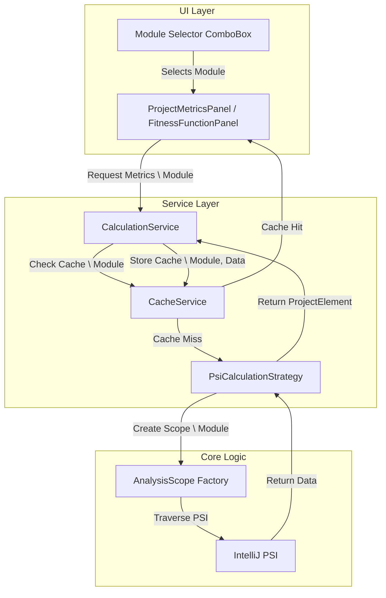

# Refactoring Design Plan: Module-Aware Metrics Calculation

## 1. Executive Summary & Goals
The objective of this plan is to refactor the `MetricsTree` plugin to support **Module-level analysis**. Currently, the plugin calculates metrics for the entire project scope. The new design will allow users to select a specific IntelliJ Module (including test modules) from a dropdown list in the "Project Metrics" and "Metric Fitness Functions" tabs.

**Key Goals:**
1.  **Granularity:** Enable metric calculation and visualization for individual modules, not just the entire project.
2.  **Scope Control:** Update calculation algorithms to respect the selected module scope (classes/files within that module).
3.  **Module-Aware Caching:** Implement a robust caching mechanism that stores and retrieves calculation models keying them by the selected Module, ensuring fast switching between contexts.
4.  **UI Enhancements:** Integrate a Module selection dropdown into the relevant tool window panels.

## 2. Current Situation Analysis
The current architecture, specifically `CalculationServiceImpl` and `PsiCalculationStrategy`, hardcodes the analysis scope to the entire project:
-   `PsiCalculationStrategy` initializes `AnalysisScope scope = new AnalysisScope(project);`.
-   `CacheService` stores results using static Keys (e.g., `PROJECT_METRICS`), which hold a single `ProjectElement` representing the whole project.
-   `ProjectMetricsPanel` and `PackageLevelFitnessFunctionPanel` do not provide any mechanism to filter input data by module.

**Pain Points:**
-   **Performance:** Calculating metrics for a monolithic project structure is slow if the user is only interested in a specific module.
-   **Usability:** In multi-module projects, "Project Level" metrics are often meaningless if they aggregate distinct, unrelated modules.
-   **Inflexibility:** Test sources are explicitly excluded (`scope.setIncludeTestSource(false)`), conflicting with the new requirement to include test modules.

## 3. Proposed Solution / Refactoring Strategy

### 3.1. High-Level Design / Architectural Overview
The refactoring moves from a **Project-Singleton** model to a **Context-Aware** model. The `CalculationService` and `CacheService` will be updated to handle a `Module` context.



### 3.2. Key Components / Modules

#### 3.2.1. UI Layer Updates
-   **`ModuleSelectorPanel` (New):** A reusable Swing component wrapping a `ComboBox<Module>`. It will list all modules in the project plus a "Whole Project" option.
-   **`ProjectMetricsPanel` & `PackageLevelFitnessFunctionPanel` (Modify):** Integrate `ModuleSelectorPanel` into the top toolbar or a new control area.

#### 3.2.2. Service Layer Updates
-   **`CalculationService` (Interface Change):** Update methods to accept a `@Nullable Module module` parameter.
    -   `calculateProjectTree(Module module)`
    -   `getOrBuildProjectMetricsModel(ProgressIndicator indicator, Module module)`
-   **`CacheService` (Data Structure Change):**
    -   Replace simple `Key<ProjectElement>` storage with `Map<String, ProjectElement>`, where the key is the Module Name (or a unique ID).
    -   Implement `getProjectMetrics(Module module)` and `putProjectMetrics(Module module, ProjectElement data)`.

#### 3.2.3. Core Logic Updates
-   **`PsiCalculationStrategy` (Logic Change):**
    -   Accept `Module` in `calculate(...)`.
    -   If `module` is not null, create `new AnalysisScope(module)`.
    -   **Crucial:** Respect the "Include Test Sources" requirement. The current `scope.setIncludeTestSource(false)` must be conditional or configurable.

### 3.3. Detailed Action Plan / Phases

#### Phase 1: Service Layer & Caching Logic Refactoring
-   **Objective:** Enable the backend to handle and cache module-specific data.
-   **Priority:** High
-   **Task 1.1: Update `CacheService`**
    -   **Rationale:** We need to store calculation results per module to avoid re-calculating when the user switches back and forth.
    -   **Implementation:**
        -   Introduce `Map<String, ProjectElement> projectMetricsCache`.
        -   Introduce `Map<String, ProjectElement> packageMetricsCache`.
        -   Update `invalidateUserData()` to clear these maps.
        -   Create helper key generator: `String getKey(Module module) { return module == null ? "PROJECT_ROOT" : module.getName(); }`.
-   **Task 1.2: Refactor `CalculationService` Interface**
    -   **Rationale:** The API must allow passing the context.
    -   **Implementation:** Update `calculateProjectTree`, `calculatePackageFitnessFunctions`, etc., to take `Module` as an argument.

#### Phase 2: Core Calculation Logic Adaptation
-   **Objective:** Ensure the PSI traversal restricts itself to the selected module.
-   **Priority:** High
-   **Task 2.1: Update `PsiCalculationStrategy`**
    -   **Implementation:**
        ```java
        // Pseudocode
        public ProjectElement calculate(Project project, Module module, ProgressIndicator indicator) {
            AnalysisScope scope;
            if (module != null) {
                scope = new AnalysisScope(module);
            } else {
                scope = new AnalysisScope(project);
            }
            // Enable test sources if required by user rules
            scope.setIncludeTestSource(true); 
            // ... rest of logic
        }
        ```
-   **Task 2.2: Update `CalculationServiceImpl`**
    -   **Rationale:** Wire the service to pass the module from the API to the Strategy.
    -   **Implementation:** Update `getOrBuildProjectMetricsModel` to use the new `CacheService` maps and pass `module` to `PsiCalculationStrategy`.

#### Phase 3: UI Implementation & Integration
-   **Objective:** Allow the user to select the module.
-   **Priority:** Medium
-   **Task 3.1: Create `ModuleSelector` Component**
    -   **Rationale:** Reusable component for multiple panels.
    -   **Implementation:**
        -   Use `ModuleManager.getInstance(project).getModules()`.
        -   Add a specific renderer to show Module icons.
        -   Include an "All Modules" (Project) item.
-   **Task 3.2: Integrate into `ProjectMetricsPanel`**
    -   **Implementation:** Add the selector to the toolbar. On selection change, trigger `project.getService(CalculationService.class).calculateProjectTree(selectedModule)`.
-   **Task 3.3: Integrate into `PackageLevelFitnessFunctionPanel`**
    -   **Implementation:** Similar integration. This covers the "Project Metric Functions" requirement.

#### Phase 4: "Including Test Ones" Configuration
-   **Objective:** Fulfill the requirement to include test modules/sources.
-   **Priority:** Medium
-   **Task 4.1:** Ensure `AnalysisScope` includes tests.
    -   **Action:** Verify `AnalysisScope(Module)` behavior. It typically includes test roots by default. Remove explicit `setIncludeTestSource(false)` or make it a toggle in `OtherSettings`.

### 3.4. API Design / Interface Changes
**`org.b333vv.metric.service.CalculationService`**:
```java
// Old
void calculateProjectTree();
// New
void calculateProjectTree(@Nullable Module module);

// Old
ProjectElement getOrBuildProjectMetricsModel(ProgressIndicator indicator);
// New
ProjectElement getOrBuildProjectMetricsModel(ProgressIndicator indicator, @Nullable Module module);
```

**`org.b333vv.metric.event.MetricsEventListener`**:
-   Update events to carry context if necessary, or simply trigger a refresh where the UI pulls the *current* state for the *selected* module.

## 4. Key Considerations & Risk Mitigation
### 4.1. Technical Risks
-   **Cache Invalidation:** When a file changes, we currently invalidate the whole project cache. With module-level caching, we could optimize to invalidate only the relevant module's cache.
    -   *Mitigation:* For Phase 1, keep it simple: invalidate *all* module caches on file change to ensure consistency. Optimization can come later.
-   **Memory Consumption:** Caching metric models for every module in a large project might consume significant RAM.
    -   *Mitigation:* Use `SoftReference` or `WeakReference` for the cache values in `CacheService` if memory becomes an issue.
-   **Cross-Module Dependencies:** Calculating metrics for Module A might depend on classes in Module B (e.g., Coupling). `AnalysisScope(Module)` only traverses files *in* that module.
    -   *Clarification:* Dependencies *to* other modules will still be detected (as external references), but the *internal metrics* of those external classes won't be calculated, which is correct behavior for module-scoped analysis.

### 4.2. Dependencies
-   IntelliJ Platform `ModuleManager` API.
-   IntelliJ `AnalysisScope` API.

## 5. Success Metrics / Validation Criteria
1.  **Functionality:** The user can select a specific module in the dropdown. The metrics tree updates to show ONLY classes/packages belonging to that module.
2.  **Tests:** Selecting a test-only module correctly displays metrics for test classes.
3.  **Performance:** Switching between previously calculated modules is instant (cached).
4.  **Accuracy:** "Project" level metrics (e.g., Total LOC) match the sum of the module's files, not the whole project.

## 6. Assumptions Made
-   The user wants "Module" selection when they say "sets of classes". In IntelliJ context, Module is the standard unit of grouping.
-   "Test ones" implies Test Modules or Test Source Roots within a module. `AnalysisScope` handles both if configured correctly.
-   The existing `ProjectElement` class can serve as the root for a Module-level tree (effectively treating a Module as a mini-Project).

## 7. Open Questions
-   Should we persist the selected module between IDE restarts? (Assumption: No, default to "All Modules" or last selected if simple to implement via `PropertiesComponent`).
-   Does "Project Metric Functions" refer strictly to `PackageLevelFitnessFunctions`? (Assumption: Yes, as this is the tab calculating aggregate metrics like Instability/Abstractness).