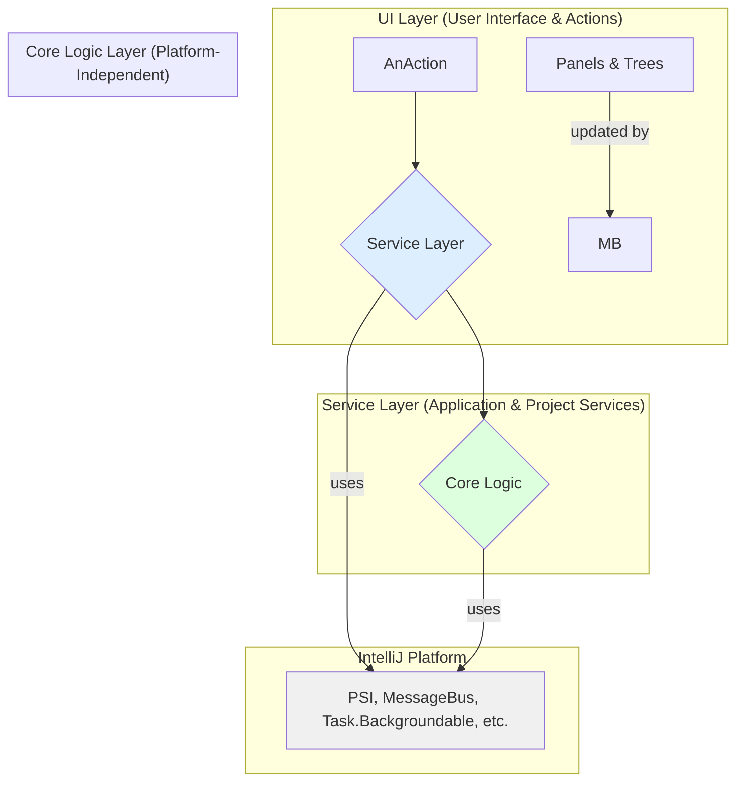

# MetricsTree Plugin Development Context for AI

This document provides essential context about the MetricsTree IntelliJ IDEA plugin for AI-assisted development. Adherence to the principles and rules outlined here is mandatory.

## 1. Project Overview

MetricsTree is an IDE extension that helps developers evaluate the quantitative properties of Java code. It supports a wide range of well-known software metrics at the project, package, class, and method levels.

### Key Features:
- **Comprehensive Metrics Calculation:** Implements classic metric sets including Chidamber-Kemerer, MOOD, Robert C. Martin, Lanza-Marinescu, Halstead, and more.
- **Multi-Level Analysis:** Provides insights at the project, package, class, and method scopes.
- **Rich Visualization:** Represents metrics data through interactive trees, treemaps, and various charts (pie, bar, XY, radar, heatmap).
- **Design Smell Detection:** Uses "Metric Fitness Functions" to help identify potential design issues and anti-patterns like "God Class" or "Feature Envy".
- **Historical Analysis:** Tracks the evolution of project-level metrics over the Git commit history.
- **IDE Integration:** Features include configurable metric thresholds, in-editor code vision hints for values outside reference ranges, and navigation from metrics to source code.

## 2. Architecture

The plugin follows a layered architecture designed to separate concerns, enhance testability, and improve maintainability.

#### 2.1. UI Layer (src/main/java/org/b333vv/metric/ui)
Responsibility: Renders data and captures user input. This layer should be as "dumb" as possible.
Components:
Actions (.../actions): Subclasses of AnAction. They handle user clicks from toolbars and menus. Their sole responsibility is to delegate the request to the appropriate service in the Service Layer.
Tool Windows & Panels (.../tool, .../info): Swing-based UI components (e.g., ProjectMetricsPanel, MetricsSummaryTable) that display data. They are updated exclusively via events from the MessageBus. They should not contain business logic.
Charts & Visualizations (.../chart, .../treemap): Components responsible for visual data representation.
#### 2.2. Service Layer (src/main/java/org/b333vv/metric/service)
Responsibility: Orchestrates application operations, manages state, and acts as a bridge between the UI and Core Logic layers. All services are registered in plugin.xml and retrieved via project.getService(...).
Key Services:
SettingsService: A facade providing unified access to all persistent plugin settings (e.g., metric ranges, fitness functions). This is the ONLY way to access settings.
CacheService: Manages in-memory caching of all calculation results to avoid redundant computations. It also contains the VFS listener to invalidate caches on file changes.
TaskQueueService: Manages a queue for executing long-running operations (Task.Backgroundable) sequentially to prevent UI freezes and race conditions.
UIStateService: Manages volatile, non-persistent UI state, such as filter settings or the "auto-scroll" toggle.
#### 2.3. Core Logic Layer (src/main/java/org/b333vv/metric/model, .../builder, .../visitor)
Responsibility: Contains the pure, platform-independent business logic of the plugin. This layer has no knowledge of the UI or IntelliJ's task management system.
Components:
Domain Model (.../model): POJOs representing the code structure and metrics (e.g., JavaProject, JavaClass, Metric, Value).
Visitors (.../visitor): Implements the Visitor design pattern. These classes traverse the PSI (Program Structure Interface) tree to calculate individual metric values. This is the heart of the calculation engine.
Builders & Calculators (.../builder): Classes that orchestrate the visitors to build the complete domain model (JavaProject) from the source code. They encapsulate the "how-to-calculate" logic.
#### 2.4. Communication
Event-Driven: Components are loosely coupled and communicate via IntelliJ's MessageBus. For example, when a background calculation finishes, it publishes an event. UI panels subscribe to these events and update themselves accordingly.
Service Calls: The UI layer makes direct, simple calls to the Service Layer to initiate actions.
### 3. Technology Stack
   Language: Java 17
   Build System: Gradle with the org.jetbrains.intellij plugin.
   Framework: IntelliJ Platform SDK
   UI: Java Swing (using IntelliJ's custom components: JBTable, JBPanel, JBSplitter, etc.)
   Charting: org.knowm.xchart
   Testing: JUnit 5, Mockito, BasePlatformTestCase (for integration/E2E tests).
   VCS Integration: Git4Idea plugin API.
### 4. Development Best Practices & Rules
   * Rule 1: Adhere to the Layered Architecture.
   UI Layer: Must not contain business logic. Actions delegate to services. Panels update from MessageBus events.
   Service Layer: Orchestrates tasks. Manages application state. Is the only bridge between UI and Core Logic.
   Core Logic Layer: Must be pure. No dependencies on UI or IntelliJ services other than the PSI API.
   * Rule 2: Use Services, Not Static Utils.
   Dependency Injection: Always get services via project.getService(...). Do not add new static utility classes for accessing shared state or logic.
   DEPRECATED CLASSES: The classes MetricsUtils and MetricTaskCache are deprecated and MUST NOT be used. All their functionality has been migrated to the new services.
   * Rule 3: Respect Threading and Concurrency.
   Background Tasks: Any operation that might take more than a few milliseconds (e.g., file I/O, metric calculations) must be wrapped in a com.intellij.openapi.progress.Task.Backgroundable and queued via the TaskQueueService.
   Read Actions: All access to the PSI tree must be wrapped in a ReadAction. Use ReadAction.run(() -> ...) or DumbService.getInstance(project).runWhenSmart(...).
   UI Updates: All modifications to Swing UI components must be performed on the Event Dispatch Thread (EDT). Use ApplicationManager.getApplication().invokeLater(...) or the onSuccess()/onCancel() callbacks of a Task.Backgroundable.
   * Rule 4: Centralize State Management.
   Persistent Settings: All access to persistent configuration must go through the SettingsService. Do not directly access individual *Settings classes (e.g., BasicMetricsValidRangesSettings).
   Volatile UI State: All non-persistent UI state (e.g., tree filters) must be managed by UIStateService.
   Results Caching: All caching of calculation results must use the CacheService. Do not implement custom caches.
   * Rule 5: Use the MessageBus for Decoupling.
   For communication between components where a direct call is inappropriate (e.g., from a background task to the UI), use the project's MessageBus.
   Define new event topics and listeners in the org.b333vv.metric.event package.
   * Rule 6: Follow Testing Conventions.
   Unit Tests: Core logic (visitors, builders, model classes) should have pure JUnit/Mockito unit tests in src/test/java.
   Integration Tests: Services and components requiring a minimal IDE environment should have integration tests in src/integration-test/java extending BasePlatformTestCase.
   E2E Tests: UI Actions and complex workflows should have end-to-end tests in src/e2e-test/java.
### 5. Development Rules
After receiving the order and before starting development, it is necessary to prepare a detailed plan and request its confirmation.