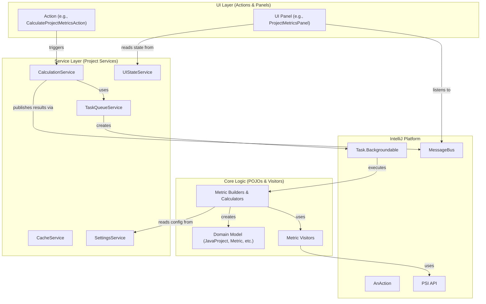

Refactoring

# Refactoring/Design Plan: Decoupling and Improving Maintainability of MetricsTree Plugin

## 1. Executive Summary & Goals
This plan outlines a phased architectural refactoring of the MetricsTree plugin. The primary objective is to significantly reduce coupling between components and improve the overall maintainability, testability, and extensibility of the codebase.

- **Goal 1: Eliminate God Objects.** Deconstruct the `MetricsUtils` and `MetricTaskCache` classes, which currently act as central hubs of functionality and state, leading to high coupling.
- **Goal 2: Establish Clear Architectural Layers.** Introduce and enforce clear boundaries between the Core Logic (metric calculation), Application Services (task management, caching, settings), and the UI Layer.
- **Goal 3: Enhance Testability and Extensibility.** By promoting dependency injection and reducing static dependencies, the new architecture will make components easier to test in isolation and simplify the process of adding new features (e.g., new metrics, new UI views).

## 2. Current Situation Analysis
The current architecture is a mix of good patterns (Visitor for metric calculation, message bus for events) and anti-patterns that hinder maintainability.

- **Key Pain Points:**
    1.  **High Coupling via `MetricsUtils`:** The static `MetricsUtils` class is a "God Object" used throughout the codebase for accessing services, state (e.g., `isProjectAutoScrollable`), and various helper functions. This creates tight, implicit dependencies between unrelated components and makes unit testing extremely difficult.
    2.  **Overloaded `MetricTaskCache` Service:** This service combines multiple responsibilities: task queuing, results caching, and VFS listening. Its static helper methods (`runTask`, `isQueueEmpty`) hide dependencies and further increase coupling.
    3.  **Blurred Layer Boundaries:** There is no clear separation between UI, application logic, and core domain logic. For example, UI-triggering `actions` and background `tasks` have deep knowledge of internal builders and data structures.
    4.  **Inconsistent State Management:** Configuration and application state are accessed inconsistently, sometimes through services (`MetricsService`), sometimes through static utils (`MetricsUtils`), making the data flow hard to trace.

## 3. Proposed Solution / Refactoring Strategy
The proposed strategy is an iterative refactoring to a layered architecture with clearly defined services, promoting Inversion of Control (IoC) and reducing static dependencies.

### 3.1. High-Level Design / Architectural Overview
We will transition from the current highly-coupled model to a layered architecture where dependencies flow in one direction and communication between layers is handled via well-defined service interfaces and events.

**Description:**
1.  **UI Layer:** User interactions (`AnAction`) trigger methods on Application Services. UI Panels subscribe to the `MessageBus` and update themselves when new data is available.
2.  **Service Layer:** A set of focused, testable services manage application concerns. For example, `CalculationService` orchestrates metric calculations, `TaskQueueService` manages background tasks, and `SettingsService` provides a single point of access for all configurations.
3.  **Core Logic:** This layer contains the pure business logic of the plugin. It knows how to build the code model and calculate metrics but is completely unaware of the UI or IntelliJ's task management system.

### 3.2. Key Components / Modules
- **New Services:**
    - `UIStateService`: Manages UI-related state (e.g., `isProjectAutoScrollable`). Replaces parts of `MetricsUtils`.
    - `TaskQueueService`: Manages the background task queue. Replaces the queuing logic in `MetricTaskCache`.
    - `CacheService`: Manages caching of calculation results. Replaces the caching logic in `MetricTaskCache`.
    - `CalculationService`: A facade for all metric calculation logic. Orchestrates builders and calculators. Replaces `MetricTaskManager`.
- **Refactored Services:**
    - `MetricsService`: To be refactored into a dedicated `SettingsService`, providing a unified interface for all `PersistentStateComponent` settings classes.
- **Deprecated & Removed Classes:**
    - `MetricsUtils`: To be completely removed after its functionality is migrated to the new services.
    - `MetricTaskCache`: To be removed after its responsibilities are migrated to `TaskQueueService` and `CacheService`.

### 3.3. Detailed Action Plan / Phases

#### Phase 1: Deconstruct God Objects & Introduce New Services
- **Objective(s):** Break down `MetricsUtils` and `MetricTaskCache` into smaller, single-responsibility services. This is the most critical phase to enable further refactoring and improve testability.
- **Priority:** High

- **Task 1.1:** Create `UIStateService`.
    - **Rationale/Goal:** Isolate UI state management from the static `MetricsUtils` class.
    - **Estimated Effort (Optional):** S
    - **Deliverable/Criteria for Completion:** A new `UIStateService` project service exists. Methods like `isProjectAutoScrollable`, `isProfileAutoScrollable`, etc., are moved from `MetricsUtils` to this service. `SetProjectAutoScrollableAction` is refactored to use this service.

- **Task 1.2:** Create `TaskQueueService`.
    - **Rationale/Goal:** Decouple task execution logic from caching.
    - **Estimated Effort (Optional):** M
    - **Deliverable/Criteria for Completion:** A new `TaskQueueService` exists. The queuing and `isProcessing` logic from `MetricTaskCache` is moved here. The static `MetricTaskCache.runTask` is replaced by an instance method on the new service.

- **Task 1.3:** Create `CacheService`.
    - **Rationale/Goal:** Isolate caching responsibility.
    - **Estimated Effort (Optional):** M
    - **Deliverable/Criteria for Completion:** A new `CacheService` exists. All `Key` constants and `UserDataHolder` logic from `MetricTaskCache` are moved here. The VFS listener for cache invalidation is also moved here.

- **Task 1.4:** Refactor `MetricsService` into `SettingsService`.
    - **Rationale/Goal:** Create a single, clear entry point for all configuration.
    - **Estimated Effort (Optional):** M
    - **Deliverable/Criteria for Completion:** `MetricsService` is renamed to `SettingsService`. It acts as a facade for all `*Settings` classes. All non-settings-related logic is removed. Callers are updated.

- **Task 1.5:** Deprecate `MetricsUtils` and `MetricTaskCache`.
    - **Rationale/Goal:** Guide developers to use the new services and prevent new dependencies on the old classes.
    - **Estimated Effort (Optional):** S
    - **Deliverable/Criteria for Completion:** All methods in `MetricsUtils` and `MetricTaskCache` are marked as `@Deprecated` with instructions pointing to the new services.

#### Phase 2: Isolate Core Calculation Logic
- **Objective(s):** Decouple the metric calculation engine from the IntelliJ framework specifics like `Task.Backgroundable`.
- **Priority:** High

- **Task 2.1:** Create `CalculationService`.
    - **Rationale/Goal:** Provide a single, simple interface for initiating any metric calculation. This service will hide the complexity of task management and caching.
    - **Estimated Effort (Optional):** L
    - **Deliverable/Criteria for Completion:** A `CalculationService` exists. It has methods like `calculateProjectMetrics()`, `calculateClassMetrics(PsiJavaFile)`. It uses the `TaskQueueService` and `CacheService` internally. It publishes results on the `MessageBus`.

- **Task 2.2:** Refactor `actions` to use `CalculationService`.
    - **Rationale/Goal:** Simplify actions and remove their knowledge of specific background tasks.
    - **Estimated Effort (Optional):** M
    - **Deliverable/Criteria for Completion:** All `AnAction` classes in the `actions` package are refactored. They now inject and call `CalculationService` instead of creating `*Task` instances directly.

- **Task 2.3:** Refactor `*Task` classes.
    - **Rationale/Goal:** Tasks should only be responsible for running a piece of logic in the background. They should not contain business logic themselves.
    - **Estimated Effort (Optional):** L
    - **Deliverable/Criteria for Completion:** The logic inside `run()` methods of `*Task` classes is moved into corresponding methods within the `builder` or a new `calculator` package. Tasks become simple wrappers that call the core logic.

#### Phase 3: Final Cleanup and Verification
- **Objective(s):** Remove deprecated code and ensure the new architecture is consistently applied.
- **Priority:** Medium

- **Task 3.1:** Eliminate all usages of `MetricsUtils`.
    - **Rationale/Goal:** Complete the migration away from the God class.
    - **Estimated Effort (Optional):** L
    - **Deliverable/Criteria for Completion:** A global search for `MetricsUtils` yields no results. The class file is deleted.

- **Task 3.2:** Eliminate all usages of `MetricTaskCache`.
    - **Rationale/Goal:** Complete the migration away from the overloaded service.
    - **Estimated Effort (Optional):** M
    - **Deliverable/Criteria for Completion:** A global search for `MetricTaskCache` yields no results. The class file is deleted.

- **Task 3.3:** Review and Refactor UI Panels.
    - **Rationale/Goal:** Ensure UI panels are dumb components that only react to events from the `MessageBus` and do not contain business logic.
    - **Estimated Effort (Optional):** M
    - **Deliverable/Criteria for Completion:** UI panels in `ui.tool` and `ui.info` are reviewed. Any direct calls to calculation services are removed and replaced with event-driven updates.

### 3.4. Data Model Changes
No significant changes to the core data model (`JavaProject`, `JavaClass`, `Metric`, `Value`) are anticipated. The refactoring focuses on the architecture surrounding the model.

### 3.5. API Design / Interface Changes
- **New Service Interfaces:** `UIStateService`, `TaskQueueService`, `CacheService`, `CalculationService`, `SettingsService`.
- **Deprecated APIs:** All public static methods in `MetricsUtils` and `MetricTaskCache`.

## 4. Key Considerations & Risk Mitigation
### 4.1. Technical Risks & Challenges
- **Pervasive Dependencies:** `MetricsUtils` is used extensively. A mechanical, file-by-file replacement is required, which is tedious and error-prone.
    - **Mitigation:** Use IDE refactoring tools to find all usages. Refactor one responsibility at a time and run existing tests after each small change.
- **Concurrency Issues:** Refactoring task and state management could introduce new race conditions or deadlocks.
    - **Mitigation:** Adhere to IntelliJ's threading rules (`runWhenSmart`, `ReadAction`, `invokeLater`). The new `TaskQueueService` will centralize and simplify concurrency management, reducing risk.
- **Test Coverage:** The existing test suite may not cover all edge cases, and refactoring could break untested functionality.
    - **Mitigation:** Before refactoring a component, write new unit tests for it to capture its current behavior. The refactoring itself should make it easier to write more comprehensive tests.

### 4.2. Dependencies
- **Internal:** Tasks in Phase 2 depend on the completion of Phase 1. The final cleanup in Phase 3 depends on the completion of Phases 1 and 2.
- **External:** None. This is a purely internal refactoring.

### 4.3. Non-Functional Requirements (NFRs) Addressed
- **Maintainability:** This is the primary goal. By creating single-responsibility services and clear layers, the code becomes easier to understand, modify, and extend.
- **Testability:** Replacing static dependencies with injectable services is a direct improvement to testability, allowing for proper mocking and isolated unit tests.
- **Performance:** While not a primary goal, centralizing task queuing and caching can provide opportunities to optimize performance by preventing redundant calculations more effectively.
- **Reliability:** Reducing complexity and improving test coverage will lead to a more reliable plugin with fewer bugs.

## 5. Success Metrics / Validation Criteria
- **Code-level Metrics:** A significant reduction (target: >90%) in the number of usages of `MetricsUtils` and `MetricTaskCache` after each phase.
- **Qualitative Assessment:** A developer new to the module should be able to understand the data flow from a UI action to a metric calculation and UI update by following the service interfaces, without needing to understand the entire codebase.
- **Testability:** The ability to write a simple unit test for a `AnAction` or a `CalculationService` method by mocking its dependencies, without needing the full IntelliJ test harness (`BasePlatformTestCase`).
- **Feature Velocity:** Adding a new metric or a new UI view should require touching fewer, more localized files than it does in the current architecture.

## 6. Assumptions Made
- The core logic of the metric `visitor` classes is correct and does not need refactoring.
- The IntelliJ Platform's service management and message bus are the appropriate tools for this architecture.
- The team is familiar with dependency injection principles and their application within the IntelliJ plugin environment.

## 7. Open Questions / Areas for Further Investigation
- Should the various `*Settings` classes be merged into a single `PersistentStateComponent` to simplify the `SettingsService` facade, or is the current separation desirable?
- Can the `builder` and `calculator` classes be further simplified and unified under the new `CalculationService`? A detailed review of their responsibilities is needed during implementation.
- How can the existing tests (`e2e-test`, `integration-test`) be leveraged to validate the refactoring, and what new unit tests are most critical to add first?