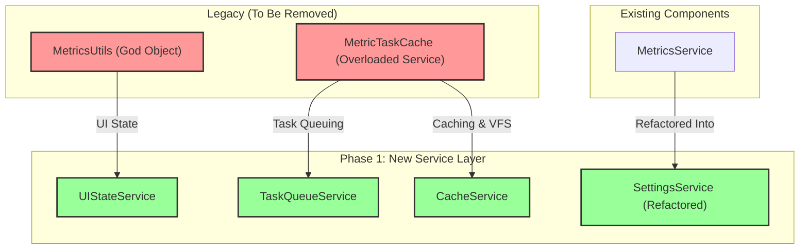

Phase 1 Spec

# Refactoring/Design Plan: Phase 1 - Foundational Service Decomposition

## 1. Executive Summary & Goals
This document provides detailed specifications for Phase 1 of the MetricsTree plugin refactoring. The primary objective of this phase is to dismantle the existing "God Objects" (`MetricsUtils`, `MetricTaskCache`) and establish a foundation of focused, single-responsibility services. This will immediately reduce coupling, improve testability, and pave the way for subsequent architectural improvements.

- **Goal 1:** Create a set of new, clearly defined project-level services for UI state, task queuing, caching, and settings management.
- **Goal 2:** Begin the migration of logic from `MetricsUtils` and `MetricTaskCache` to these new services.
- **Goal 3:** Formally deprecate the legacy God Objects to prevent new dependencies and guide future development.

## 2. Current Situation Analysis
The current architecture is heavily reliant on two classes:
- **`MetricsUtils`**: A static utility class that has grown into a God Object, mixing responsibilities like UI state management, access to project services, and general helper functions. This creates tight, implicit, and untestable dependencies across the entire codebase.
- **`MetricTaskCache`**: A project service that violates the Single Responsibility Principle by managing three distinct concerns: background task queuing, results caching (via `UserDataHolder`), and VFS listening for cache invalidation. Its static helper methods further obscure dependencies.

This design makes the system rigid, difficult to test in isolation, and hard to reason about due to non-obvious data flows and dependencies.

## 3. Proposed Solution / Refactoring Strategy
### 3.1. High-Level Design / Architectural Overview
This phase focuses on creating a new Service Layer composed of focused, project-level services. We will extract specific responsibilities from the legacy classes and move them into these new services. The immediate goal is not to refactor all call sites, but to establish the new architectural components and begin the migration process, starting with the most straightforward use cases.



### 3.2. Key Components / Modules
- **`UIStateService`**: New service to manage UI-specific state.
- **`TaskQueueService`**: New service to manage the background task queue.
- **`CacheService`**: New service to manage caching of calculation results.
- **`SettingsService`**: Refactored from `MetricsService` to be a unified facade for all persistent settings.

### 3.3. Detailed Action Plan / Phases
This plan constitutes a single, focused phase. The following tasks should be executed in order.

- **Phase 1: Foundational Service Creation**
    - **Objective(s):** Establish the new service layer and begin migrating logic.
    - **Priority:** High

    - **Task 1.1:** Create `UIStateService`
        - **Rationale/Goal:** Isolate UI state (e.g., scroll settings, tree visibility) from the static `MetricsUtils` class into a testable, injectable service.
        - **Estimated Effort (Optional):** M
        - **Detailed Steps:**
            1.  Create a new class `org.b333vv.metric.service.UIStateService`.
            2.  Move the following static fields and their corresponding getter/setter methods from `MetricsUtils` into `UIStateService`:
                - `projectAutoScrollable`
                - `profileAutoScrollable`
                - `classMetricsTreeExists`
                - `projectMetricsTreeActive`
                - `classMetricsValuesEvolutionCalculationPerforming`
                - `classMetricsValuesEvolutionAdded`
            3.  Register `UIStateService` as a project-level service in `plugin.xml`:
                ```xml
                <projectService serviceImplementation="org.b333vv.metric.service.UIStateService"/>
                ```
            4.  Refactor `SetProjectAutoScrollableAction` and `SetProfileAutoScrollableAction` to get the `UIStateService` instance from the project and use its methods instead of `MetricsUtils`.
                - **Before:** `MetricsUtils.isProjectAutoScrollable()`
                - **After:** `event.getProject().getService(UIStateService.class).isProjectAutoScrollable()`
            5.  Find all other usages of the moved static members and refactor them to use the new service.
        - **Deliverable/Criteria for Completion:** `UIStateService` is implemented and registered. At least two actions (`SetProjectAutoScrollableAction`, `SetProfileAutoScrollableAction`) are refactored to use it. The original static members in `MetricsUtils` are marked with `@Deprecated`.

    - **Task 1.2:** Create `TaskQueueService`
        - **Rationale/Goal:** Decouple task execution logic from caching, creating a dedicated service for managing background operations.
        - **Estimated Effort (Optional):** M
        - **Detailed Steps:**
            1.  Create a new class `org.b333vv.metric.service.TaskQueueService`.
            2.  Move the `taskQueue` (`ConcurrentLinkedQueue`) and `isProcessing` fields from `MetricTaskCache` to `TaskQueueService`.
            3.  Move the `processNextTask()` method logic from `MetricTaskCache` to `TaskQueueService`.
            4.  Create a new public method `queue(Task.Backgroundable task)` that replaces the old static `runTask` method. This new method will add the task to the queue and trigger `processNextTask()`.
            5.  Create a public method `isQueueEmpty()` that returns `taskQueue.isEmpty() && !isProcessing`.
            6.  Register `TaskQueueService` as a project-level service in `plugin.xml`.
            7.  Refactor `CalculateProjectMetricsAction` to inject `TaskQueueService` and call `queue(task)` instead of `MetricTaskCache.runTask(project, task)`.
        - **Deliverable/Criteria for Completion:** `TaskQueueService` is implemented and registered. The task queuing logic and state are removed from `MetricTaskCache`. `CalculateProjectMetricsAction` is updated to use the new service.

    - **Task 1.3:** Create `CacheService`
        - **Rationale/Goal:** Create a dedicated service for managing in-memory caches and handling VFS-based cache invalidation.
        - **Estimated Effort (Optional):** L
        - **Detailed Steps:**
            1.  Create a new class `org.b333vv.metric.service.CacheService` that implements `UserDataHolder` and `Disposable`.
            2.  Move all `public static final Key<T>` constants from `MetricTaskCache` into `CacheService`.
            3.  Move the `myUserDataHolder`, `javaFiles` map, and all their related public methods (`getUserData`, `putUserData`, `getJavaFile`, `invalidateUserData`, etc.) from `MetricTaskCache` to `CacheService`.
            4.  Move the inner class `MyAsyncVfsListener` and the `VirtualFileManager.getInstance().addAsyncFileListener(...)` registration from `MetricTaskCache`'s constructor to `CacheService`'s constructor.
            5.  Register `CacheService` as a project-level service in `plugin.xml`.
            6.  Refactor `DependenciesTask` and `ClassAndMethodMetricTask` to get/put data from the new `CacheService` instead of `MetricTaskCache`.
        - **Deliverable/Criteria for Completion:** `CacheService` is implemented and registered. All caching logic and VFS listening is removed from `MetricTaskCache`. At least two `*Task` classes are refactored to use the new service.

    - **Task 1.4:** Refactor `MetricsService` into `SettingsService`
        - **Rationale/Goal:** Create a single, clear entry point for all persistent configurations, improving clarity and separating settings access from other logic.
        - **Estimated Effort (Optional):** M
        - **Detailed Steps:**
            1.  Rename the file `MetricsService.java` to `SettingsService.java`.
            2.  Rename the class `MetricsService` to `SettingsService`.
            3.  Update its registration in `plugin.xml` from `<projectService serviceImplementation="...MetricsService"/>` to `<projectService serviceImplementation="...SettingsService"/>`.
            4.  Move the `isLongValueMetricType` method to a new utility class `MetricTypeUtils` or directly onto the `MetricType` enum as a new method `public boolean isLongValue()`.
            5.  Refactor the service to provide clear getter methods for each `*Settings` component (e.g., `public BasicMetricsValidRangesSettings getBasicMetricsSettings()`). This service will now act as a facade.
            6.  Update all call sites that previously used `project.getService(MetricsService.class)` to use `project.getService(SettingsService.class)`.
        - **Deliverable/Criteria for Completion:** `MetricsService` no longer exists. The new `SettingsService` is implemented and acts as a pure facade for configuration components.

    - **Task 1.5:** Formally Deprecate Legacy Classes
        - **Rationale/Goal:** Prevent new usages of the old God Objects and provide clear migration paths for developers during the refactoring process.
        - **Estimated Effort (Optional):** S
        - **Detailed Steps:**
            1.  Add `@Deprecated(forRemoval = true)` to the `MetricsUtils` class definition.
            2.  For each public static method in `MetricsUtils` that was moved, add a `@Deprecated` annotation and a Javadoc comment pointing to the new service. Example:
                ```java
                /** @deprecated Use {@link UIStateService#isProjectAutoScrollable()} instead. */
                @Deprecated(forRemoval = true)
                public static boolean isProjectAutoScrollable() { ... }
                ```
            3.  Add `@Deprecated(forRemoval = true)` to the `MetricTaskCache` class definition.
            4.  For each public method in `MetricTaskCache` that was moved, add a `@Deprecated` annotation and a Javadoc comment pointing to the new service (e.g., `TaskQueueService` or `CacheService`).
        - **Deliverable/Criteria for Completion:** All public, refactored members of `MetricsUtils` and `MetricTaskCache` are marked as deprecated with clear Javadoc instructions for migration.

### 3.4. Data Model Changes
No changes to the core data model are required for this phase.

### 3.5. API Design / Interface Changes
This phase introduces the following new public service APIs:
- `UIStateService`: `isProjectAutoScrollable()`, `setProjectAutoScrollable(boolean)`, etc.
- `TaskQueueService`: `queue(Task.Backgroundable)`, `isQueueEmpty()`
- `CacheService`: `getUserData(Key<T>)`, `putUserData(Key<T>, T)`, `getJavaFile(VirtualFile)`, etc.
- `SettingsService`: `getBasicMetricsSettings()`, `getClassMetricsTreeSettings()`, etc.

## 4. Key Considerations & Risk Mitigation
### 4.1. Technical Risks & Challenges
- **Widespread Change:** The refactoring of `MetricsUtils` will touch many files.
    - **Mitigation:** Proceed method-by-method. Use the IDE's "Find Usages" and refactoring tools extensively. Run all tests after each logical group of changes.
- **Service Lifecycle:** Ensuring services are available when needed and disposed of correctly is critical.
    - **Mitigation:** Rely on IntelliJ's standard project-level service registration in `plugin.xml`, which handles the lifecycle automatically.

### 4.2. Dependencies
- The tasks within this phase are sequential. For example, `UIStateService` must be created before usages in `MetricsUtils` can be refactored.

### 4.3. Non-Functional Requirements (NFRs) Addressed
- **Maintainability:** This is the primary driver. Code will become more organized and responsibilities will be clearer.
- **Testability:** The new services will be injectable and mockable, allowing for true unit tests to be written for components that use them.

## 5. Success Metrics / Validation Criteria
- All new services (`UIStateService`, `TaskQueueService`, `CacheService`, `SettingsService`) are created and registered in `plugin.xml`.
- At least one action/component is successfully refactored to use each new service.
- All public methods and classes targeted in this phase are marked with `@Deprecated`.
- All existing tests continue to pass after the refactoring.

## 6. Assumptions Made
- The IntelliJ Platform's service management (`project.getService()`) is the correct mechanism for dependency injection in this context.
- The development team has a sufficient understanding of dependency injection and the Single Responsibility Principle.

## 7. Open Questions / Areas for Further Investigation
- Should the new services have corresponding interfaces to further decouple implementations? (Recommendation: Yes, for testability. This can be added as part of each task.)
- What is the best location for the new `service` package? (Recommendation: `org.b333vv.metric.service`)