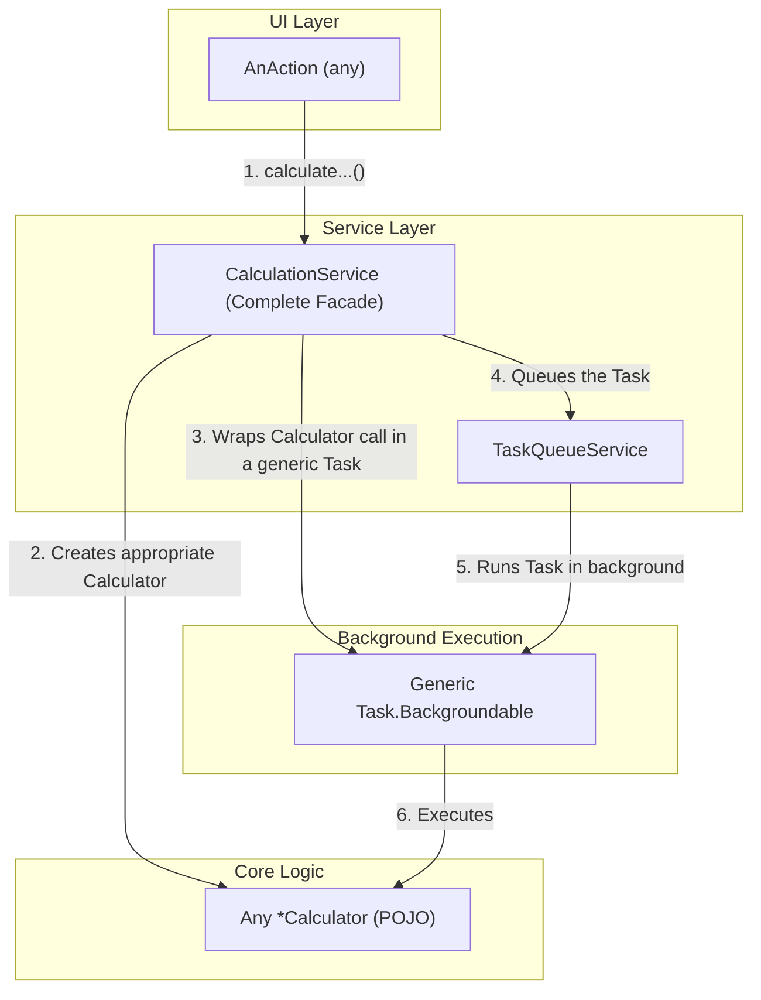

# Refactoring Plan: Completion of Phase 2 - Core Logic Isolation

## 1. Executive Summary & Goals
This document provides a comprehensive, actionable plan to complete the goals outlined in `Phase 2 Detailed.md`. The primary objective is to systematically apply the successful refactoring pattern established for the `ProjectTree` workflow to all remaining calculation tasks. This will fully decouple the core metric calculation logic from the IntelliJ Platform's execution framework, making the codebase more modular, testable, and maintainable.

- **Goal 1:** Fully implement the `CalculationService` facade to serve as the single, high-level entry point for all metric computation and data generation workflows.
- **Goal 2:** Systematically refactor all remaining `*Task` classes, extracting their business logic into dedicated, testable `*Calculator` or `*Builder` components.
- **Goal 3:** Simplify all UI `AnAction` classes by delegating their calculation requests to the `CalculationService`, thereby removing their knowledge of specific background task implementations.

## 2. Current Situation Analysis
Analysis of the current codebase against the plan in `Phase 2 Detailed.md` reveals the following status:

- **Completed Work:**
    - The `ProjectTree` calculation workflow has been successfully refactored.
    - `CalculationService` is implemented and correctly handles the `ProjectTree` workflow, using the `TaskQueueService` and `CacheService`.
    - `ProjectTreeModelCalculator` correctly encapsulates the core logic for tree model creation and is unit-tested.
    - `CalculateProjectMetricsAction` is fully decoupled, making a single call to `CalculationService`.
    - The corresponding E2E test for `CalculateProjectMetricsAction` has been updated to validate this new interaction.

- **Incomplete Tasks & Gaps:**
    - **Task 3.1 (Systematic Refactoring):** This is the largest remaining gap. The majority of `*Task` classes (e.g., `PieChartTask`, `ExportToXmlTask`, `ClassFitnessFunctionsTask`) still contain significant business logic within their `run()` methods. The refactoring pattern has not yet been applied to them.
    - **Task 3.2 (Service Implementation):** The `CalculationService` is incomplete. It only exposes the `calculateProjectTree()` method. Methods for triggering other calculations (charts, exports, etc.) are missing. Consequently, the `AnAction` classes for these features have not been refactored.
    - **Test Coverage:** While the `ProjectTree` workflow is now well-tested, the business logic inside the other `*Task` classes remains difficult to test. New unit tests must be created for each `*Calculator` as the logic is extracted.

## 3. Proposed Solution / Refactoring Strategy
### 3.1. High-Level Design / Architectural Overview
The target architecture remains the same as defined in `Phase 2 Detailed.md`. The goal is to route all UI actions through the `CalculationService`, which orchestrates background execution of pure-logic `*Calculator` components. This plan details the systematic application of this pattern to the rest of the codebase.

### 3.2. Key Components / Modules
- **`CalculationService`:** To be expanded with methods for every calculation type.
- **`*Calculator` / `*Builder` Classes:** New classes to be created by extracting logic from existing `*Task` classes.
- **`*Task` Classes:** To be refactored into simple wrappers, and eventually replaced by a single generic task class.

### 3.3. Detailed Action Plan / Phases
The remaining work is broken down into logical phases based on functionality. Each task follows the pattern: **Extract Logic -> Refactor Task -> Implement Service Method -> Refactor Action -> Add Tests**.

#### Phase 1: Refactor Chart and Visualization Tasks
- **Objective(s):** Decouple all chart and treemap generation logic from background task implementations.
- **Priority:** High

- **Task 1.1:** Refactor `PieChartTask`
    - **Rationale/Goal:** Isolate pie chart data generation logic.
    - **Estimated Effort (Optional):** M
    - **Deliverable/Criteria for Completion:**
        1.  Create `org.b333vv.metric.builder.PieChartDataCalculator`.
        2.  Move logic from `PieChartTask.run()` to a `calculate()` method in the new calculator.
        3.  Refactor `PieChartTask` to accept a `Supplier` for its data.
        4.  Add `void calculatePieChart()` to the `CalculationService` interface and implement it.
        5.  Refactor `BuildMetricsPieChartAction` to call `calculationService.calculatePieChart()`.
        6.  Create `PieChartDataCalculatorTest.java` to unit-test the extracted logic.

- **Task 1.2:** Refactor `CategoryChartTask`
    - **Rationale/Goal:** Isolate category chart data generation logic.
    - **Estimated Effort (Optional):** M
    - **Deliverable/Criteria for Completion:**
        1.  Create `org.b333vv.metric.builder.CategoryChartDataCalculator`.
        2.  Move logic from `CategoryChartTask.run()` to the new calculator.
        3.  Refactor `CategoryChartTask` into a wrapper.
        4.  Add `void calculateCategoryChart()` to `CalculationService`.
        5.  Refactor `BuildMetricsCategoryChartAction` to call the service.
        6.  Create `CategoryChartDataCalculatorTest.java`.

- **Task 1.3:** Refactor `MetricTreeMapTask`
    - **Rationale/Goal:** Isolate treemap model generation logic.
    - **Estimated Effort (Optional):** M
    - **Deliverable/Criteria for Completion:**
        1.  Create `org.b333vv.metric.builder.MetricTreeMapModelCalculator`.
        2.  Move logic from `MetricTreeMapTask.run()` to the new calculator.
        3.  Refactor `MetricTreeMapTask` into a wrapper.
        4.  Add `void calculateMetricTreeMap()` to `CalculationService`.
        5.  Refactor `BuildMetricTreeMapAction` to call the service.
        6.  Create `MetricTreeMapModelCalculatorTest.java`.

- **Task 1.4:** Continue for all remaining visualization tasks
    - **Rationale/Goal:** Apply the same pattern to all other `*...ChartTask` and `*...TreeMapTask` classes.
    - **Estimated Effort (Optional):** L
    - **Deliverable/Criteria for Completion:** All tasks in the `task` package related to UI visualization are refactored, with corresponding `CalculationService` methods and updated `AnAction` classes.

#### Phase 2: Refactor Data Export Tasks
- **Objective(s):** Decouple all data export logic.
- **Priority:** Medium

- **Task 2.1:** Refactor `ExportToXmlTask`
    - **Rationale/Goal:** Isolate XML report generation logic.
    - **Estimated Effort (Optional):** M
    - **Deliverable/Criteria for Completion:**
        1.  Create `org.b333vv.metric.export.XmlReportBuilder`.
        2.  Move logic from `ExportToXmlTask.run()` to the new builder.
        3.  Refactor `ExportToXmlTask` into a wrapper.
        4.  Add `void exportToXml()` to `CalculationService`.
        5.  Refactor `ExportCalculatedMetricsToXmlAction` to call the service.
        6.  Create `XmlReportBuilderTest.java`.

- **Task 2.2:** Refactor CSV Export Tasks
    - **Rationale/Goal:** Isolate CSV generation logic for class, method, and package metrics.
    - **Estimated Effort (Optional):** L
    - **Deliverable/Criteria for Completion:** Repeat the pattern from previous tasks for `ExportClassMetricsToCsvTask`, `ExportMethodMetricsToCsvTask`, and `ExportPackageMetricsToCsvTask`, creating corresponding `*CsvBuilder` classes and service methods.

#### Phase 3: Refactor Fitness Function and Other Tasks
- **Objective(s):** Decouple the remaining calculation logic.
- **Priority:** Medium

- **Task 3.1:** Refactor `ClassFitnessFunctionsTask` and `PackageFitnessFunctionsTask`
    - **Rationale/Goal:** Isolate fitness function calculation logic.
    - **Estimated Effort (Optional):** L
    - **Deliverable/Criteria for Completion:**
        1.  Create `ClassFitnessFunctionCalculator` and `PackageFitnessFunctionCalculator`.
        2.  Extract logic from the corresponding `*Task` classes.
        3.  Refactor tasks into wrappers.
        4.  Add `calculateClassFitnessFunctions()` and `calculatePackageFitnessFunctions()` to `CalculationService`.
        5.  Refactor `BuildClassLevelFitnessFunctionAction` and `BuildPackageLevelFitnessFunctionAction`.
        6.  Create corresponding unit tests for the new calculators.

- **Task 3.2:** Refactor `ClassByMetricsTreeTask`
    - **Rationale/Goal:** Isolate the logic for building the sorted class tree.
    - **Estimated Effort (Optional):** M
    - **Deliverable/Criteria for Completion:**
        1.  Create `SortedClassesTreeModelCalculator`.
        2.  Extract logic from `ClassByMetricsTreeTask`.
        3.  Refactor the task, add a service method, and update `SortClassesByMetricsValuesAction`.
        4.  Create a unit test for the new calculator.

#### Phase 4: Generalization and Finalization
- **Objective(s):** Reduce boilerplate code and perform a final verification of the architecture.
- **Priority:** Medium

- **Task 4.1:** Create a Generic `MetricsBackgroundableTask` Wrapper
    - **Rationale/Goal:** Eliminate the numerous, now-redundant `*Task` wrapper classes, as suggested in the original plan.
    - **Estimated Effort (Optional):** M
    - **Deliverable/Criteria for Completion:**
        1.  Create a generic class `MetricsBackgroundableTask<T>` that accepts a `Supplier<T>` for the main logic and a `Consumer<T>` for the `onSuccess` callback.
        2.  Refactor all `CalculationService` methods to use this generic task instead of instantiating specific (but now empty) `*Task` classes.
        3.  Delete all the now-unused `*Task` classes (e.g., `ProjectTreeTask`, `PieChartTask`, etc.), except for the new generic one.

- **Task 4.2:** Final Test Suite Execution and Manual Verification
    - **Rationale/Goal:** To provide a final, comprehensive check for any regressions.
    - **Estimated Effort (Optional):** M
    - **Deliverable/Criteria for Completion:** The entire test suite passes. A manual check of each UI button confirms that all calculation features work as expected.

## 4. Key Considerations & Risk Mitigation
- **Technical Risk:** Extracting logic that is intertwined with `ProgressIndicator` updates can be complex.
    - **Mitigation:** The new `*Calculator` classes can accept a `Consumer<String>` for progress updates, which the generic `MetricsBackgroundableTask` can provide via a lambda connected to the `ProgressIndicator`. This keeps the core logic free of direct `ProgressIndicator` dependency.
- **Refactoring Fatigue:** The process is repetitive.
    - **Mitigation:** Tackle one functional area at a time (e.g., all charts, then all exports). The creation of the generic task in Phase 4 is a key step to reduce the final amount of boilerplate code.

## 5. Success Metrics / Validation Criteria
- **Primary Metric:** All `AnAction` classes that trigger calculations use the `CalculationService`.
- **Primary Metric:** All business logic is removed from the `task` package and resides in testable `builder` or `calculator` classes.
- **Verification:** The `CalculationService` interface is complete, with methods for all user-driven calculations.
- **Code Quality:** The number of classes in the `task` package is reduced to one or very few generic wrappers.
- **Functional Correctness:** The application's functionality remains unchanged from the user's perspective.

## 6. Assumptions Made
- The successful refactoring of `ProjectTreeTask` serves as a valid and repeatable pattern for all other tasks.
- The `MessageBus` is the correct and sufficient mechanism for communicating results back to the UI layer for all calculation types.

## 7. Open Questions / Areas for Further Investigation
- **Calculator Granularity:** The plan suggests a one-to-one mapping of tasks to calculators. During implementation, if significant overlap is found (e.g., multiple chart calculators share data preparation steps), these could be consolidated into a smaller number of more versatile calculators. This can be addressed as an optimization during or after the main refactoring.

