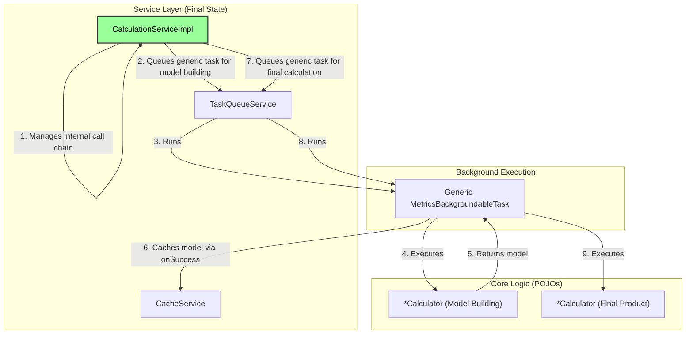

# Refactoring Plan: Finalizing Core Logic Isolation

## 1. Executive Summary & Goals
This document provides a detailed specification to complete the architectural refactoring of the MetricsTree plugin. The previous phase successfully decoupled most UI actions and calculation logic, but left a dependency on the legacy `MetricTaskManager` for foundational data model creation.

This plan's primary objective is to eliminate this final dependency by absorbing all orchestration logic into the `CalculationService`, thereby making it the single, authoritative entry point for all metric-related operations. This will finalize the decoupling of core logic, simplify the service architecture, and remove obsolete code.

- **Goal 1:** Migrate all remaining model-building logic from legacy `*Task` classes into the new service-oriented architecture, orchestrated by `CalculationService`.
- **Goal 2:** Completely remove the `MetricTaskManager` service and its associated legacy `*Task` classes.
- **Goal 3:** Ensure the final architecture is robust, consistent, and fully validated through automated and manual testing.

## 2. Current Situation Analysis
The current architecture is in a transitional state. While UI `AnAction`s correctly use the `CalculationService` facade, the service itself delegates the initial, critical step of building the `JavaProject` model to the `MetricTaskManager`. This manager still uses an old pattern of instantiating specific, logic-filled `*Task` classes (`ClassAndMethodMetricTask`, `DependenciesTask`, etc.), which were intended to be removed.

- **Key Pain Point:** The `CalculationService` is not a true, self-sufficient facade. It has a "man-in-the-middle" dependency on `MetricTaskManager`, which prevents the full benefits of the new architecture from being realized and keeps obsolete code in the project.
- **Architectural Inconsistency:** Two different patterns for background processing coexist: the new generic task pattern in `CalculationService` for high-level features, and the old specific-task pattern in `MetricTaskManager` for foundational data.

## 3. Proposed Solution / Refactoring Strategy
The strategy is to complete the migration by refactoring the `CalculationService` to handle the entire calculation pipeline, from building the initial code model to producing the final result. This involves moving the orchestration logic from `MetricTaskManager` into `private` helper methods within `CalculationServiceImpl`, which will then be used by the existing public API. Once `MetricTaskManager` has no more responsibilities, it and its legacy tasks will be deleted.

### 3.1. High-Level Design / Architectural Overview
The final architecture will have a clean, two-step flow for any calculation:
1.  A public method in `CalculationService` is called.
2.  Internally, the service ensures the required base model (`JavaProject`) is built and cached (using private helpers and the generic task).
3.  The service then uses this model to perform the final calculation (e.g., generate a chart), also in a generic background task.

### 3.2. Detailed Action Plan / Phases

#### Phase 1: Logic Consolidation and Service Refactoring
- **Objective(s):** Make `CalculationService` self-sufficient by absorbing all model-building logic from `MetricTaskManager`.
- **Priority:** High

- **Task 1.1:** Implement Private Model-Building Helpers in `CalculationServiceImpl`
    - **Rationale/Goal:** To centralize and refactor the logic for creating and caching the foundational `JavaProject` models, removing the need for `MetricTaskManager`.
    - **Estimated Effort (Optional):** L
    - **Deliverable/Criteria for Completion:**
        1.  Create a `private DependenciesBuilder getOrBuildDependencies(ProgressIndicator indicator)` method in `CalculationServiceImpl`. This method will:
            - Check `CacheService` for `DEPENDENCIES`.
            - If cache miss, create and run a `MetricsBackgroundableTask<DependenciesBuilder>` that executes `new DependenciesCalculator(...).calculateDependencies()`.
            - The task's `onSuccess` will populate the cache.
            - **Note:** This method will need to run synchronously for internal use, so it should manage the background task and wait for its completion if necessary, or the dependent methods must be adapted to be asynchronous.
        2.  Create a `private JavaProject getOrBuildClassAndMethodModel(ProgressIndicator indicator)` method. This method will:
            - Check `CacheService` for `CLASS_AND_METHODS_METRICS`.
            - If cache miss, first ensure dependencies are built by calling `getOrBuildDependencies(indicator)`.
            - Then, run a `MetricsBackgroundableTask<JavaProject>` that executes `new ClassAndMethodsMetricsCalculator(...).calculateMetrics()`.
            - The task's `onSuccess` will populate the cache.
        3.  Repeat this pattern for `getPackageMetricsModel` (which depends on `getClassAndMethodModel`) and `getProjectMetricsModel` (which depends on `getPackageMetricsModel`), mirroring the dependency chain from `MetricTaskManager`.

- **Task 1.2:** Update Public `CalculationService` Methods to Use Helpers
    - **Rationale/Goal:** To sever the final ties to `MetricTaskManager`.
    - **Estimated Effort (Optional):** M
    - **Deliverable/Criteria for Completion:**
        1.  Go through every public method in `CalculationServiceImpl` (e.g., `calculatePieChart`, `exportToXml`).
        2.  Replace any call to `project.getService(MetricTaskManager.class).get...Model()` with a call to the appropriate new private helper method (e.g., `getOrBuildClassAndMethodModel(indicator)`).
        3.  Ensure the `ProgressIndicator` is correctly passed down from the generic background task that wraps the entire public method's logic.

- **Task 1.3:** Adapt and Enhance Integration Tests
    - **Rationale/Goal:** To verify the new, more complex orchestration logic within `CalculationService`.
    - **Estimated Effort (Optional):** M
    - **Deliverable/Criteria for Completion:**
        1.  The existing `CalculationServiceTest` is expanded.
        2.  New tests are added to verify the dependency chaining. For example, a test for `calculateProjectMetricsHistoryChart` should, with an empty cache, trigger a chain of calculations that results in `DependenciesCalculator`, `ClassAndMethodsMetricsCalculator`, etc., being run (verifiable with mocks/spies).
        3.  The logic from any existing tests for the legacy `*Task` classes should be moved into new unit tests for their corresponding `*Calculator` classes.

#### Phase 2: Final Cleanup and Verification
- **Objective(s):** Remove all obsolete code and perform a final validation of the completed architecture.
- **Priority:** High

- **Task 2.1:** Delete Obsolete Classes
    - **Rationale/Goal:** To remove all legacy components related to the old task management system, leaving the codebase clean and consistent.
    - **Estimated Effort (Optional):** S
    - **Deliverable/Criteria for Completion:**
        1.  Delete the file `src/main/java/org/b333vv/metric/task/MetricTaskManager.java`.
        2.  Delete the following files from `src/main/java/org/b333vv/metric/task/`:
            - `ClassAndMethodMetricTask.java`
            - `DependenciesTask.java`
            - `PackageMetricTask.java`
            - `ProjectMetricTask.java`
        3.  The project must compile successfully after these deletions.

- **Task 2.2:** Full Regression Testing
    - **Rationale/Goal:** To provide a final, comprehensive check for any regressions introduced during the consolidation.
    - **Estimated Effort (Optional):** M
    - **Deliverable/Criteria for Completion:**
        1.  The entire automated test suite (unit, integration, E2E) is executed and passes with 100% success.
        2.  A manual test is performed on at least two key features that rely on the full calculation chain (e.g., "Calculate Project Metrics" and "Build Project Metrics History XY Chart"). The features must function correctly from a cold start (empty cache), triggering the full background processing chain and updating the UI as expected.

## 4. Key Considerations & Risk Mitigation
- **Synchronous vs. Asynchronous Helpers:** The private `getOrBuild...` methods inside `CalculationServiceImpl` will be called from a background thread (the one running the main generic task). However, they need to ensure their own sub-tasks complete before the main task proceeds. This can be managed by running the sub-tasks and blocking for their result, as the entire operation is already off the UI thread. Care must be taken to avoid deadlocks.
- **Testing Private Methods:** The new private helper methods in `CalculationServiceImpl` contain critical logic. While private methods are not typically tested directly, their behavior must be verified. This can be achieved by writing thorough integration tests for the public methods that rely on them, using mocks to confirm that the correct sequence of calculations is triggered.

## 5. Success Metrics / Validation Criteria
- **Code Metric:** The `org.b333vv.metric.task` package is free of all specific, logic-filled task classes.
- **Code Metric:** The `MetricTaskManager.java` file no longer exists.
- **Architectural Verification:** A code review confirms that `CalculationServiceImpl` is now the sole orchestrator of all metric calculations.
- **Functional Verification:** All automated tests pass, and manual testing confirms that end-to-end features that require model building (e.g., project tree, project-level charts) work correctly from a cold cache.

## 6. Assumptions Made
- The logic within the `*Calculator` classes is a correct and complete representation of the logic from the legacy `*Task` classes.
- The existing `CacheService` and `TaskQueueService` are robust and sufficient for the needs of the expanded `CalculationService`.

## 7. Open Questions / Areas for Further Investigation
- None. This plan outlines the final, concrete steps to achieve the long-term architectural goal of a fully decoupled calculation pipeline.