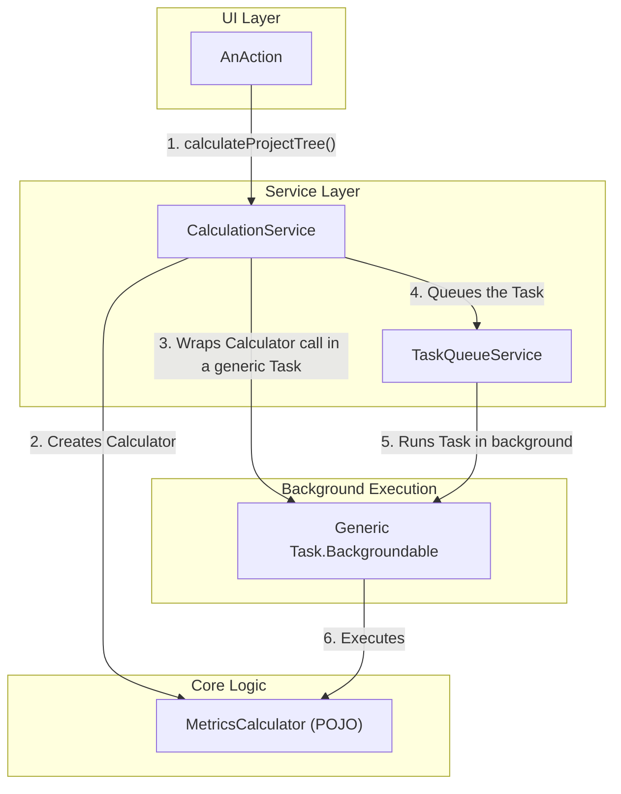

# Refactoring Plan: Phase 2 - Isolate Core Calculation Logic

## 1. Executive Summary & Goals
This document provides a comprehensive, actionable realization plan for Phase 2 of the MetricsTree plugin refactoring. It merges the goals of `Phase 2 Spec.md` with the validation strategy of `Phase 2 Test.md`. The primary objective is to fully decouple the core metric calculation logic from the IntelliJ Platform's execution framework by introducing a `CalculationService` facade, simplifying the UI layer, and making the core logic pure, reusable, and independently testable.

- **Goal 1:** Introduce `CalculationService` as the single, high-level entry point for initiating all metric computations.
- **Goal 2:** Simplify all UI `AnAction` classes by delegating calculation requests to the `CalculationService`.
- **Goal 3:** Refactor the `*Task` classes into thin, generic wrappers, moving their business logic into dedicated, testable `calculator` or `builder` classes.
- **Goal 4:** Validate each step of the refactoring with a combination of new and adapted unit, integration, and E2E tests.

## 2. Current Situation Analysis
Following Phase 1, foundational services for state, caching, and settings are in place. However, the UI `Action` classes remain tightly coupled to specific `Task.Backgroundable` implementations (e.g., `CalculateProjectMetricsAction` directly instantiates `ProjectTreeTask`).

- **Key Pain Points:**
    1.  **Mixed Concerns in Tasks:** The `*Task` classes (e.g., `ProjectTreeTask`, `PieChartTask`) still contain significant business logic, mixing the "what" (the calculation) with the "how" (background execution).
    2.  **Brittle UI Actions:** `AnAction` classes have too much responsibility. They need to know which specific `Task` to create, making them difficult to test and brittle to changes.
    3.  **Untestable Core Logic:** The core calculation logic, being embedded within `Task` classes, cannot be easily unit-tested without a full IDE environment.

## 3. Proposed Solution / Refactoring Strategy
### 3.1. High-Level Design / Architectural Overview
This phase introduces a `CalculationService` that acts as a mediator between the UI layer and the core logic. Actions will now make simple, declarative calls to this service (e.g., `calculateProjectTree()`). The service will then orchestrate the background execution using the `TaskQueueService` and the refactored, logic-free `Task` wrappers.

**Description:** The `AnAction` is now only responsible for initiating a request. The `CalculationService` handles the complexity of checking caches, preparing the correct calculator, wrapping it in a generic background task, and queuing it for execution.

### 3.2. Key Components / Modules
- **`CalculationService` (New):** A project-level service that provides a high-level API for all metric calculation workflows.
- **`*Calculator` / `*Builder` Classes (New/Refactored):** A set of plain Java classes (POJOs) that encapsulate the pure logic of calculating metrics or building data models. These will be extracted from the existing `*Task` classes.
- **`*Task` Classes (Refactored):** These will be simplified to become generic wrappers that execute a `Runnable` or `Supplier`.

### 3.3. Detailed Action Plan / Phases
The plan is broken into sequential phases to ensure a stable, test-driven refactoring process.

#### Phase 1: Prerequisite - Test Baseline Creation
- **Objective(s):** Create a test safety net to validate the behavior of existing components before refactoring them.
- **Priority:** High

- **Task 1.1:** Create Integration Test for `ProjectTreeTask`
    - **Rationale/Goal:** To capture the current behavior of a key `*Task` class before its logic is extracted. This test will serve as a contract for the refactoring.
    - **Estimated Effort (Optional):** M
    - **Deliverable/Criteria for Completion:** A new integration test, `src/integration-test/java/org/b333vv/metric/task/ProjectTreeTaskTest.java`, is created. It instantiates and runs the `ProjectTreeTask` and asserts that the resulting `DefaultTreeModel` is correctly created and stored in the cache. The test passes.

- **Task 1.2:** Run Full Existing Test Suite
    - **Rationale/Goal:** To ensure the project is in a stable, "green" state before beginning modifications.
    - **Estimated Effort (Optional):** S
    - **Deliverable/Criteria for Completion:** The entire existing test suite (`test`, `integrationTest`, `e2eTest`) passes without errors.

#### Phase 2: Core Refactoring - The `ProjectTree` Workflow
- **Objective(s):** Implement the new service-oriented architecture for a single, representative workflow (`CalculateProjectMetricsAction` -> `ProjectTreeTask`).
- **Priority:** High

- **Task 2.1:** Create `CalculationService` Interface and Implementation
    - **Rationale/Goal:** To establish the stable, high-level API for initiating all metric calculations.
    - **Estimated Effort (Optional):** M
    - **Deliverable/Criteria for Completion:**
        1.  `CalculationService` interface and `CalculationServiceImpl` class are created in `org.b333vv.metric.service`.
        2.  The service is registered in `plugin.xml` with its interface.
        3.  The implementation's constructor is injected with `TaskQueueService`, `CacheService`, and `SettingsService`.
        4.  A placeholder method `void calculateProjectTree()` is defined in the interface and implementation.

- **Task 2.2:** Extract `ProjectTreeModelCalculator` and Refactor `ProjectTreeTask`
    - **Rationale/Goal:** To extract the business logic from `ProjectTreeTask` into a testable, reusable POJO component.
    - **Estimated Effort (Optional):** L
    - **Deliverable/Criteria for Completion:**
        1.  A new class `org.b333vv.metric.builder.ProjectTreeModelCalculator` is created.
        2.  The core logic from `ProjectTreeTask.run()` is moved into a `public DefaultTreeModel calculate()` method in the new calculator.
        3.  `ProjectTreeTask` is refactored to accept a `Supplier<DefaultTreeModel>` in its constructor. Its `run()` method now only invokes the supplier, and `onSuccess()` publishes the result.

- **Task 2.3:** Adapt `ProjectTreeTaskTest` to become `ProjectTreeModelCalculatorTest`
    - **Rationale/Goal:** To convert the integration test from Phase 1 into a fast, reliable unit test for the new pure-logic component.
    - **Estimated Effort (Optional):** S
    - **Deliverable/Criteria for Completion:** The test file is renamed/moved to `src/test/java/org/b333vv/metric/builder/ProjectTreeModelCalculatorTest.java`. It no longer extends `BasePlatformTestCase`. It instantiates `ProjectTreeModelCalculator` directly, calls `calculate()`, and asserts on the returned model. The test passes.

- **Task 2.4:** Implement `CalculationService.calculateProjectTree`
    - **Rationale/Goal:** To connect the new high-level API with the refactored core logic and background task execution.
    - **Estimated Effort (Optional):** M
    - **Deliverable/Criteria for Completion:** The `calculateProjectTree()` method in `CalculationServiceImpl` is fully implemented. It checks the cache, and if a miss occurs, it instantiates `ProjectTreeModelCalculator`, wraps it in a `ProjectTreeTask` via a `Supplier`, and queues it with `TaskQueueService`. The task's `onSuccess` is updated to populate the cache.

- **Task 2.5:** Create Integration Test for `CalculationService`
    - **Rationale/Goal:** To verify the orchestration logic of the `CalculationService` itself.
    - **Estimated Effort (Optional):** M
    - **Deliverable/Criteria for Completion:** A new test `src/integration-test/java/org/b333vv/metric/service/CalculationServiceTest.java` is created. It uses mocked services (`CacheService`, `TaskQueueService`) to verify that `calculateProjectTree()` correctly uses the cache when available and correctly queues a task when the cache is empty.

- **Task 2.6:** Refactor `CalculateProjectMetricsAction` and its Test
    - **Rationale/Goal:** To complete the decoupling of the UI layer from the calculation implementation.
    - **Estimated Effort (Optional):** S
    - **Deliverable/Criteria for Completion:**
        1.  `CalculateProjectMetricsAction.actionPerformed` is refactored to make a single call: `project.getService(CalculationService.class).calculateProjectTree()`.
        2.  `CalculateProjectMetricsActionTest.java` is updated to mock `CalculationService` and verify that `calculateProjectTree()` is called on the mock object. The test passes.

#### Phase 3: Generalization - Refactor All Remaining Tasks
- **Objective(s):** Apply the established architectural pattern to all other calculation workflows for consistency.
- **Priority:** High

- **Task 3.1:** Systematically Refactor All `*Task` Classes
    - **Rationale/Goal:** To ensure all business logic is removed from background tasks and moved into dedicated, testable components.
    - **Estimated Effort (Optional):** XL
    - **Deliverable/Criteria for Completion:** For each of the following tasks (and any others found), the logic is extracted into a corresponding `*Calculator` or `*Builder` class, and the task is refactored into a generic wrapper.
        - `CategoryChartTask` -> `CategoryChartDataCalculator`
        - `ClassByMetricsTreeTask` -> `SortedClassesTreeModelCalculator`
        - `ClassFitnessFunctionsTask` -> `ClassFitnessFunctionCalculator`
        - `ExportClassMetricsToCsvTask` -> `ClassMetricsCsvBuilder`
        - `ExportMethodMetricsToCsvTask` -> `MethodMetricsCsvBuilder`
        - `ExportPackageMetricsToCsvTask` -> `PackageMetricsCsvBuilder`
        - `ExportToXmlTask` -> `XmlReportBuilder`
        - `MetricTreeMapTask` -> `MetricTreeMapModelCalculator`
        - `PackageFitnessFunctionsTask` -> `PackageFitnessFunctionCalculator`
        - `PieChartTask` -> `PieChartDataCalculator`
        - `ProfilesBoxChartTask` -> `ProfileBoxChartDataCalculator`
        - `ProfilesCategoryChartTask` -> `ProfileCategoryChartDataCalculator`
        - `ProfilesHeatMapChartTask` -> `ProfileHeatMapDataCalculator`
        - `ProfilesRadarChartTask` -> `ProfileRadarDataCalculator`
        - `ProfileTreeMapTask` -> `ProfileTreeMapModelCalculator`
        - `ProjectMetricsHistoryXyChartTask` -> `ProjectHistoryChartDataCalculator`
        - `XyChartTask` -> `XyChartDataCalculator`

- **Task 3.2:** Implement Corresponding `CalculationService` Methods and Refactor Actions
    - **Rationale/Goal:** To provide a complete facade API and fully decouple all UI actions.
    - **Estimated Effort (Optional):** L
    - **Deliverable/Criteria for Completion:**
        1.  For each refactored task in 3.1, a corresponding method is added to the `CalculationService` interface and implementation.
        2.  The associated `AnAction` class is refactored to call the new service method.
        3.  Existing E2E tests for these actions are adapted to mock the `CalculationService` and verify the correct method is called.

#### Phase 4: Final Verification
- **Objective(s):** Ensure the fully refactored system is stable and functionally correct.
- **Priority:** Medium

- **Task 4.1:** Full Test Suite Execution
    - **Rationale/Goal:** To provide a final, comprehensive check for any regressions introduced during the widespread refactoring.
    - **Estimated Effort (Optional):** S
    - **Deliverable/Criteria for Completion:** The entire test suite passes.

- **Task 4.2:** Manual Regression Testing
    - **Rationale/Goal:** To confirm that all user-facing calculation features work as expected.
    - **Estimated Effort (Optional):** M
    - **Deliverable/Criteria for Completion:** A manual check of each button in the "Project Metrics" and "Metric Fitness Functions" toolbars confirms that a background task is initiated and the UI updates correctly with the expected results (trees, charts, etc.).

## 4. Key Considerations & Risk Mitigation
### 4.1. Technical Risks & Challenges
- **Logic Extraction Complexity:** Some `*Task` classes may have complex logic intertwined with `ProgressIndicator` updates.
    - **Mitigation:** The new `*Calculator` classes can accept a `Consumer<String>` for progress updates, which the `Task` can provide via a lambda connected to the `ProgressIndicator`. This keeps the core logic free of `ProgressIndicator` dependency.
- **Repetitive Refactoring:** The process is repetitive and could lead to copy-paste errors.
    - **Mitigation:** Create a single, truly generic `BackgroundableTask` that takes a `Supplier<T>` and a `Consumer<T>` (for `onSuccess`) to avoid having multiple, nearly identical `*Task` classes. This can be a follow-up optimization.

### 4.2. Dependencies
- This phase is critically dependent on the successful completion of Phase 1, as it relies on the `TaskQueueService`, `CacheService`, and `SettingsService`.

### 4.3. Non-Functional Requirements (NFRs) Addressed
- **Testability:** The primary benefit. The new `*Calculator` classes can be unit-tested without the IntelliJ test framework.
- **Maintainability:** Logic is now located in predictable places. Changing a calculation algorithm only requires modifying a single `*Calculator` class.
- **Extensibility:** Adding a new calculation and a corresponding UI action is now a clear, repeatable process.

## 5. Success Metrics / Validation Criteria
- All `AnAction` classes that trigger calculations no longer instantiate `*Task` classes and instead use `CalculationService`.
- All `*Task` classes are refactored to be simple wrappers with no domain-specific calculation logic.
- The core calculation logic is encapsulated in new or refactored classes within the `org.b333vv.metric.builder` package.
- The application's functionality remains unchanged from the user's perspective. All metric calculation features work as before.

## 6. Assumptions Made
- Phase 1 has been completed, and the new services (`TaskQueueService`, `CacheService`, `SettingsService`) are available and functioning correctly.
- The `MessageBus` is the correct mechanism for communicating results back to the UI layer.

## 7. Open Questions / Areas for Further Investigation
- **Granularity of Calculators:** Should there be one large `MetricsCalculator` class with many methods, or many small classes each for a single calculation?
    - **Recommendation:** Start with a one-to-one mapping from old tasks to new calculator classes for simplicity. They can be consolidated later if significant overlap is found.
- **Generic Task Wrapper:** Should a single generic `BackgroundableTask<T>` be created to replace all the individual, now-empty `*Task` classes?
    - **Recommendation:** Yes, this would be a good final cleanup step within this phase to reduce boilerplate code. The generic task would take a `Supplier<T>` for the main logic and a `Consumer<T>` for the `onSuccess` callback.

