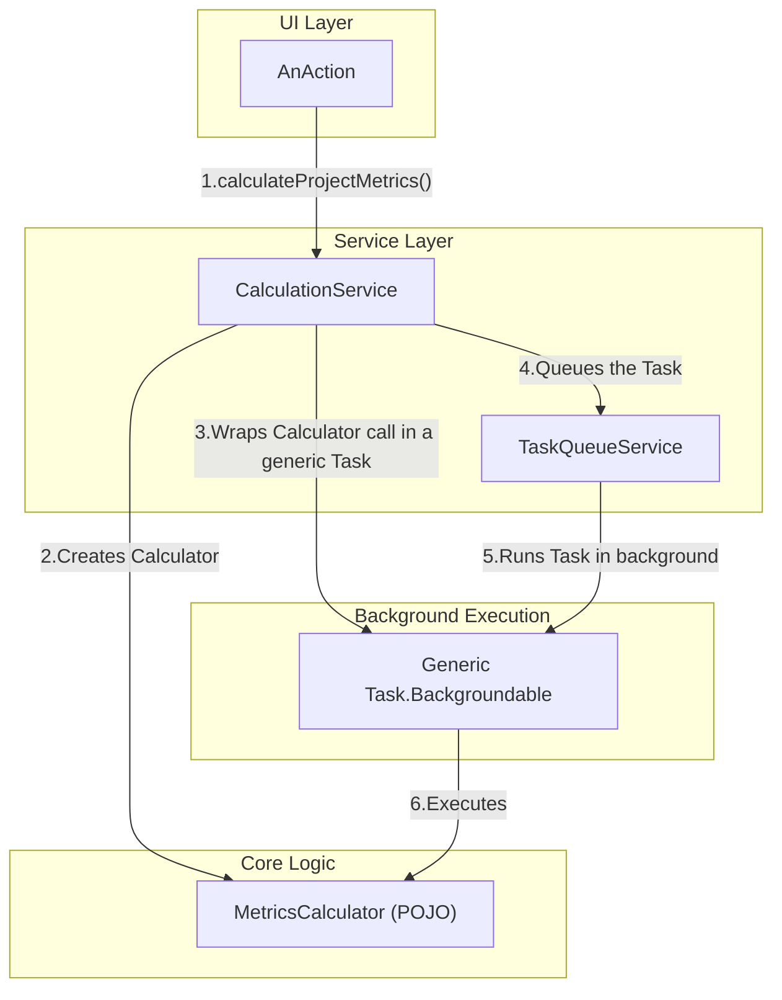

Phase 2 Spec

# Refactoring/Design Plan: Phase 2 - Isolate Core Calculation Logic

## 1. Executive Summary & Goals
This document provides detailed specifications for Phase 2 of the MetricsTree plugin refactoring. Building upon the foundational services created in Phase 1, this phase aims to fully decouple the core metric calculation logic from the IntelliJ Platform's execution framework. We will introduce a `CalculationService` to act as a facade, simplifying the UI layer and making the core logic pure, reusable, and independently testable.

- **Goal 1:** Introduce `CalculationService` as the single, high-level entry point for initiating all metric computations.
- **Goal 2:** Simplify all UI `AnAction` classes by delegating calculation requests to the `CalculationService`, removing their knowledge of background tasks.
- **Goal 3:** Refactor the `*Task` classes into thin, generic wrappers, moving their business logic into dedicated, testable `calculator` or `builder` classes.

## 2. Current Situation Analysis
Following Phase 1, we have foundational services but the UI `Action` classes are still tightly coupled to specific `Task.Backgroundable` implementations. For example, `CalculateProjectMetricsAction` directly instantiates a `ProjectTreeTask`.

- **Key Pain Points:**
    1.  **Mixed Concerns in Tasks:** The `*Task` classes (e.g., `ProjectTreeTask`, `PieChartTask`) still contain significant business logic within their `run()` methods. This mixes the "what" (the calculation) with the "how" (running it in the background), violating the Single Responsibility Principle.
    2.  **Brittle UI Actions:** The `AnAction` classes have too much responsibility. They need to know which specific `Task` to create for a given operation, making them difficult to test and brittle to changes in the calculation process.
    3.  **Untestable Core Logic:** The core calculation logic, being embedded within `Task` classes that depend on the IntelliJ Platform, cannot be easily unit-tested without a full IDE environment.

## 3. Proposed Solution / Refactoring Strategy
### 3.1. High-Level Design / Architectural Overview
This phase introduces a `CalculationService` that acts as a mediator between the UI layer and the core logic. Actions will now make simple, declarative calls to this service (e.g., `calculateProjectMetrics()`). The service will then orchestrate the background execution using the `TaskQueueService` and the refactored, logic-free `Task` wrappers.


**Description:**
The `AnAction` is now only responsible for initiating a request. The `CalculationService` handles the complexity of checking caches, preparing the correct calculator, wrapping it in a generic background task, and queuing it for execution.

### 3.2. Key Components / Modules
- **`CalculationService` (New):** A project-level service that provides a high-level API for all metric calculation workflows. It will be the primary client of the `TaskQueueService` and `CacheService`.
- **`*Calculator` Classes (New/Refactored):** A set of plain Java classes (POJOs) that encapsulate the pure logic of calculating a specific set of metrics or building a specific data model (e.g., `ProjectTreeModelCalculator`, `PieChartDataCalculator`). These will be extracted from the existing `*Task` classes.
- **`*Task` Classes (Refactored):** These will be simplified to become generic wrappers that execute a `Runnable` or `Supplier`, with their business logic removed.

### 3.3. Detailed Action Plan / Phases
This plan constitutes a single, focused phase. The tasks should be executed in the specified order.

- **Phase 2: Service-Oriented Calculation**
    - **Objective(s):** Decouple UI actions from task implementation and isolate core logic.
    - **Priority:** High

    - **Task 2.1:** Create `CalculationService` Interface and Implementation
        - **Rationale/Goal:** To establish a stable, high-level API for initiating all metric calculations, hiding the underlying complexity.
        - **Estimated Effort (Optional):** M
        - **Detailed Steps:**
            1.  Create a new interface `org.b333vv.metric.service.CalculationService`.
            2.  Define asynchronous, `void`-returning methods for each major calculation type. Examples:
                ```java
                public interface CalculationService {
                    void calculateProjectTree();
                    void calculatePieChart();
                    void calculateClassMetricsEvolution(PsiJavaFile psiJavaFile);
                    // ... and so on for other actions
                }
                ```
            3.  Create an implementation class `org.b333vv.metric.service.CalculationServiceImpl`.
            4.  Inject `TaskQueueService`, `CacheService`, and `SettingsService` into the constructor of `CalculationServiceImpl`.
            5.  Register the service in `plugin.xml`:
                ```xml
                <projectService serviceInterface="org.b333vv.metric.service.CalculationService"
                                serviceImplementation="org.b333vv.metric.service.CalculationServiceImpl"/>
                ```
        - **Deliverable/Criteria for Completion:** The `CalculationService` interface and implementation are created and registered. The implementation has its dependencies injected.

    - **Task 2.2:** Refactor `ProjectTreeTask` and Extract `ProjectTreeModelCalculator`
        - **Rationale/Goal:** To extract the business logic from a `Task` into a testable, reusable component. This task serves as the pattern for all other `*Task` refactorings.
        - **Estimated Effort (Optional):** L
        - **Detailed Steps:**
            1.  Create a new class `org.b333vv.metric.builder.ProjectTreeModelCalculator`.
            2.  Move the core logic from `ProjectTreeTask.run()` into a `calculate()` method in `ProjectTreeModelCalculator`. This new method will take necessary dependencies (like `Project`) as parameters and return a `DefaultTreeModel`.
            3.  Refactor `ProjectTreeTask` to accept a `Supplier<DefaultTreeModel>` in its constructor.
            4.  The `run()` method of `ProjectTreeTask` will now simply invoke the supplier. The result will be stored in a field.
            5.  The `onSuccess()` method will retrieve the result from the field and publish it to the `MessageBus`.
        - **Deliverable/Criteria for Completion:** `ProjectTreeModelCalculator` contains the core logic. `ProjectTreeTask` is now a generic wrapper.

    - **Task 2.3:** Implement `CalculationService.calculateProjectTree`
        - **Rationale/Goal:** To connect the new high-level API with the refactored core logic and background task execution.
        - **Estimated Effort (Optional):** M
        - **Detailed Steps:**
            1.  In `CalculationServiceImpl`, implement the `calculateProjectTree()` method.
            2.  The method will first check `cacheService` for a valid `PROJECT_TREE` result. If found, it will publish the cached result to the `MessageBus` and return.
            3.  If not cached, it will create an instance of `ProjectTreeModelCalculator`.
            4.  It will then create a `Supplier<DefaultTreeModel>` lambda: `() -> projectTreeModelCalculator.calculate(project)`.
            5.  It will instantiate the refactored `ProjectTreeTask`, passing this supplier.
            6.  The task's `onSuccess()` will be enhanced to also store the result in `cacheService`.
            7.  Finally, it will queue the task using `taskQueueService.queue(task)`.
        - **Deliverable/Criteria for Completion:** The `calculateProjectTree` workflow is fully implemented through the new service-oriented architecture.

    - **Task 2.4:** Refactor `CalculateProjectMetricsAction`
        - **Rationale/Goal:** To complete the decoupling of the UI layer from the calculation implementation details.
        - **Estimated Effort (Optional):** S
        - **Detailed Steps:**
            1.  Modify `CalculateProjectMetricsAction`.
            2.  In `actionPerformed`, remove the instantiation of `ProjectTreeTask`.
            3.  Replace it with a single call: `event.getProject().getService(CalculationService.class).calculateProjectTree();`.
            4.  In the `update` method, change the dependency from `MetricTaskCache.isQueueEmpty(project)` to `project.getService(TaskQueueService.class).isQueueEmpty()`.
        - **Deliverable/Criteria for Completion:** `CalculateProjectMetricsAction` is simplified and fully decoupled from the `ProjectTreeTask` implementation.

    - **Task 2.5:** Repeat for All Other Tasks and Actions
        - **Rationale/Goal:** Apply the established pattern across the entire application to achieve consistent architecture.
        - **Estimated Effort (Optional):** XL
        - **Detailed Steps:**
            1.  Repeat the process from Tasks 2.2, 2.3, and 2.4 for all other `*Task` classes and their corresponding `AnAction` triggers (e.g., `PieChartTask`, `ExportToXmlTask`, etc.).
            2.  For each, create a dedicated `*Calculator` or `*Builder` class, refactor the `*Task` to be a generic wrapper, implement the corresponding method in `CalculationService`, and update the `AnAction`.
        - **Deliverable/Criteria for Completion:** All UI actions for metric calculations are routed through `CalculationService`. All `*Task` classes are free of business logic.

### 3.4. Data Model Changes
No changes to the core data model are required for this phase.

### 3.5. API Design / Interface Changes
- **`CalculationService`**: A new public API is introduced.
- **`*Task` classes**: Their constructors will change to accept `Supplier` or `Runnable` arguments, making them internal implementation details rather than part of the public API for actions.

## 4. Key Considerations & Risk Mitigation
### 4.1. Technical Risks & Challenges
- **Logic Extraction Complexity:** Some `*Task` classes may have complex logic intertwined with `ProgressIndicator` updates.
    - **Mitigation:** The new `*Calculator` classes can accept a `Consumer<String>` for progress updates, which the `Task` can provide via a lambda connected to the `ProgressIndicator`. This keeps the core logic free of `ProgressIndicator` dependency.
- **Repetitive Refactoring:** The process is repetitive and could lead to copy-paste errors.
    - **Mitigation:** Create a single, truly generic `BackgroundableTask` that takes a `Supplier<T>` and a `Consumer<T>` (for `onSuccess`) to avoid having multiple, nearly identical `*Task` classes.

### 4.2. Dependencies
- This phase is critically dependent on the successful completion of Phase 1, as it relies on the `TaskQueueService`, `CacheService`, and `SettingsService`.

### 4.3. Non-Functional Requirements (NFRs) Addressed
- **Testability:** The primary benefit. The new `*Calculator` classes can be unit-tested without the IntelliJ test framework. The `CalculationService` can be tested by mocking its service dependencies.
- **Maintainability:** Logic is now located in predictable places. Changing a calculation algorithm only requires modifying a single `*Calculator` class, with no impact on the UI or task execution layers.
- **Extensibility:** Adding a new calculation and a corresponding UI action is now a clear, repeatable process: create a new calculator, add a method to `CalculationService`, and create a simple action that calls it.

## 5. Success Metrics / Validation Criteria
- All `AnAction` classes in the `org.b333vv.metric.actions` package (that trigger calculations) no longer instantiate `*Task` classes and instead use `CalculationService`.
- All `*Task` classes in `org.b333vv.metric.task` are refactored to be simple wrappers with no domain-specific calculation logic.
- The core calculation logic is encapsulated in new or refactored classes within the `org.b333vv.metric.builder` (or a new `calculator`) package.
- The application's functionality remains unchanged from the user's perspective. All metric calculation features work as before.

## 6. Assumptions Made
- Phase 1 has been completed, and the new services (`TaskQueueService`, `CacheService`, `SettingsService`) are available and functioning correctly.
- The `MessageBus` is the correct mechanism for communicating results back to the UI layer.

## 7. Open Questions / Areas for Further Investigation
- **Granularity of Calculators:** Should there be one large `MetricsCalculator` class with many methods, or many small classes each for a single calculation? (Recommendation: Start with one-to-one mapping from old tasks to new calculator classes for simplicity. They can be consolidated later if significant overlap is found).