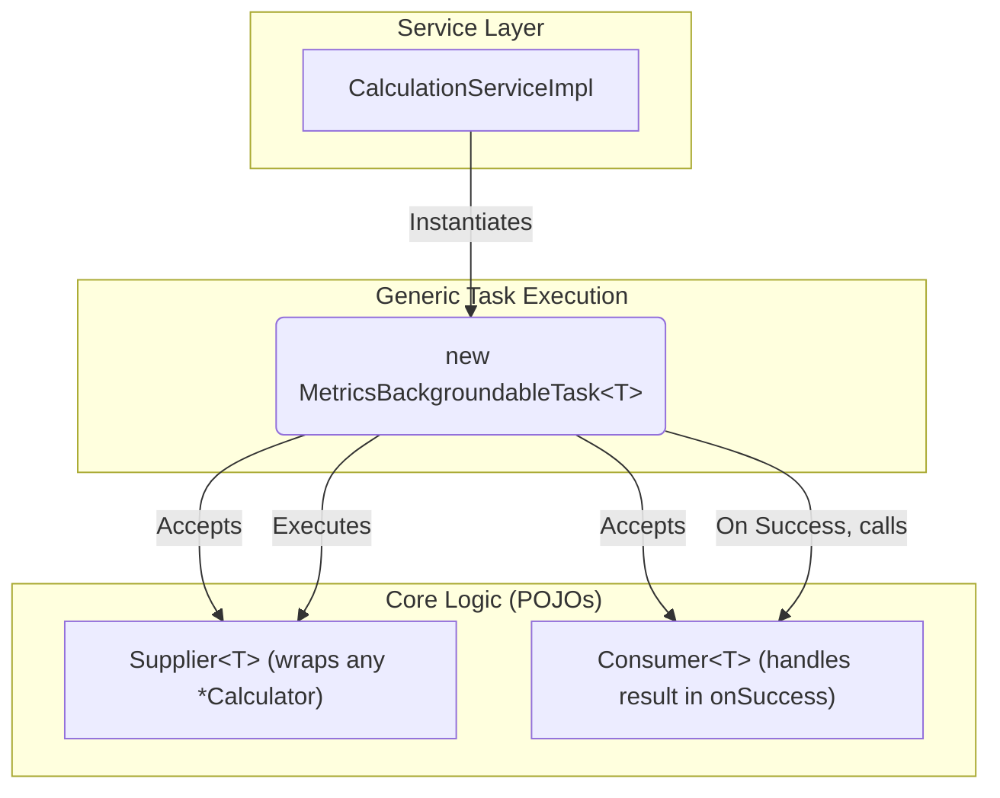

# Refactoring Plan: Implement Generic Background Task Wrapper

## 1. Executive Summary & Goals
This document provides a detailed implementation specification for Task 4.1 from the "Core Logic Isolation" phase. The primary objective is to eliminate the multitude of specific, boilerplate `*Task` classes by refactoring `MetricsBackgroundableTask` into a single, generic, and reusable component.

This refactoring will significantly reduce code duplication, simplify the `CalculationService`, and make the background task execution framework more robust and maintainable.

- **Goal 1:** Refactor the existing `MetricsBackgroundableTask` to be generic, capable of handling any type of calculation and result.
- **Goal 2:** Systematically update `CalculationServiceImpl` to use this new generic task for all calculation workflows.
- **Goal 3:** Delete all redundant, specific `*Task` classes, cleaning up the `task` package and finalizing the decoupling of logic from execution.

## 2. Current Situation Analysis
Following the initial refactoring in Phase 2, the business logic has been extracted from the `*Task` classes into `*Calculator` components. However, this has left the `task` package cluttered with numerous classes (e.g., `ProjectTreeTask`, `PieChartTask`, `ExportToXmlTask`) that are now just thin, almost identical wrappers.

- **Key Pain Points:**
    - **Code Duplication:** The project contains over a dozen `*Task` classes that share the same structure and purpose, differing only in the type of data they handle and the specific calculator they invoke. This is a significant source of boilerplate.
    - **Implementation-Specific Dependencies:** `CalculationServiceImpl` is still coupled to these specific `*Task` implementations, even if they are just wrappers. This adds unnecessary complexity to the service.
    - **Existing Generic Task is Insufficient:** The class `org.b333vv.metric.builder.MetricsBackgroundableTask` exists but is not generic. It uses `Runnable` for its main logic and callbacks, which prevents it from handling calculations that produce a return value.

## 3. Proposed Solution / Refactoring Strategy
### 3.1. High-Level Design / Architectural Overview
The core of this plan is to make the existing `MetricsBackgroundableTask` generic. It will be parameterized with a type `T` representing the result of a calculation. Its constructor will accept a `Supplier<T>` for the main logic and a `Consumer<T>` for the `onSuccess` callback. This allows a single, powerful task class to orchestrate any background calculation, receive its result, and process it upon successful completion on the UI thread.



### 3.2. Key Components / Modules
- **`org.b333vv.metric.builder.MetricsBackgroundableTask<T>` (Refactored):**
    - This class will be modified to be generic.
    - It will replace its `Runnable task` field with a `Supplier<T> task`.
    - It will replace its `Runnable onSuccess` field with a `Consumer<T> onSuccess`.
    - A new private field `private T result;` will be added to hold the value produced by the supplier.
    - The `run()` method will call `result = task.get();`.
    - The `onSuccess()` method will call `onSuccess.accept(result);`.

### 3.3. Detailed Action Plan / Phases
The refactoring will be performed in three focused phases to ensure a controlled and verifiable process.

#### Phase 1: Implement the Generic Task and Refactor a Single Workflow
- **Objective(s):** Create the generic task component and prove its viability by refactoring a single, representative workflow.
- **Priority:** High

- **Task 1.1:** Refactor `MetricsBackgroundableTask` to be Generic
    - **Rationale/Goal:** To create the core reusable component that will replace all other task wrappers.
    - **Estimated Effort (Optional):** M
    - **Deliverable/Criteria for Completion:** The class `org.b333vv.metric.builder.MetricsBackgroundableTask` is modified to be generic.
        - **New Signature:** `public class MetricsBackgroundableTask<T> extends Task.Backgroundable`
        - **New Fields:**
            ```java
            private final Supplier<T> task;
            private final Consumer<T> onSuccess;
            private T result;
            ```
        - **New Constructor:**
            ```java
            public MetricsBackgroundableTask(@Nullable Project project,
                                             @Nls(capitalization = Nls.Capitalization.Title) @NotNull String title,
                                             boolean canBeCancelled,
                                             @NotNull Supplier<T> task,
                                             @NotNull Consumer<T> onSuccess,
                                             @Nullable Runnable onCancel,
                                             @Nullable Runnable onFinished)
            ```
        - **Updated `run()` method:**
            ```java
            @Override
            public void run(@NotNull ProgressIndicator indicator) {
                result = task.get();
            }
            ```
        - **Updated `onSuccess()` method:**
            ```java
            @Override
            public void onSuccess() {
                if (onSuccess != null) {
                    onSuccess.accept(result);
                }
            }
            ```

- **Task 1.2:** Refactor `CalculationServiceImpl.calculateProjectTree`
    - **Rationale/Goal:** To apply the new generic task pattern to a single workflow, creating a template for all subsequent refactorings.
    - **Estimated Effort (Optional):** S
    - **Deliverable/Criteria for Completion:** The `calculateProjectTree` method in `CalculationServiceImpl` is updated to use the new generic task.
        - **Before:**
            ```java
            // ...
            ProjectTreeTask task = new ProjectTreeTask(project, () -> calculator.calculate(), cacheService);
            taskQueueService.queue(task);
            ```
        - **After:**
            ```java
            Supplier<DefaultTreeModel> taskLogic = new ProjectTreeModelCalculator(project)::calculate;
            Consumer<DefaultTreeModel> onSuccessCallback = (model) -> {
                cacheService.putUserData(CacheService.PROJECT_TREE, model);
                project.getMessageBus().syncPublisher(MetricsEventListener.TOPIC)
                       .projectMetricsTreeIsReady(model);
            };
            Runnable onCancelCallback = () -> project.getMessageBus().syncPublisher(MetricsEventListener.TOPIC).printInfo("Building tree model canceled");

            MetricsBackgroundableTask<DefaultTreeModel> genericTask = new MetricsBackgroundableTask<>(
                    project,
                    "Build Project Tree",
                    true, // canBeCancelled
                    taskLogic,
                    onSuccessCallback,
                    onCancelCallback,
                    null // onFinished
            );
            taskQueueService.queue(genericTask);
            ```

- **Task 1.3:** Delete `ProjectTreeTask.java`
    - **Rationale/Goal:** The specific wrapper class is now redundant and should be removed.
    - **Estimated Effort (Optional):** S
    - **Deliverable/Criteria for Completion:** The file `src/main/java/org/b333vv/metric/task/ProjectTreeTask.java` is deleted from the project.

#### Phase 2: Systematically Refactor All Other Calculation Workflows
- **Objective(s):** Apply the proven pattern from Phase 1 to all remaining calculation methods in `CalculationServiceImpl`.
- **Priority:** High

- **Task 2.1:** Refactor All `CalculationServiceImpl` Methods
    - **Rationale/Goal:** To achieve architectural consistency and eliminate dependencies on all other specific `*Task` classes.
    - **Estimated Effort (Optional):** L
    - **Deliverable/Criteria for Completion:** Every method in `CalculationServiceImpl` that previously instantiated a specific `*Task` class is refactored to use the new generic `MetricsBackgroundableTask<T>`. This includes, but is not limited to, methods for charts, exports, and fitness functions.
    - **Example for an export task (no return value):**
        ```java
        // In CalculationServiceImpl.exportToXml(String fileName)
        Supplier<Void> taskLogic = () -> {
            JavaProject javaProject = project.getService(MetricTaskManager.class).getProjectModel(indicator); // indicator is not available here, this logic must be inside the supplier
            new XmlExporter(project).export(fileName, javaProject);
            return null; // Supplier<Void> must return null
        };
        Consumer<Void> onSuccessCallback = (v) -> {
            // This can be empty or log a success message
            project.getMessageBus().syncPublisher(MetricsEventListener.TOPIC).printInfo("Export to XML finished");
        };
        // ... instantiate and queue MetricsBackgroundableTask<Void>
        ```

#### Phase 3: Cleanup and Finalization
- **Objective(s):** Remove all obsolete code and handle any special cases that were not covered by the main refactoring sweep.
- **Priority:** Medium

- **Task 3.1:** Delete All Redundant `*Task` Classes
    - **Rationale/Goal:** To finalize the cleanup of the `task` package, leaving only essential classes.
    - **Estimated Effort (Optional):** M
    - **Deliverable/Criteria for Completion:** All of the following files (and any other similar task wrappers) are deleted from `src/main/java/org/b333vv/metric/task/`:
        - `CategoryChartTask.java`, `ClassByMetricsTreeTask.java`, `ClassFitnessFunctionsTask.java`, `ExportClassMetricsToCsvTask.java`, `ExportMethodMetricsToCsvTask.java`, `ExportPackageMetricsToCsvTask.java`, `ExportToXmlTask.java`, `MetricTreeMapTask.java`, `PackageFitnessFunctionsTask.java`, `PieChartTask.java`, `ProfileBoxChartsTask.java`, `ProfileCategoryChartTask.java`, `ProfileHeatMapChartTask.java`, `ProfileRadarChartsTask.java`, `ProfileTreeMapTask.java`, `ProjectMetricsHistoryChartTask.java`, `ProjectMetricsHistoryXyChartTask.java`, `XyChartTask.java`.
        - The legacy calculation tasks (`ClassAndMethodMetricTask`, `DependenciesTask`, `PackageMetricTask`, `ProjectMetricTask`) should also be refactored out of `MetricTaskManager` and replaced with direct calls to calculators, wrapped in the generic task by the `CalculationService`.

- **Task 3.2:** Adapt `ClassMetricsValuesEvolutionProcessor`
    - **Rationale/Goal:** The processor uses the old `MetricsBackgroundableTask` and must be updated to use the new generic version.
    - **Estimated Effort (Optional):** S
    - **Deliverable/Criteria for Completion:** The `buildClassMetricsValuesEvolutionMap` method is refactored.
        - **New Logic:**
            ```java
            // Inside buildClassMetricsValuesEvolutionMap()
            Supplier<Void> taskLogic = () -> { getFileFromGitCalculateMetricsAndPutThemToMap.run(); return null; };
            Consumer<Void> onSuccess = (v) -> buildTree.run();
            MetricsBackgroundableTask<Void> genericTask = new MetricsBackgroundableTask<>(
                psiJavaFile.getProject(),
                "Get Metrics History...",
                true,
                taskLogic,
                onSuccess,
                cancel, // Existing onCancel Runnable
                null  // onFinished
            );
            psiJavaFile.getProject().getService(TaskQueueService.class).queue(genericTask);
            ```

- **Task 3.3:** Final Verification
    - **Rationale/Goal:** To ensure the entire application remains stable and functional after the widespread changes.
    - **Estimated Effort (Optional):** M
    - **Deliverable/Criteria for Completion:** The full test suite passes. A manual check of each UI button confirms that background tasks are still executed correctly and produce the expected results.

## 4. Key Considerations & Risk Mitigation
- **Breaking Change:** The refactoring of `MetricsBackgroundableTask` is a breaking change for its existing user (`ClassMetricsValuesEvolutionProcessor`). This dependency is explicitly addressed in Task 3.2.
- **Callback Preservation:** The `onCancel` and `onFinished` callbacks, which are `Runnable`, are preserved in the new generic task's constructor to maintain existing functionality without requiring them to be generic as well.
- **Clarity of `Supplier` and `Consumer`:** The logic within the lambdas passed to the generic task should be kept minimal. Complex logic should reside within the `*Calculator` classes, not in the `CalculationServiceImpl`'s lambdas.

## 5. Success Metrics / Validation Criteria
- The `task` package is reduced to a handful of essential classes (e.g., `MetricTaskManager`, `InvalidateCachesTask`, and the new generic task).
- `CalculationServiceImpl` is completely decoupled from specific `*Task` implementations.
- All user-facing calculation features are confirmed to be working correctly.
- The project compiles successfully after the deletion of all redundant task files.

## 6. Assumptions Made
- The `Supplier`/`Consumer` pattern is sufficient for all calculation workflows.
- The existing `onCancel` and `onFinished` logic can be handled with simple `Runnable` callbacks.

## 7. Open Questions / Areas for Further Investigation
- None. This plan provides a clear and complete path to finalizing the task execution refactoring.