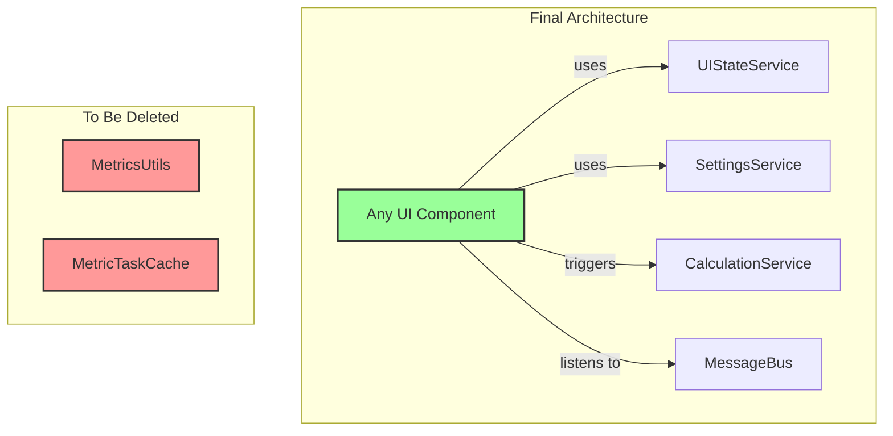

Phase 3 Spec

# Refactoring/Design Plan: Phase 3 - Final Cleanup and Architectural Solidification

## 1. Executive Summary & Goals
This document provides detailed specifications for Phase 3, the final stage of the MetricsTree plugin refactoring. With the foundational services from Phase 1 and the `CalculationService` from Phase 2 in place, this phase focuses on eliminating the remaining technical debt, removing the deprecated "God Objects," and ensuring the new service-oriented architecture is consistently applied across the entire codebase.

- **Goal 1:** Completely remove the deprecated `MetricsUtils` and `MetricTaskCache` classes from the project.
- **Goal 2:** Ensure all components, especially UI panels and helper classes, exclusively use the new services for state management, task execution, and data caching.
- **Goal 3:** Solidify the event-driven UI pattern, ensuring UI components are "dumb" renderers that react to `MessageBus` events rather than containing business logic.

## 2. Current Situation Analysis
At the start of this phase, the new service layer is operational and used by the primary UI actions. However, the legacy classes `MetricsUtils` and `MetricTaskCache` still exist, marked as `@Deprecated`. They are likely still referenced by numerous secondary components, such as UI panels, tree builders, and metric visitors, which were not the focus of the initial refactoring phases. This residual technical debt prevents the full realization of a decoupled architecture and poses a risk of new code accidentally depending on the old, incorrect patterns.

- **Key Pain Points:**
    1.  **Lingering Dependencies:** Many components still have static dependencies on `MetricsUtils` or direct dependencies on `MetricTaskCache`, bypassing the new service-oriented architecture.
    2.  **Inconsistent UI Logic:** Some UI panels may still contain logic that directly fetches data or initiates processes, instead of passively listening for updates via the `MessageBus`.
    3.  **Architectural Debt:** The presence of deprecated classes clutters the codebase and makes it confusing for developers, who might see two different ways of performing the same action.

## 3. Proposed Solution / Refactoring Strategy
### 3.1. High-Level Design / Architectural Overview
This phase is a systematic "search and destroy" mission. The strategy is to methodically find every remaining usage of the deprecated classes and refactor them to use the appropriate new service. This will be followed by a comprehensive review of the UI layer to enforce a clean, event-driven pattern, ensuring the final architecture is robust and consistent.

**Description:** The final state will have no dependencies on the legacy classes. All components will interact through the well-defined service layer or the platform's message bus.

### 3.2. Key Components / Modules
- **`PsiUtils` / `EditorUtils` (New):** A new, focused utility class to house genuinely static helper methods related to PSI and Editor manipulation, extracted from `MetricsUtils`.
- **All other components:** Will be refactored to remove dependencies on the deprecated classes.

### 3.3. Detailed Action Plan / Phases
This plan constitutes a single, focused phase. The tasks should be executed in order.

- **Phase 3: Cleanup and Solidification**
    - **Objective(s):** Eliminate all legacy code and verify the new architecture.
    - **Priority:** High

    - **Task 3.1:** Eliminate All Usages of `MetricsUtils`
        - **Rationale/Goal:** To completely remove the primary God Object and its associated technical debt.
        - **Estimated Effort (Optional):** L
        - **Detailed Steps:**
            1.  Use the IDE's "Find Usages" feature on the `MetricsUtils` class.
            2.  Categorize and refactor each usage:
                - **UI State Access:** Calls like `MetricsUtils.isProjectAutoScrollable()` must be replaced with calls to the `UIStateService`. The component making the call must get the service via `project.getService(UIStateService.class)`.
                - **Filter Access:** Calls like `MetricsUtils.getClassMetricsTreeFilter()` must be refactored. The `MetricsTreeFilter` objects should be moved into and managed by the `UIStateService`.
                - **PSI/Editor Helpers:** Truly static, stateless helpers like `getSelectedPsiJavaFile` or `openInEditor` should be moved to a new, focused utility class (e.g., `org.b333vv.metric.util.EditorUtils`).
                - **Service Access:** Calls like `MetricsUtils.getDumbService(project)` should be replaced by injecting the `DumbService` directly where needed.
            3.  After all usages are refactored, delete the `MetricsUtils.java` file.
        - **Deliverable/Criteria for Completion:** The `MetricsUtils.java` file is deleted from the project. The project compiles without errors.

    - **Task 3.2:** Eliminate All Usages of `MetricTaskCache`
        - **Rationale/Goal:** To finalize the removal of the overloaded service and ensure all caching and task management goes through the new, dedicated services.
        - **Estimated Effort (Optional):** M
        - **Detailed Steps:**
            1.  Use "Find Usages" on the `MetricTaskCache` class.
            2.  Most remaining usages will likely be in `*Task` classes or metric `visitor` classes.
            3.  Refactor any code that calls `project.getService(MetricTaskCache.class)` to instead call `project.getService(CacheService.class)`.
            4.  Pay special attention to `CouplingBetweenObjectsVisitor`, which gets the `DependenciesBuilder` from the cache. It must be updated to use `CacheService`.
            5.  After all usages are refactored, delete the `MetricTaskCache.java` file.
        - **Deliverable/Criteria for Completion:** The `MetricTaskCache.java` file is deleted from the project. The project compiles without errors.

    - **Task 3.3:** Review and Refactor UI Panels for Architectural Purity
        - **Rationale/Goal:** To enforce a strict separation of concerns where UI panels are "dumb" components that only render data and delegate user actions.
        - **Estimated Effort (Optional):** M
        - **Detailed Steps:**
            1.  Review all classes in `org.b333vv.metric.ui.tool` and `org.b333vv.metric.ui.info`.
            2.  **Identify and remove any business logic.** For example, if a panel calculates which metrics to display based on settings, this logic should be moved to a `ViewModel` or a helper that is called by the `MessageBus` listener.
            3.  **Ensure all data updates are event-driven.** Panels should not proactively fetch data (e.g., `project.getService(CacheService.class).getUserData(...)`). Instead, they must implement a `MetricsEventListener` and update their state only when an event like `projectMetricsTreeIsReady()` is received.
            4.  **Verify action delegation.** Panels should not directly trigger calculations. All user actions (button clicks, etc.) that result in a calculation must be handled by `AnAction` classes, which then call the `CalculationService`.
        - **Deliverable/Criteria for Completion:** UI panels are stateless (or have minimal view state) and are updated exclusively via `MessageBus` events. No business logic remains in the UI layer.

    - **Task 3.4:** Final Code Review and Full Test Suite Execution
        - **Rationale/Goal:** To verify the stability, correctness, and consistency of the newly refactored architecture.
        - **Estimated Effort (Optional):** M
        - **Detailed Steps:**
            1.  Conduct a peer code review of all changed components, specifically checking for adherence to the new service-oriented patterns.
            2.  Execute the entire test suite, including unit, integration, and E2E tests, to ensure no regressions have been introduced.
            3.  Perform manual testing of all major user workflows: calculating class metrics, project metrics, using fitness functions, and changing settings.
        - **Deliverable/Criteria for Completion:** A successful build with all automated tests passing. Manual verification confirms all plugin features work as expected.

### 3.4. Data Model Changes
No changes to the core data model are required for this phase.

### 3.5. API Design / Interface Changes
This phase involves the **removal** of all public APIs previously exposed by `MetricsUtils` and `MetricTaskCache`.

## 4. Key Considerations & Risk Mitigation
### 4.1. Technical Risks & Challenges
- **Missed Dependencies:** A static usage of a deprecated method might be missed by automated tools if it's in a less-obvious location.
    - **Mitigation:** The final step of deleting the class files (`MetricsUtils.java`, `MetricTaskCache.java`) is the ultimate verification. A compilation failure will pinpoint any missed reference.
- **Behavioral Changes:** Refactoring UI components to be purely event-driven might subtly alter behavior related to timing or state updates.
    - **Mitigation:** Thorough manual testing of the UI is crucial. Pay close attention to panel clearing, state persistence across tabs, and responsiveness during calculations.

### 4.2. Dependencies
- This phase is fully dependent on the successful completion of Phases 1 and 2.

### 4.3. Non-Functional Requirements (NFRs) Addressed
- **Maintainability:** The final removal of legacy code and enforcement of architectural patterns will maximize the maintainability gains of the entire refactoring effort.
- **Developer Experience:** The codebase will be significantly cleaner, more predictable, and easier for new developers to understand and contribute to.

## 5. Success Metrics / Validation Criteria
- **Primary Metric:** The `MetricsUtils.java` and `MetricTaskCache.java` files are successfully deleted from the source tree.
- **Verification:** The project compiles, all automated tests pass, and all user-facing features are confirmed to be working correctly through manual testing.
- **Qualitative Assessment:** A code review confirms that the new service-oriented architecture is applied consistently and that the UI layer is properly decoupled.

## 6. Assumptions Made
- The new services created in Phase 1 and 2 are stable and correctly implement the required functionality.
- The existing test suite provides adequate coverage to detect major regressions.

## 7. Open Questions / Areas for Further Investigation
- Are there any other "utility" or "manager" classes in the project that exhibit God Object characteristics and should be considered for a future refactoring phase? (A post-mortem review after Phase 3 would be beneficial).