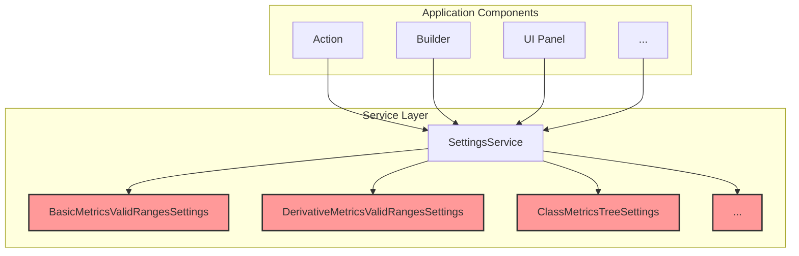

# Refactoring/Design Plan: Complete Task 1.4 - Finalize `SettingsService` Facade

## 1. Executive Summary & Goals
This plan details the necessary steps to complete the refactoring of `MetricsService` into a pure `SettingsService` facade, as specified in Task 1.4 of the Phase 1 refactoring documentation.

Analysis of the current codebase shows that while the class has been renamed and some call sites updated, the refactoring is incomplete. Key logic still resides in the service, and numerous components bypass the new facade, accessing individual settings services directly. Furthermore, the specified validation tests have not been created.

- **Goal 1:** Implement the missing integration tests for `SettingsService` to create a safety net and validate its behavior.
- **Goal 2:** Systematically refactor all parts of the application to exclusively use `SettingsService` for accessing configuration, thereby enforcing the facade pattern.
- **Goal 3:** Ensure the final `SettingsService` implementation is clean, its role is clearly defined, and the overall architecture is more consistent and maintainable.

## 2. Current Situation Analysis
- **What's Done:**
    - `MetricsService.java` has been successfully renamed to `SettingsService.java`.
    - The service is correctly registered in `plugin.xml`.
    - The `isLongValue()` logic has been moved to the `MetricType` enum.
    - Facade-style getter methods for each settings component (e.g., `getBasicMetricsSettings()`) have been added to `SettingsService`.

- **Key Gaps & Pain Points:**
    1.  **Incomplete Facade Adoption:** A significant number of classes throughout the application still directly request individual settings services (e.g., `project.getService(BasicMetricsValidRangesSettings.class)`), completely bypassing the intended `SettingsService` facade. This undermines the goal of creating a single, clear entry point for configuration.
    2.  **Missing Validation:** The integration test `SettingsServiceTest.java`, specified in `Phase 1 Test.md`, has not been implemented. This leaves the current facade logic without dedicated test coverage.
    3.  **Ambiguous Service Role:** `SettingsService` contains convenience methods (e.g., `getRangeForMetric`) that combine logic from multiple settings objects. While useful, this makes it more than a pure facade. This plan will proceed by keeping these convenience methods, as they centralize important business logic, but will ensure all other components use the service as the single source of truth.

## 3. Proposed Solution / Refactoring Strategy
The strategy is to first build the test safety net, then perform a comprehensive "search and replace" of all direct settings service usages, and finally, verify the correctness of the completed refactoring.

### 3.1. High-Level Design / Architectural Overview
The target state is one where the `SettingsService` is the exclusive gateway to all configuration-related components. No other part of the application should have knowledge of the individual `*Settings` classes.

**Description:** All application components will depend only on `SettingsService`. The individual `*Settings` classes become implementation details hidden behind the facade.

### 3.2. Detailed Action Plan / Phases

#### Phase 1: Implement Test Coverage
- **Objective(s):** Create the specified integration tests for `SettingsService` to validate its behavior and provide a safety net for the subsequent refactoring.
- **Priority:** High

- **Task 1.1:** Create `SettingsServiceTest.java`
    - **Rationale/Goal:** Fulfill the testing requirement from `Phase 1 Test.md` and ensure the service facade is working as expected.
    - **Estimated Effort (Optional):** M
    - **Deliverable/Criteria for Completion:**
        1.  Create the file `src/integration-test/java/org/b333vv/metric/service/SettingsServiceTest.java` extending `BasePlatformTestCase`.
        2.  Implement `testGettersReturnNonNullSettings()`:
            - Get the `SettingsService` instance from the test project.
            - Call every getter method (e.g., `getBasicMetricsSettings()`, `getOtherSettings()`, etc.).
            - Assert that each returned settings object is not `null`.
        3.  Implement `testSettingsModificationIsPersisted()`:
            - Get the `SettingsService` and use it to retrieve a settings object (e.g., `getOtherSettings()`).
            - Assert its default state (e.g., `isProjectMetricsStampStored()` is `true`).
            - Modify the state (e.g., set to `false`).
            - Get a new `SettingsService` instance from the project.
            - Retrieve the same settings object again and assert that the modified state (`false`) is present.
            - Reset the state to its default for subsequent tests.

#### Phase 2: Refactor All Direct Settings Usages
- **Objective(s):** Enforce the facade pattern by eliminating all direct dependencies on individual settings services throughout the codebase.
- **Priority:** High

- **Task 2.1:** Systematically Refactor Call Sites
    - **Rationale/Goal:** To ensure all parts of the application consistently use the `SettingsService` facade, centralizing access to configuration.
    - **Estimated Effort (Optional):** L
    - **Deliverable/Criteria for Completion:** A global search for `project.getService(<any *Settings class>.class)` yields zero results (except within `SettingsService` itself). All such calls are replaced with `project.getService(SettingsService.class).get...()`.
    - **Key Files to Refactor (non-exhaustive list):**
        - **`BasicMetricsValidRangesSettings` usages:**
            - `BuildMetricsCategoryChartAction`, `BuildMetricsPieChartAction`, `SortClassesByMetricsValuesAction`, `ProfileRadarChartBuilder`, `AddValidRangeForBasicMetricDialog`, `BasicMetricsValidRangesTable`, `EditValidRangeForBasicMetricDialog`.
        - **`DerivativeMetricsValidRangesSettings` usages:**
            - `ProfileRadarChartBuilder`, `AddValidRangeForDerivativeMetricDialog`, `DerivativeMetricsValidRangesTable`, `EditValidRangeForDerivativeMetricDialog`.
        - **`ClassMetricsTreeSettings` usages:**
            - `ModelBuilder`, `ProjectModelBuilder`, `ClassMetricsTreeSettingsPanel`.
        - **`ClassLevelFitnessFunctions` usages:**
            - `ClassLevelFitnessFunctionBuilder`, `ClassFitnessFunctionPanel`.
        - **`PackageLevelFitnessFunctions` usages:**
            - `PackageLevelFitnessFunctionBuilder`, `PackageFitnessFunctionPanel`.
        - **`OtherSettings` usages:**
            - `BuildProjectMetricsHistoryXYChartAction`, `ProjectMetricTask`, `OtherSettingsPanel`.
        - **General `SettingsService` usages (verify they are correct):**
            - `MetricNode`, `MetricsSummaryTable`, `MetricsTrimmedSummaryTable`, `MetricTypeColorProvider`, `ProjectMetricXYChartBuilder`, etc.

#### Phase 3: Verification and Cleanup
- **Objective(s):** Confirm the successful completion of the refactoring and ensure the system is stable.
- **Priority:** Medium

- **Task 3.1:** Run Full Test Suite
    - **Rationale/Goal:** To verify that the widespread changes have not introduced any regressions.
    - **Estimated Effort (Optional):** S
    - **Deliverable/Criteria for Completion:** The entire test suite (`test`, `integrationTest`, `e2eTest`), including the new tests from Phase 1 of this plan, passes successfully.

- **Task 3.2:** Manual Sanity Check
    - **Rationale/Goal:** To provide a final, user-level confirmation that settings-dependent features work correctly.
    - **Estimated Effort (Optional):** S
    - **Deliverable/Criteria for Completion:**
        1.  Open the plugin settings dialog.
        2.  Change a value on the "Basic Metrics Valid Values" tab.
        3.  Run a project-level calculation and verify that the metrics tree reflects the new range (e.g., a metric's color changes from green to yellow).
        4.  Change a value in the "Class Level Fitness Functions" tab.
        5.  Run the fitness function analysis and verify the results reflect the change.
        6.  All manually checked features behave as expected.

## 4. Key Considerations & Risk Mitigation
- **Risk:** The refactoring is widespread and touches many files, increasing the risk of an oversight.
- **Mitigation:** The "search and replace" nature of the task is mechanical. Using the IDE's "Find Usages" tool is critical. The new integration tests from Phase 1 will provide a strong safety net against regressions in the core facade logic.

## 5. Success Metrics / Validation Criteria
- **Primary Metric:** A global search for `project.getService` on any of the individual `*Settings` classes (e.g., `BasicMetricsValidRangesSettings.class`) returns no results outside of `SettingsService.java`.
- **Test Coverage:** The new `SettingsServiceTest.java` is implemented and passes.
- **Regression:** The full existing test suite passes without any new failures.
- **Functional:** Manual checks confirm that features dependent on settings continue to work correctly.

## 6. Assumptions Made
- The logic within the individual `*Settings` classes is correct and does not need to be refactored at this time.
- The convenience methods within `SettingsService` (e.g., `getRangeForMetric`) are a desired feature for centralizing logic and will be kept.

## 7. Open Questions / Areas for Further Investigation
- None. The task is a well-defined refactoring with a clear end state.